## Page 1

# $\infty$ collette 

## WORLDWIDE TRAVEL GUIDE

2021-2023・VOL. 2

## where will you go next?

There's a world of experience-rich tears, waiting for your with departure dates through May 2023. Find your perfect tour in these pages.

## WITH COLLETTE

you're family.
From our industry-leading travel protection plan, which allows for a full money-back refund if you cancel to our home to support seduri service, your happiness is our priority.

## Page 2

# TODAY IS A NEW DAY, fall of opportunity. 

And while we may be faced with a "new normal" in many ways, one thing remains unchanged - the desire to travel and experience life somewhere new. Whether you've been dreaming of taking a trip for years or you're eager to set out after a few challenging months, this is your moment to fulfill your wanderlust and set out for new adventures.
The Collette team is constantly monitoring travel around the world and is ready to support your plans to get out there.

## WHAT'S INSIDE?

INTRODUCTION ..... 4-17
NORTH AMERICA ..... 18-36
Canyon Country ..... 18
Painted Canyons of the West ..... 18
National Parks of America ..... 19
America's National Parks and Denver ..... 19
Alaska Discovery Land \& Cruise ..... 20
Alaska's Northern Lights ..... 20
Hawaiian Adventure ..... 21
Pacific Northwest \& California ..... 21
California Dreamin' ..... 22
America's Cowboy Country ..... 22
(4) Spotlight on South Dakota ..... 23
The Colorado Rockies ..... 23
Albuquerque Balloon Fiesta ..... 24
(4) Spotlight on Santa Fe ..... 24
(4) Spotlight on San Antonio ..... 25
(4) Spotlight on San Antonio Holiday ..... 25
Mackinac Island. ..... 26
Bluegrass Country \& the Smoky Mountains ..... 26
Nashville \& the Smoky Mountains Holiday ..... 27
America's Music Cities ..... 27
(4) Spotlight on Nashville ..... 28
(4) Spotlight on New Orleans ..... 28
Southern Charm ..... 29
Heritage of America ..... 29
(4) Spotlight on Washington, D.C. ..... 30
Washington, D.C., Niagara Falls \& New York City ..... 30
(4) Spotlight on New York City ..... 31
(4) Spotlight on New York City Holiday ..... 31
Islands of New England ..... 32
Autumn in Vermont ..... 32
Colors of New England featuring Coastal Maine ..... 33
(4) Roaming Coastal Maine ..... 33
Canadian Rockies by Train ..... 34
Canadian Rockies featuring Rocky Mountaineer ..... 34
Canadian Rockies \& Glacier National Park ..... 35
Western Canada's Rockies, Lakes \& Wine Country ..... 35
The Best of Eastern Canada ..... 36
Maritimes Coastal Wonders ..... 36
ITALY ..... 37-43
Italian Vistas ..... 37
Reflections of Italy ..... 37
(4) Spotlight on Tuscany ..... 38
Rome \& the Amalfi Coast ..... 38
Tuscany \& the Italian Riviera ..... 39
Northern Italy \& Its Lakes ..... 39
Rome, Florence \& Venice ..... 40
Southern Italy \& Sicily ..... 40
(4) Sicily and Its Isles ..... 41
(4) Old World Sicily \& Malta ..... 41
(4) Italy's Treasures ..... 42
(4) Tuscan \& Umbrian Countryside ..... 42
(4) Italy: Amalfi Coast to Puglia ..... 43
(4) Shrines of Italy ..... 43
ICELAND \& SCANDINAVIA ..... 44-46
Iceland: Land of Fire \& Ice ..... 44
Iceland's Magical Northern Lights ..... 44
Spectacular Scandinavia ..... 45
Highlights of Norway ..... 45
(4) The Northern Lights of Finland ..... 46
(4) Icelandic Adventure ..... 46
U.K. \& IRELAND ..... 47-53
Shades of Ireland ..... 47
Shades of Ireland featuring Northern Ireland ..... 47
(4) Countryside of the Emerald Isle ..... 48
Irish Splendor ..... 48
(4) Shrines of Ireland ..... 49
Exploring Britain \& Ireland ..... 49
British Landscapes ..... 50

## Page 3

(3) Journey through Scotland \& England. ..... 50
Exploring Scotland \& Ireland ..... 51
Discover Scotland ..... 51
(3) Scottish Adventure ..... 52
(3) Scotland: Isles of Lore \& Legend ..... 52
(3) Spotlight on London ..... 53
(3) Christmas in London ..... 53
ACROSS EUROPE ..... $54-55$
London \& Paris ..... 54
Treasures of Europe ..... 54
(3) Netherlands, Belgium \& France ..... 55
FRANCE ..... $55-58$
(3) Spotlight on the French Riviera ..... 55
France Magnifique ..... 56
(3) Journey through Southern France ..... 56
(3) La Belle Seine. ..... 57
(3) Shrines of France ..... 58
(3) Spotlight on Paris ..... 58
SPAIN \& PORTUGAL ..... 59-62
(3) The Azores: Jewels of Portugal. ..... 59
Spain's Classics ..... 59
Spain's Classics \& Portugal ..... 60
Spain \& Morocco ..... 60
Sunny Portugal ..... 61
Portugal \& Its Islands ..... 61
(3) Pilgrimage to Fatima \& Lourdes with Barcelona ..... 62
CROATIA \& GREECE ..... $62-65$
Discover Croatia, Slovenia and the Adriatic Coast ..... 62
(3) Croatia \& Its Islands ..... 63
(3) Greece Island Hopper ..... 64
Exploring Greece \& Its Islands ..... 64
(3) Classical Greece. ..... 65
(3) Greece: In the Footsteps of Paul the Apostle ..... 65
CENTRAL EUROPE ..... 66-73
(3) The Baltics Revealed ..... 66
Imperial Russia ..... 66
Exploring the Alpine Countries ..... 67
Alpine Lakes \& Scenic Trains ..... 67
(3) Switzerland: Hidden Trails \& Majestic Peaks ..... 68
Discover Switzerland, Austria \& Bavaria ..... 68
Imperial Cities ..... 69
Magnificent Cities of Central \& Eastern Europe ..... 69
Discovering Poland ..... 70
Classic Christmas Markets ..... 70
Magical Christmas Markets ..... 71
(3) Classic Danube ..... 71
(3) Christmas on the Danube ..... 72
(3) Holland \& Belgium Springtime River Cruise ..... 72
(3) Magical Rhine \& Moselle ..... 73
ISRAEL ..... 73-75
Iconic Israel ..... 73
(3) Israel: A Journey of Faith ..... 74
(3) Israel: Pilgrimage to the Holy Land ..... 74
(3) Jordan \& Israel ..... 75
OBERAMMERGAU ..... 76-79
Imperial Cities with the Oberammergau Passion Play ..... 76
Exploring the Alpine Countries
with the Oberammergau Passion Play ..... 77
Germany's Cultural Cities \& the Romantic Road
with the Oberammergau Passion Play ..... 77
Switzerland \& Germany
with the Eberammergau Passion Play ..... 78
Alpine Explorer with the Oberammergau Passion Play ..... 78
Discover Switzerland, Austria \& Bavaria
with the Oberammergau Passion Play ..... 79
Classic Danube with the Oberammergau Passion Play ..... 79
THE FLORIADE EXPO 2022 ..... 80-81
(3) Europe's Cosmopolitan Cities with Floriade Expo 2022 ..... 80
(3) The Chelsea Flower Show with Floriade Expo 2022 ..... 80
(3) Holland \& Belgium Springtime River Cruise
with Floriade Expo 2022 ..... 81
(3) Netherlands, Belgium \& France with Floriade Expo 2022 ..... 81
AUSTRALIA \& NEW ZEALAND ..... 82-84
Australia's Outback to New Zealand's South Island ..... 82
The Complete South Pacific. ..... 82
South Pacific Wonders ..... 83
South Pacific Wonders with New Zealand's North Island ..... 83
(3) Exploring New Zealand's Wonders ..... 84
(3) Australia \& New Zealand Uncovered ..... 84
SOUTH \& CENTRAL AMERICA ..... 86-88
Tropical Costa Rica ..... 86
(3) Costa Rica: A World of Nature ..... 86
Peru: From Lima to Lake Titicaca ..... 87
(3) Patagonia: Edge of the World. ..... 87
(3) Machu Picchu \& Galapagos Wonders ..... 88
ASIA \& AFRICA ..... 88-93
Cultural Treasures of Japan ..... 88
(3) Mysteries of India ..... 89
(3) Kingdoms of Southeast Asia ..... 89
Spectacular South Africa ..... 90
(3) Journey through Egypt \& Jordan ..... 90
(3) Treasures of Egypt. ..... 91
(3) Colors of Morocco. ..... 91
(3) Exploring South Africa, Victoria Falls \& Botswana ..... 92
(3) African Safari: Kenya \& Tanzania ..... 92
(3) The Plains of Africa ..... 93
OTHER ..... 94-99
Frequently Asked Questions. ..... 94-95
Air \& Reservation Information. ..... 96-99
TRAVEL STYLES See page 16 for details
All tours are Classic tours except those marked as follows:
(3) Small Group Explorations A connection to culture
(3) Spotlights Single-Hotel Stays Go in depth, unpack just once
(3) Cruise Explore the world's scenic waterways
Faith Spiritual journeys

## Page 4

# PEACE OF MIND 

## pulling you first

## EVERY STEP OF THE WAY

You can rest assured that your well-being and enjoyment always come first. When you travel with Collette, you can discover the world confidently knowing that everything is taken care of - before, during, and after your trip.
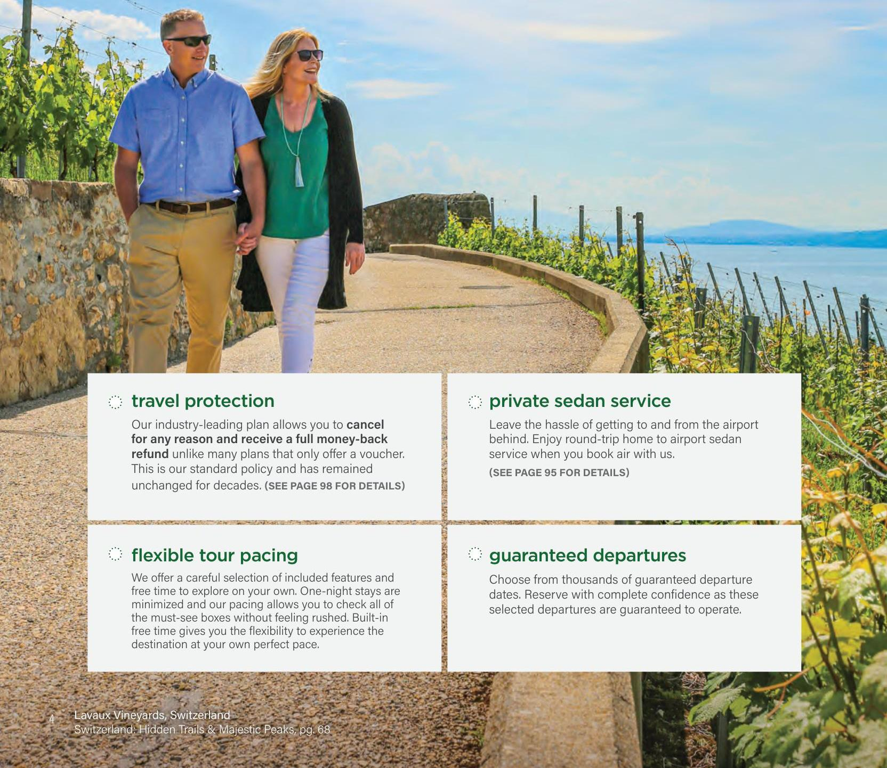

## Page 5

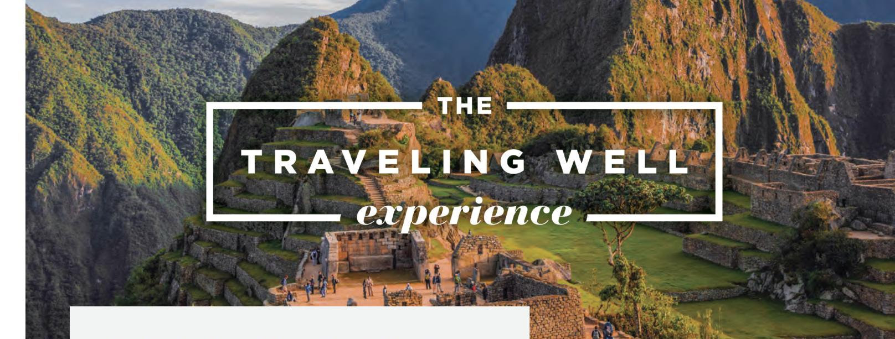

OUR COMMITMENT TO YOUR well-being \& enjoyment

## BEFORE YOUR TOUR

## Each guest that travels with us deserves a memorable and fulfilling travel experience. And

we intend to continue to deliver on that promise. Your health, well-being, and enjoyment remain our top focus - just as they have been since we started in 1918.

Our team consults with health and security experts all around the world to ensure a healthy and enjoyable travel experience. Here are some of the steps we're taking for you.

Visit collette.com/travelingwell to learn more.

## Pre-Tour Health Screenings

We will ask all travelers to complete a wellness declaration form before joining their tour. All guests traveling with Collette must provide proof upon arrival on tour of either full vaccination against Covid-19, or recovery from Covid-19, or a negative Covid-19 test to verify information you will be providing to Collette when filling out our wellness declaration.

## LEARN MORE ABOUT THESE REQUIREMENTS VISIT COLLETTE.COM/TRAVELINGWELL.

Air Travel
Specific protocols will vary by airline, but standard operations typically include flight attendants wearing masks, sanitizing all surfaces between flights and physical distancing. Check with your airline for specific details.

## ON YOUR TOUR

## Use of Face Coverings

Both vaccinated and non-vaccinated guests are required to bring their own personal protective equipment they are comfortable with using, as wearing a mask may be required during some parts of your tour experience. For more information on Collette's on-tour mask policy, please refer to our Traveling Well FAQ.

## Your Tour Manager

We have employed new and enhanced hygiene \& physical distancing protocols for tour managers. They are local experts and highly trained to handle a variety of unexpected situations including illnesses and emergencies. They are also available $24 / 7$ for guests throughout the tour should any situation arise.

## Hotels

Specific protocols will vary from destination to destination, hotel to hotel. Overall, rooms and areas like restaurants, fitness centers, etc. will be deep-cleaned regularly, with rooms disinfected thoroughly between guests. High-traffic areas like lobbies and elevators will be cleaned hourly.

## On-Tour Experiences

We work closely with our local partners to ensure adequate physical distancing during meals, experiences, and sightseeing. Guests may be rotated in smaller sub-groups when necessary.

## Self-Screening

We will ask all travelers to monitor their health throughout their tour, with protocols in place in the event someone becomes ill.

## Motorcoach

All surfaces will be sanitized often, including regular cleaning of hightouch areas with disinfecting wipes. Hand sanitizer will be available at all times and drivers will wear protective gear when appropriate.

## Page 6

# CANCEL \& GET YOUR MONEY BACK WITH COLLETTE'S TRAVEL PROTECTION PLAN 

## any reason, every tour. no blackout dates or restrictions.

Go ahead and book that dream trip, because when you purchase our industry-leading Travel Protection Plan, you can cancel for any reason and get your full money refunded in the form of original payment - all the way up to 24 hours before your trip departs. That includes any airfare purchases you made through us, too*.

We've offered this plan for decades to give our travelers assurance every step of the way - with no blackout windows or hidden restrictions.
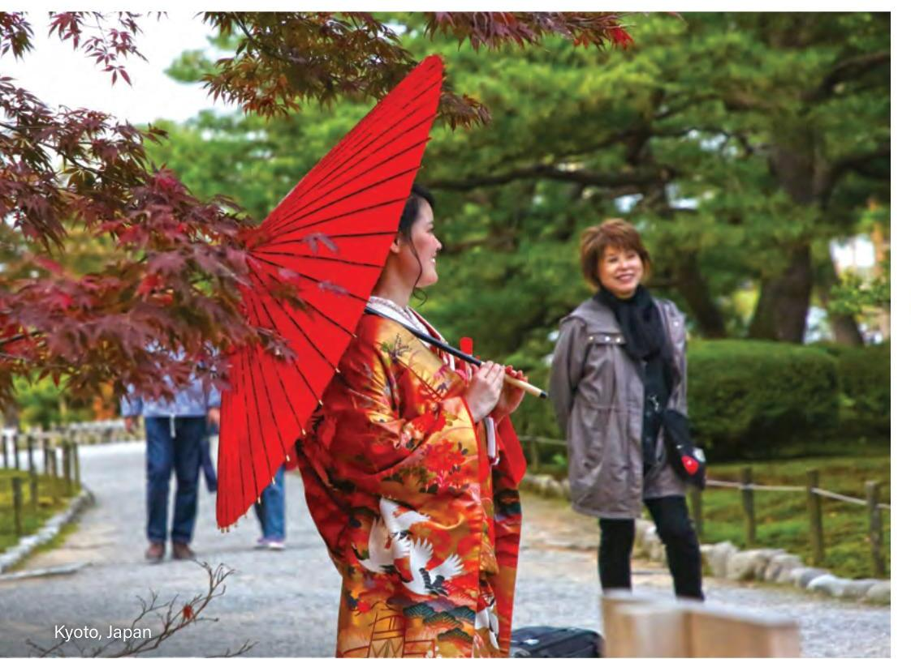

Collette took care of helping us rebook for the same trip again in the future.

This right here is why we LOVE Collette. We have traveled twice with two other companies, and returned to Collette because the service is unmatched."

Roxanne R.

## Page 7

(44) Thank you Collette. I appreciate you having my back!
I will definitely book again with you and be sure to recommend you to my family and friends. You take the people first and not the business. THANK YOU!

- Michael M.
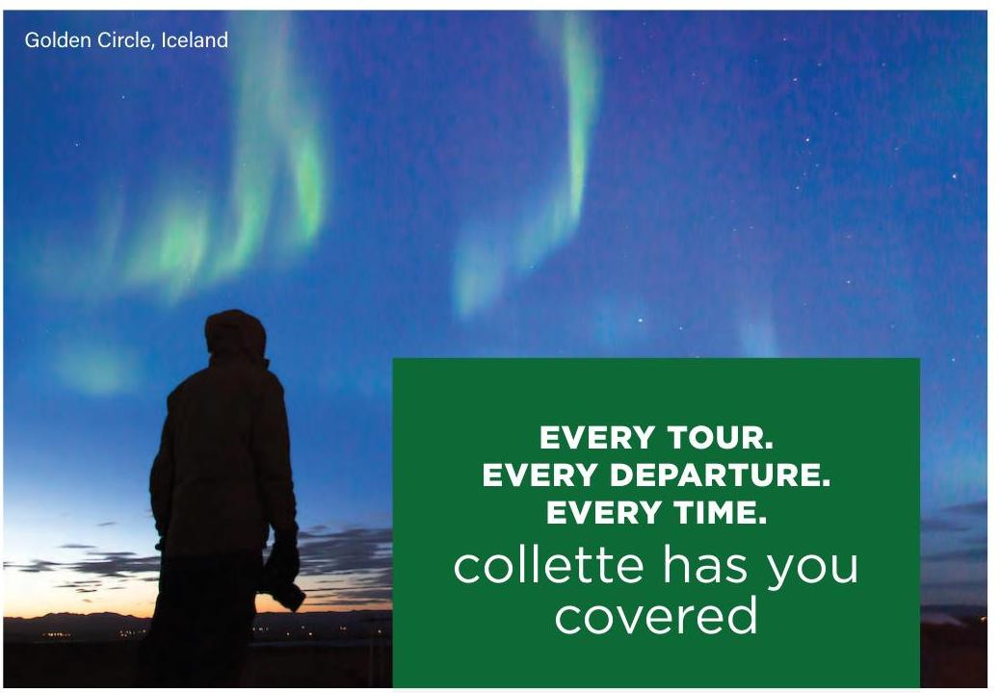

EVERY TOUR. EVERY DEPARTURE. EVERY TIME. collette has you covered
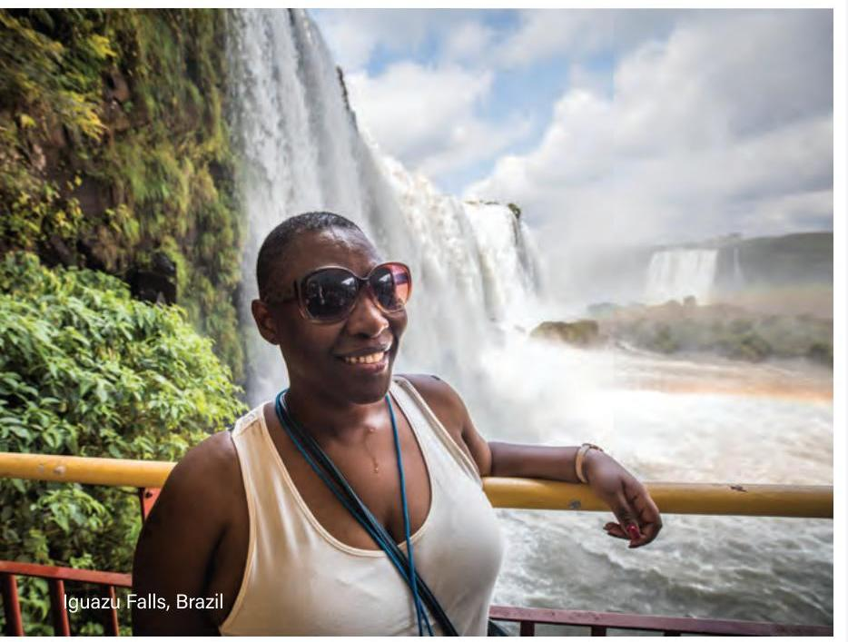

Collette's cancellation policy is the best around!

Better to have it and not need it, than need it and not have it! Collette always takes care of their people!"

- Marisa D.

In addition to covering you for pre-trip cancellation, our Travel Protection Plan also includes:
$\odot$ travel delay support DAILY STIPEND
$\odot$ trip interruption IF YOU NEED TO END YOUR TRIP EARLY
$\odot$ baggage loss or delay
$\odot$ missed connections IF YOU PURCHASED AIR
$\odot$ emergency assistance
$\odot$ access to telehealth services

# PLUS 

If you purchase air* with Collette, your Travel Protection covers your air travel too!
*Flex airfare only, Instant Purchase air is not included in this coverage. Learn more at collette.com/travelprotection.

## Page 8

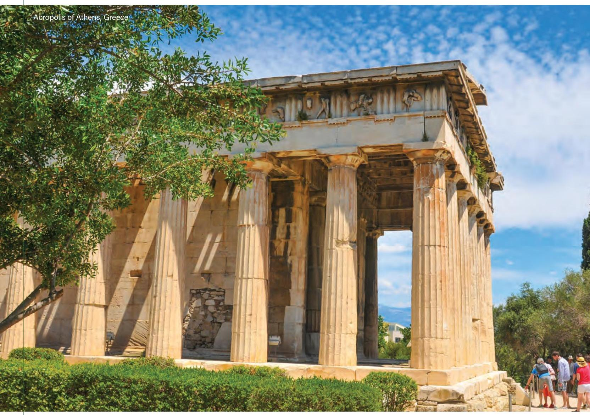

# STABILITY, SECURITY \& TRUST 

know that, no matter what, you'll be taken care of when you travel with Collette

For over 102 years, Collette has helped travelers feel secure and at ease, all while making their travel dreams come true. And that's a fact that will never change.

## Page 9

## TRAVEL PROTECTION

Our industry-leading, worry-free travel protection plan offers you a full refund unlike many plans that only offer a voucher. Cancel for any reason right up to the day prior to departure.
Every tour, every departure, every time - Collette has you covered.

LEARN MORE ON PAGE 98

## 24/7 CUSTOMER SERVICE

We're here for you, always. Our Customer Care Center is waiting to help you, on tour and at home, any time. Pick up the phone, email us, we're always here to help.

## PREPARED CRISIS TEAM

Our dedicated crisis team is ready with defined protocols and responses to any health, safety, or natural event that could occur. They meet weekly - not just in the event of a crisis - and keep in constant contact with governments and partners worldwide to ensure your safety and well-being.

LEARN MORE AT
COLLETTE.COM/TRAVELINGWELL

## STABILITY YOU CAN COUNT ON

Enjoy peace of mind knowing that Collette is rated 4A2 with Dun \& Bradstreet. We are proud of the financial stability we've developed over 102 years in the travel industry.

## THIS IS MORE THAN A BUSINESS this is family

From 1918 to today, Collette has been enhancing lives through travel. And, since Dan Sullivan Sr. bought the company, it's been family owned. That family feeling is ingrained in every relationship we have - from our guests to travel agents, employees to business partners.

The business is led by CEO Dan Sullivan Jr. and his daughter and Collette President, Jaclyn Leibl-Cote (pictured).

## Page 10

# what you'll love ABOUT TRAVELING WITH COLLETTE 

When it comes to traveling with us, all you need to focus on are the incredible times ahead. With $160+$ tours across all 7 continents and 5 different travel styles, you'll find a travel experience that fits you.

## Page 11

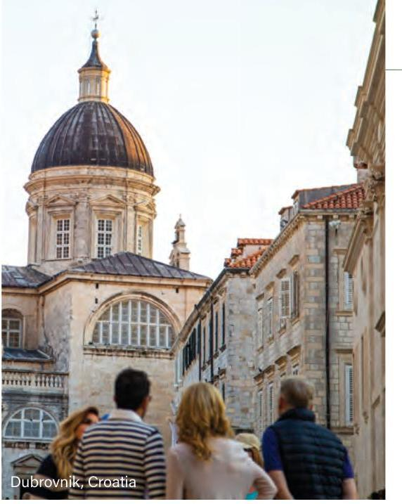

# all the details are covered 

We'll handle everything like transportation and logistics. All you'll need to plan is your free time and to enjoy yourself.

## make your trip your own

We include It's Your Choice excursions on most tours to allow flexibility in your itinerary. Plus, you can add options, extensions, and more to make your trip as unique as you.

## your itinerary is inclusive, yet flexible

Your tour is balanced with must-sees, cultural experiences, and plenty of free time. Plus, our team of experts walk the streets and experience it firsthand.

## your accommodations are arranged

Stay in 4-star and above accommodations, with expertly paced itineraries to keep onenight stays to a minimum.

## many meals included

Get a true taste of a destination with included meals full of local flavor, plus unique culinary experiences like cooking classes, home-hosted meals, and more.

## travel you can feel good about

We seek to make a positive impact on the communities where we live, work, and travel through a variety of programs and initiatives that fit each community's specific needs.

## Page 12

# MORE INCLUDED you're not just going on tour you're having a travel experience 

Wherever your next trip takes you, you'll have everything you need to experience it - accommodations, experiences, many meals, and must-sees included. You also get to personalize your tour with options that you'll enjoy the most. Your on-tour options are curated to enhance your experience, not make up for what's missing.
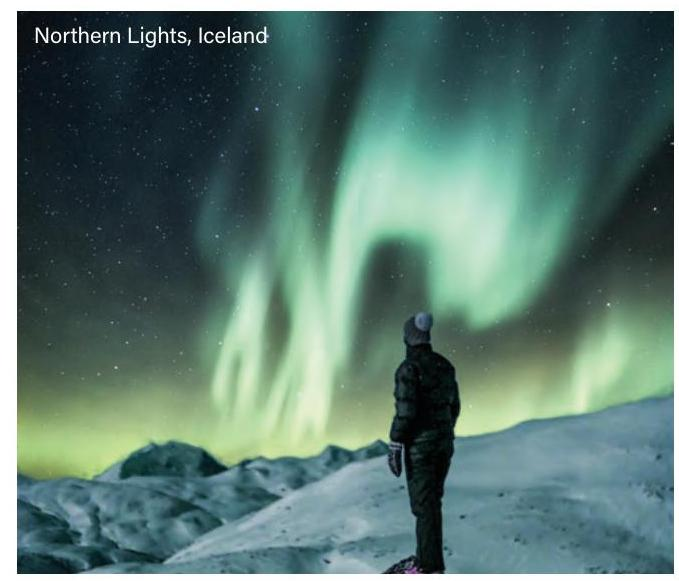
(13) must-sees

They're called "must-sees" for a reason. Our carefully crafted itineraries include those iconic, can't-miss, must-see sights for each of our incredible destinations.

(14) cultural experiences

Our cultural experiences, hand-crafted by our experts, allow you to truly get to know both the destination and the people who call it home.

## Page 13

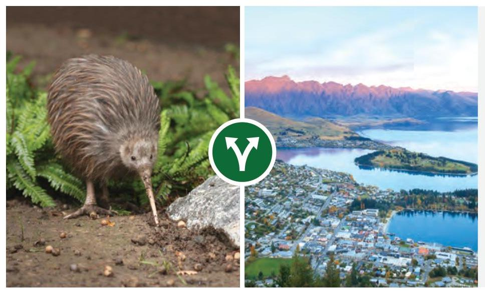

# BIRDWATCHING \& BOB'S PEAK 

Meet some fuzzy and feathered new friends on a birdwatch trip to the Kiwi Birdlife Park OR hop in a gondola that will whisk you away to the top of Bob's Peak in Queenstown for some amazing sights.

SOUTH PACIFIC WONDERS - PG. 83 EXPLORING NEW ZEALAND - PG. 84

## it's your choice

Enjoy more freedom to explore. Your travel experience is personal and should feel unique to you. With that in mind, Collette pioneered It's Your Choice excursions, where you pick the included option you like best. Before your departure, pick whichever excursion you like. On select days (indicated by the icon), you'll set out on your preferred included experience.

## 4-star accommodations

You'll stay in exactly the right spot with accommodations that capture the destination, enrich your experience, and allow you to explore your surroundings.
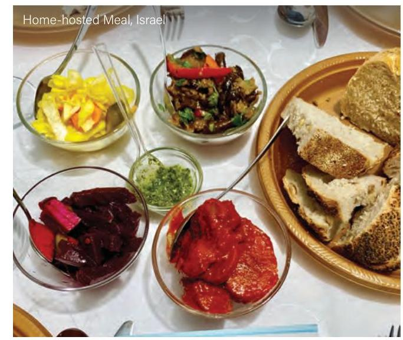
(3) culinary inclusions

Meals become memorable moments.
Our meals are culinary experiences that allow you to explore new cultures in an engaging, not to mention flavorful, way.

## Page 14

# GET TO KNOW our tour managers 

Our Tour Managers are destination experts and pros at navigating a variety of situations. They are highly trained to take care of our guests, including managing emergencies and ensuring a safe and enjoyable experience for every traveler.
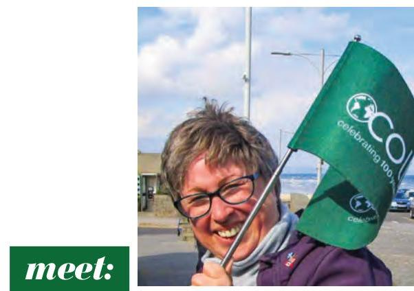

Laura G.

TOUR MANAGER REGION: United Kingdom

## # YEARS AS A COLLETTE TOUR MANAGER: 2

HOMETOWN: North Ayrshire

FAVORITE DESTINATION(S):
Ireland's West Coast

## DO YOU HAVE ANY TOP TIPS FOR OUR TRAVELERS?

If possible, arrive the day before to let yourself shake off your journey and be ready to enjoy your trip. Make sure you bring the right clothes that your tour manager has recommended for your destination. Don't forget comfortable shoes for walking. If they are new, break them in. As we say here in Scotland, "Today's rain is tomorrow's whisky" - come with an open mind. And, be prepared to make new friends and have fun, there will be lots of it!

John P.

TOUR MANAGER REGION: Southeast Asia

## # YEARS AS A COLLETTE TOUR MANAGER:

3

HOMETOWN:
Ho Chi Minh City
FAVORITE DESTINATION(S):
Europe, Japan

## WHY WOULD YOU RECOMMEND GROUP TOURING WITH COLLETTE?

I recommend group touring with Collette because Collette is one of the best guided travel companies in the U.S. Collette has lots of inclusions on tour, you get to travel with an expert tour manager with local knowledge and the tours are very competitively priced.

## Page 15

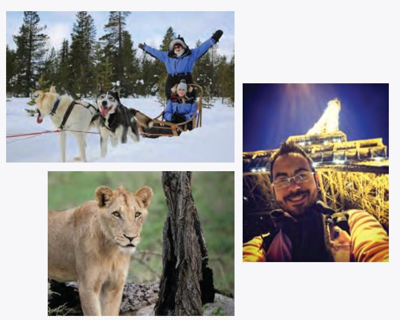

# CAPTURING THE MOMENT 

Our Tour Managers' love of traveling the world really shines through the snapshots they take. Here are a few of our favorite photos that capture the magic of being a Tour Manager out on the road.

## CONNECT WITH COLLETTE

( ) ( ) ( ) $\square$
\#gocollette

## Thabie M.

TOUR MANAGER REGION: Southern Africa

## \# YEARS AS A COLLETTE TOUR MANAGER: 6

HOMETOWN: Cape Town

FAVORITE DESTINATION(S):
NYC, Serengeti

## WHAT'S YOUR FAVORITE COLLETTE ITINERARY AND WHY?

I really enjoy the Exploring South Africa, Victoria Falls \& Botswana tour. This tour includes so many varied experiences! From cosmopolitan Cape Town and rugged coastline drives to amazing safaris and majestic Victoria Falls...there really is something for everyone and each day has a new surprise.

## Giancarlo G.

TOUR MANAGER REGION: South America

## \# YEARS AS A COLLETTE TOUR MANAGER:   4

HOMETOWN: Lima
FAVORITE DESTINATION(S):
Argentina

## WHY WOULD YOU RECOMMEND GROUP TOURING WITH COLLETTE?

Collette has a team behind the scenes that is working to make every tour a unique and special experience. Every tour has an expert Tour Manager in each destination that makes the trip an unforgettable memory, making sure to monitor every detail to ensure excellence. Traveling with Collette is always fun, dinners are amazing, sharing stories and anecdotes of lived travels, creating beautiful memories and new friendships.

## Page 16

# WHAT'S YOUR TRAVEL STYLE? 

No matter how you like to travel, there's a style that fits you. Each travel style has its own unique way of showing you the world.

## Here's what sets each one apart.

Look for the travel style tag on each itinerary.

## SMALL GROUP EXPLORATIONS

a connection to culture

- Ideal for the culturally curious: come home with stories you can't wait to tell.
- Say "yes" to unique experiences you'd be hardpressed to find on your own.
- Hotels that perfectly capture the local vibe mean your exploration never stops.
- Travel today, improve tomorrow with socially responsible Impact Moments and carbon offsetting.

## CLASSIC

iconic sights, enriching experiences

- Ideal for seeing the world's iconic destinations.
- 100+ globe-spanning tours: from close to home to a world away.
- Preferential access to sights means you'll skip the line and spend more time discovering.
- Hit all the highlights at a value-minded price.

## Page 17

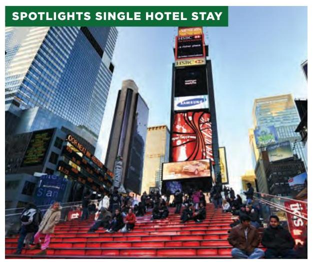

# SPOTLIGHTS 

## go in depth, unpack just once

- Ideal for overpackers, urban explorers, and cultural deep-divers: unpack once at a centrally located hotel.
- 5-9 day stays make great getaways.
- Perfectly choreographed itineraries balance free time with fuller days.
- Know where the locals go with a guide by your side.
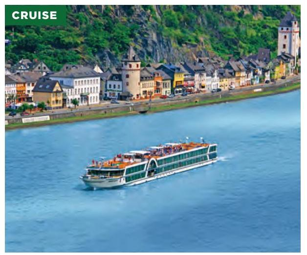

## CRUISE

explore the world's scenic waterways

- Ideal for those who think some of the best sightseeing comes from the deck of a boat.
- Step off the boat and right into the culture with included onshore excursions and experiences.
- Many exclusive departures mean you and your fellow Collette travelers are the only ones on board.
- Private yachts to small ships, iconic rivers to open sea: see the world by water.
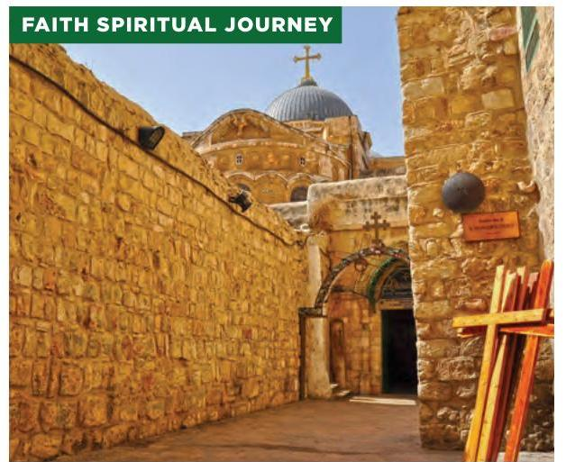

## FAITH

spiritual journeys

- Ideal for those who wish to connect with their faith on a deeper level.
- Reverent and reflective: from shrines \& holy sites to included Mass on many tours.
- Take a personal pilgrimage: walk in the footsteps of your faith's forefathers.
- Modest 3-star accommodations capture the humble surroundings in which they sit.

## Page 18

# United States 

## CANYON COUNTRY

## 8 DAYS / 10 MEALS / STARTING AT \$2,799* PP PRICE BASED ON AUGUST 6, 2021 DEPARTURE.

View our website for additional dates.
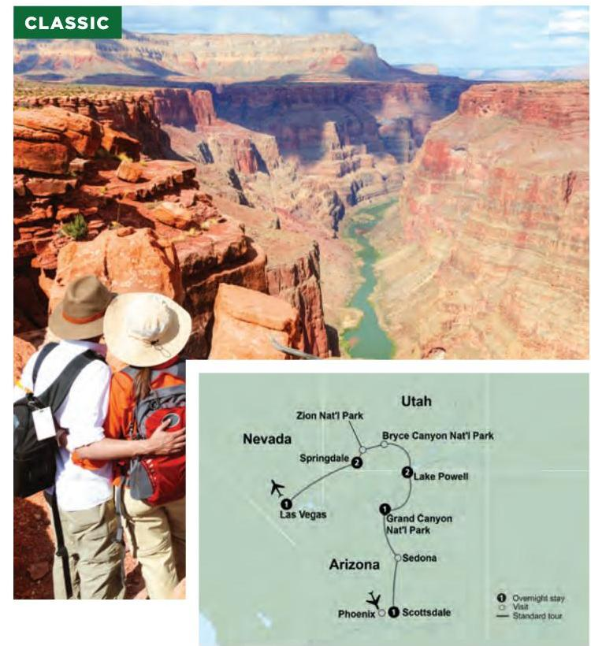

From the imposing Grand Canyon and serenity of Lake Powell to the opulence of Las Vegas, you'll see the Southwest's most-prized sites.

## HIGHLIGHTS

- Take in scenic Sedona and Oak Creek Canyon.
- Climb aboard Zion's open-air tram with a guide.
- Behold the breathtaking views of the Grand Canyon.
- Explore the spires of Bryce Canyon National Park.
- Marvel at the sandstone cliffs of Zion National Park.

## STAYS

1 Night Scottsdale, Arizona / 1 Night Grand Canyon, Arizona / 2 Nights Page, Arizona / 2 Nights Springdale, Utah / 1 Night Las Vegas, Nevada

## PAINTED CANYONS OF THE WEST

9 DAYS / 11 MEALS / STARTING AT \$2,999* PP PRICE BASED ON AUGUST 15, 2021 DEPARTURE.

View our website for additional dates.

Venture across the West as you take in the siennacolored canyons, towering spires and still desert landscapes found in Utah's five national parks.

## HIGHLIGHTS

- Explore Arches and Canyonlands national parks.
- Take in some scenery on Utah's most scenic byways.
- Behold incredible views at Zion National Park.
- Scan the spires of Bryce Canyon National Park.
- Experience a sunset "Cowboy Dinner" in Moab.

## STAYS

1 Night Denver, Colorado / 1 Night Grand Junction, Colorado / 2 Nights Moab, Utah / 1 Night Bryce, Utah / 2 Nights Springdale, Utah / 1 Night Las Vegas, Nevada

## VISIT COLLETTE.COM/634 FOR MORE DETAILS.

## Page 19

## NATIONAL PARKS OF AMERICA

12 DAYS / 16 MEALS / STARTING AT \$3,999* PP PRICE BASED ON SEPTEMBER 29, 2021 DEPARTURE.

View our website for additional dates.
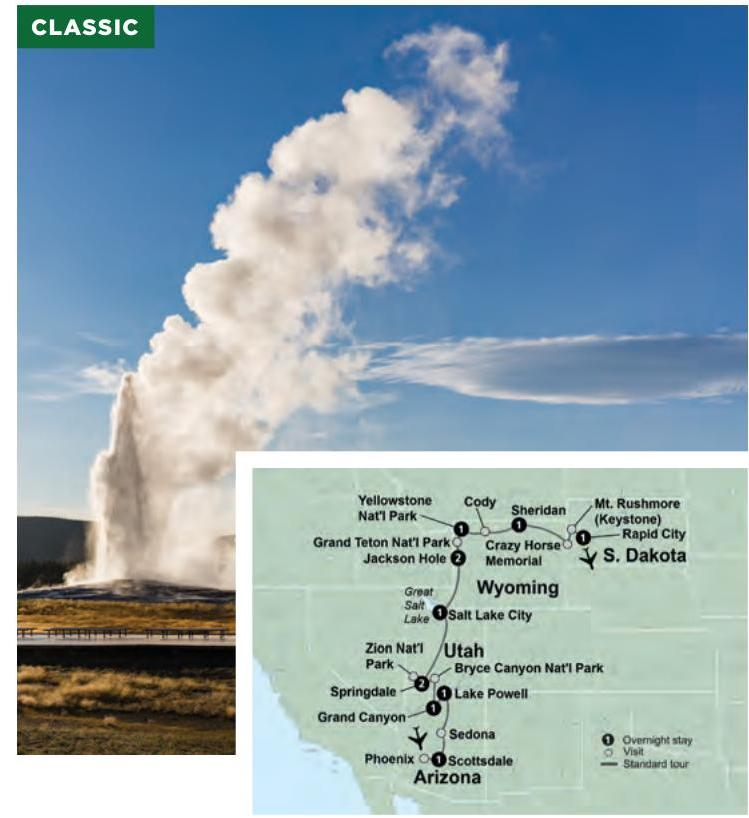

Experience the grandeur of the American West as you explore five fantastic national parks on this exciting journey.

## HIGHLIGHTS

- Explore the Buffalo Bill Center of the West.
- Meet Native Americans and learn about their culture.
- Spend a night at the spectacular Grand Canyon.
- Visit Yellowstone National Park's most famous geyser.
- Behold the famous Mount Rushmore.

## STAYS

1 Night Scottsdale, Arizona / 1 Night Grand Canyon, Arizona / 1 Night Page, Arizona / 2 Nights Springdale, Utah / 1 Night Salt Lake City, Utah / 2 Nights Jackson Hole, Wyoming / 1 Night Yellowstone National Park / 1 Night Sheridan, Wyoming / 1 Night Rapid City, South Dakota

VISIT COLLETTE.COM/93 FOR MORE DETAILS.

## AMERICA'S NATIONAL PARKS \& DENVER

14 DAYS / 20 MEALS / STARTING AT \$4,899* PP PRICE BASED ON JUNE 25, 2022 DEPARTURE.

View our website for additional dates.

Gain a new appreciation of the great outdoors on this journey that takes you from the Grand Canyon to Rocky Mountain National Park and everywhere in between.

## HIGHLIGHTS

- Meet Native Americans and learn about their culture.
- Spend a night at the spectacular Grand Canyon.
- Visit Yellowstone National Park's most famous geyser.
- Behold the famous Mount Rushmore.
- Spend two nights in the "Mile High City," Denver.

## STAYS

1 Night Scottsdale, Arizona / 1 Night Grand Canyon, Arizona / 1 Night Page, Arizona / 2 Nights Springdale, Utah / 1 Night Salt Lake City, Utah / 2 Nights Jackson Hole, Wyoming / 1 Night Yellowstone National Park / 1 Night Sheridan, Wyoming / 1 Night Rapid City, South Dakota / 2 Nights Denver, Colorado

VISIT COLLETTE.COM/93 FOR MORE DETAILS.

## Page 20

# united states 

## ALASKA DISCOVERY LAND \& CRUISE

12 DAYS / 26 MEALS / STARTING AT \$3,649 PRICE BASED ON MAY 17, 2022 DEPARTURE.

View our website for additional dates.

Cruise the Inside Passage and uncover stunning wildlife in Alaska's Denali National Park on this breathtaking journey from Alaska to Washington.

## HIGHLIGHTS

- Journey from Denali to Talkeetna in a luxury railcar.
- Enjoy an expert-guided Tundra Wilderness Tour.
- Relive Alaska's Gold Rush days in historic Skagway.
- Relax aboard a 7-night Princess cruise.
- Sail through Glacier Bay and by the Hubbard Glacier.

## STAYS

1 Night Fairbanks, Alaska / 2 Nights Denali National Park, Alaska / 1 Night Denali, Alaska / 7 Night Cruise Aboard Princess Cruises

## VISIT COLLETTE.COM/148 FOR MORE DETAILS.

## ALASKA'S NORTHERN LIGHTS

7 DAYS / 11 MEALS / STARTING AT \$2,999* PP PRICE BASED ON MARCH 28, 2022 DEPARTURE.

View our website for additional dates.
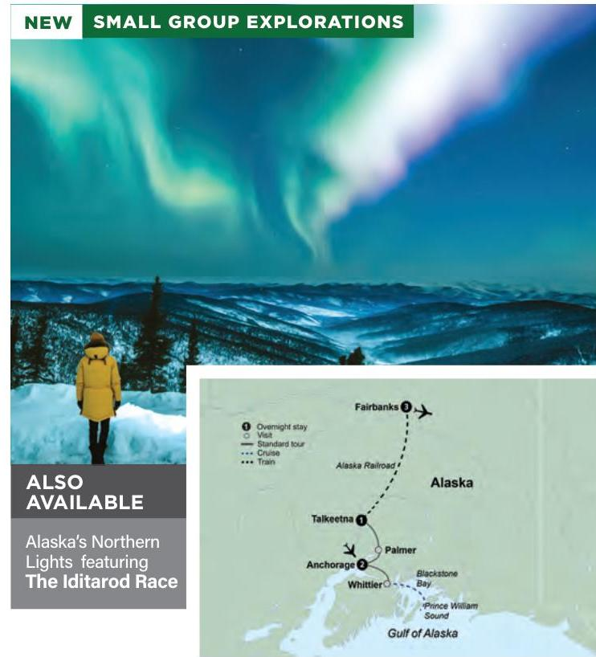

Take a snowy peek into Alaska. Visit the friendly local towns of the last frontier and bond with energetic sled dogs.

## HIGHLIGHTS

- Search for the northern lights in Fairbanks' star-filled sky.
- Hop in a sled and experience dog mushing like a local.
- Visit Musk Ox Farm and learn about the sustainable domestication project.
- Pass by glaciers on a cruise through Prince William Sound.
- Enjoy a scenic train ride via the Alaska Railroad.

## STAYS

2 Nights Anchorage / 1 Night Talkeetna / 3 Nights Fairbanks

## VISIT COLLETTE.COM/660 FOR MORE DETAILS.

## Page 21

## HAWAIIAN ADVENTURE

10 DAYS / 13 MEALS / STARTING AT \$3,599* PP PRICE BASED ON DECEMBER 2, 2021 DEPARTURE.

View our website for additional dates.
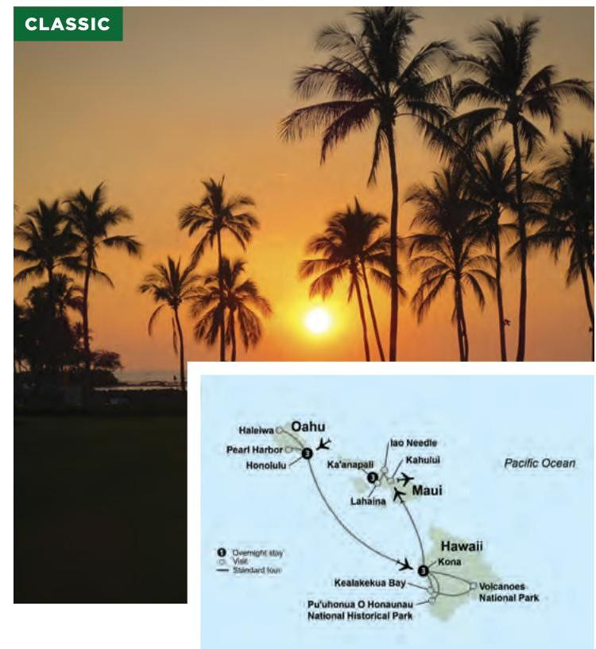

Embrace the spirit of "Aloha" on a leisurely three-island tour of Hawaii featuring 3-night stays each on Oahu, Kauai and Maui.

## HIGHLIGHTS

- Enjoy a cruise on tranquil Wailua River in Kauai.
- Behold the breathtaking Waimea Canyon.
- Journey along Oahu's famous North Shore.
- Remember Pearl Harbor at the USS Arizona Memorial.
- Savor a Polynesian luau featuring tropical drinks.
- Learn about coffee at the biggest estate in Hawaii.

## STAYS

3 Nights Oahu, Hawaii / 3 Nights Kona, Hawaii / 3 Nights Maui, Hawaii

## VISIT COLLETTE.COM/98 FOR MORE DETAILS.

## PACIFIC NORTHWEST \& CALIFORNIA

8 DAYS / 10 MEALS / STARTING AT \$2,499* PP PRICE BASED ON SEPTEMBER 5, 2021 DEPARTURE.

View our website for additional dates.
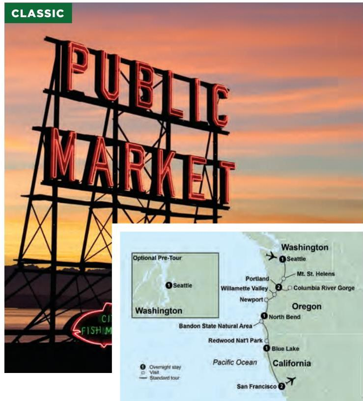

Fall under the spell of the Pacific Northwest and California, from the wilds of Mount St. Helens to the shadow of giants in the Redwoods.

## HIGHLIGHTS

- Visit Seattle's famous fish and vegetable market.
- Learn about the eruptions of Mount St. Helens.
- Experience a wine tasting and visit to a lavender farm.
- Embark on a sightseeing tour of Seattle.
- Behold the majestic beauty of the Redwood Forest.

## STAYS

1 Night Seattle, Washington / 2 Nights Portland, Oregon / 1 Night North Bend, Oregon / 1 Night Blue Lake, California / 2 Nights San Francisco, California

VISIT COLLETTE.COM/66 FOR MORE DETAILS.

## Page 22

# United States 

## CALIFORNIA DREAMIN' MONTEREY, YOSEMITE \& NAPA

## 8 DAYS / 12 MEALS / STARTING AT \$2,499* PP PRICE BASED ON MARCH 7, 2022 DEPARTURE.

View our website for additional dates.
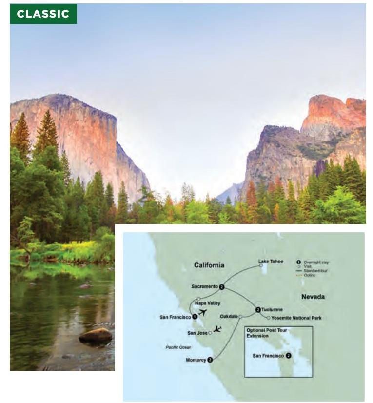

This is the essence of Northern California, from fine wine and freshly caught seafood to vibrant cities and nature on an epic scale.

## HIGHLIGHTS

- Marvel at the views along scenic 17-Mile Drive.
- Take a tram tour through Yosemite National Park.
- Meet a local farmer in the Central Valley and sample some of their farm's produce.
- Sample local vintages during a winery tour and tasting in Napa Valley.

## STAYS

2 Nights Monterey / 2 Nights Tuolumne (Yosemite) /
2 Nights Sacramento / 1 Night San Francisco

## AMERICA'S   COWBOY COUNTRY

8 DAYS / 10 MEALS / STARTING AT \$2,599* PP PRICE BASED ON OCTOBER 4, 2021 DEPARTURE.

View our website for additional dates.
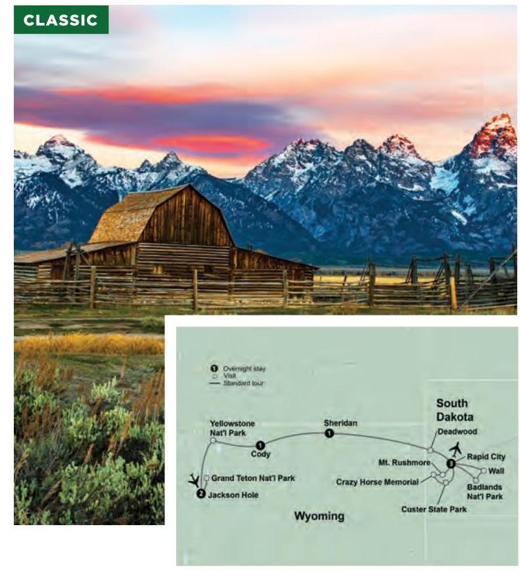

Grab your Stetson hat and saddle up for an adventure as you discover America's Wild West from Jackson Hole to Rapid City.

## HIGHLIGHTS

- Experience rugged Badlands National Park along the famed Loop Road.
- Watch an eruption of the Old Faithful geyser.
- Search for herds of buffalo in Custer State Park.
- Explore Yellowstone National Park.
- Visit the Old West landmark town of Deadwood.

## STAYS

2 Nights Jackson, Wyoming / 1 Night Cody, Wyoming /
1 Night Sheridan, Wyoming / 3 Nights Rapid City, South Dakota

VISIT COLLETTE.COM/438 FOR MORE DETAILS.

## Page 23

## SPOTLIGHT ON SOUTH DAKOTA

7 DAYS / 9 MEALS / STARTING AT \$1,999* PP PRICE BASED ON AUGUST 20, 2021 DEPARTURE.

View our website for additional dates.
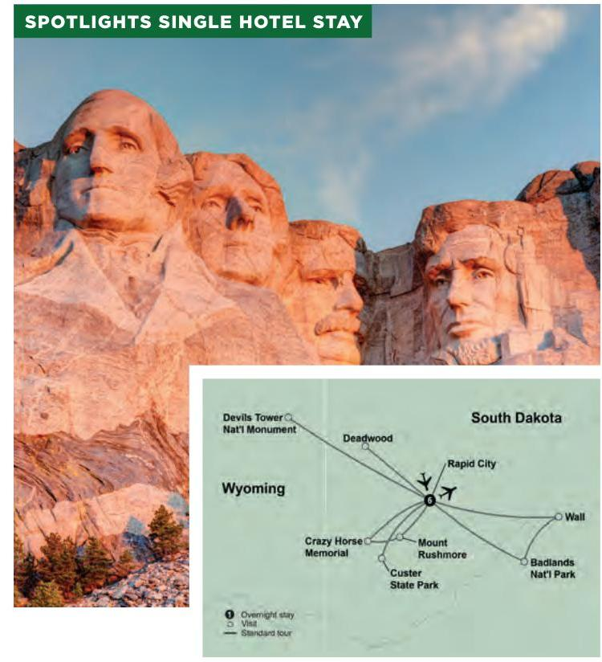

From Deadwood to the High Plains, the spirit of the American West comes alive where the blacktop meets the dust.

## HIGHLIGHTS

- Hear stories from a Native American chronicler.
- Travel to the legendary Badlands National Park.
- Visit the iconic Mount Rushmore.
- Visit the Old West landmark town of Deadwood.
- Taste local flavors during a western dinner show.

## STAYS

6 Nights Rapid City, South Dakota

## THE COLORADO ROCKIES

9 DAYS / 11 MEALS / STARTING AT \$2,599* PP PRICE BASED ON MAY 20, 2022 DEPARTURE.

View our website for additional dates.
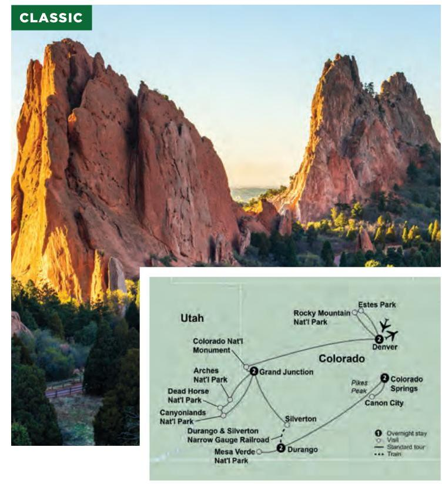

Experience the grand landscape of the American West as you journey from the "Mile High City" to Colorado Springs on this spirited adventure.

## HIGHLIGHTS

- Spend two nights in the cowboy town of Durango.
- Enjoy the mountainous Royal Gorge Route Railroad.
- Visit the Arches and Rocky Mountain national parks.
- Visit a majestic mesa at Canyonlands National Park.
- Experience an Old West adventure and cowboy cuisine.

## STAYS

2 Nights Denver, Colorado / 2 Nights Grand Junction, Colorado / 2 Nights Durango, Colorado / 2 Nights Colorado Springs, Colorado

VISIT COLLETTE.COM/282 FOR MORE DETAILS.

## Page 24

# United States 

## ALBUQUERQUE BALLOON FIESTA

6 DAYS / 7 MEALS/ STARTING AT \$1,999* PP PRICE BASED ON OCTOBER 6, 2021 DEPARTURE.

View our website for additional dates.
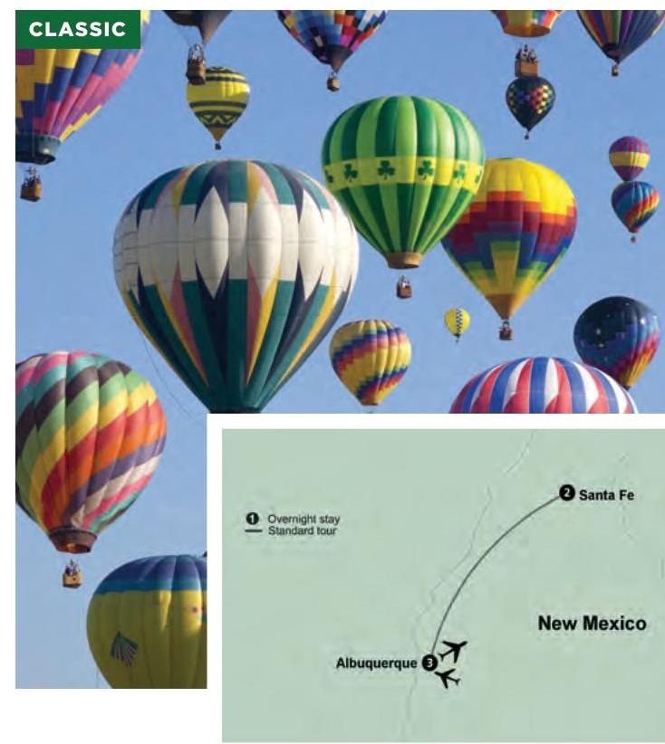

Up, up, and away. Witness one of the world's most spectacular airborne events and be enriched by the diverse cultures of New Mexico.

## HIGHLIGHTS

- Embark on a ride along the eclectic Route 66.
- Tour the National Museum of Nuclear Science \& History.
- View art at the Indian Pueblo Cultural Center.
- Behold the Albuquerque International Balloon Fiesta.
- Become a chef at the Santa Fe School of Cooking.

## STAYS

3 Nights Albuquerque, New Mexico /
2 Nights Santa Fe, New Mexico

## SPOTLIGHT ON SANTA FE

6 DAYS / 8 MEALS / STARTING AT \$1,599* PP PRICE BASED ON NOVEMBER 7, 2021 DEPARTURE.

View our website for additional dates.
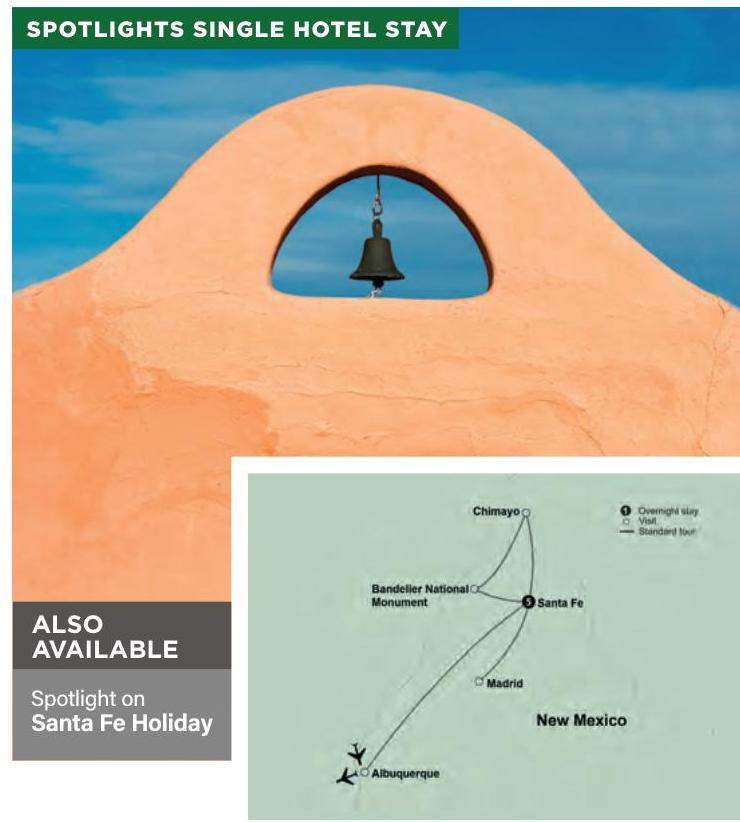

Feel inspired by the creative spirit that runs free through Santa Fe, a city Native Americans called the "Dancing Ground of the Sun."

## HIGHLIGHTS

- Take an open-air trolley tour of Santa Fe.
- Visit the pilgrimage site of El Santuario de Chimayo.
- Visit the rugged Bandelier National Monument.
- Amble through the Allan Houser Sculpture Garden.
- Make a tamale at the Santa Fe School of Cooking.

## STAYS

5 Nights Santa Fe, New Mexico

VISIT COLLETTE.COM/453 FOR MORE DETAILS.

## Page 25

## SPOTLIGHT ON SAN ANTONIO

5 DAYS / 5 MEALS / STARTING AT \$1,449* PP PRICE BASED ON SEPTEMBER 26, 2021 DEPARTURE.

View our website for additional dates.
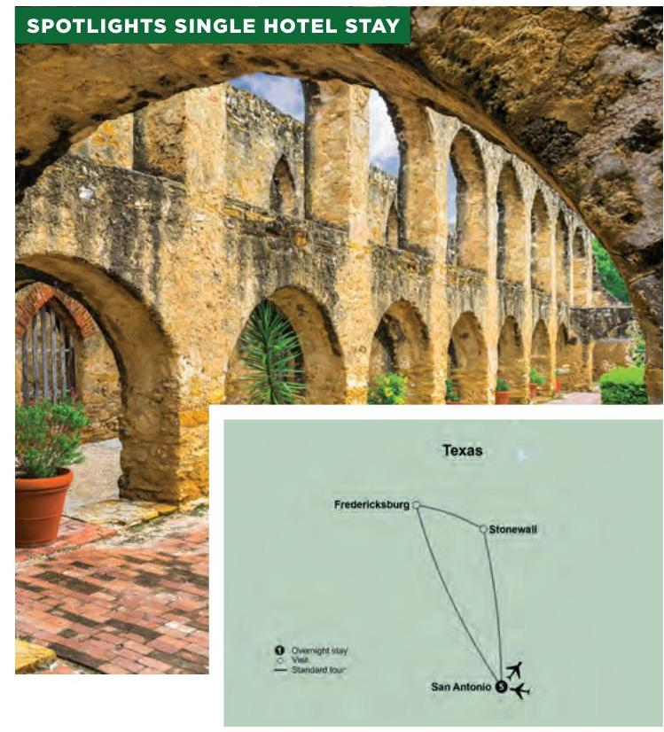

Say howdy to Texas as you take in San Antonio's enchanting River Walk and the legendary Alamo.

## HIGHLIGHTS

- Discover the German settlement of Fredericksburg set in the Hill Country.
- Experience El Mercado, the Mexican Marketplace.
- Visit the Alamo battle site.
- Tour San Antonio with an expert local guide.
- Cruise down the Paseo del Rio by boat.

## STAYS

4 Nights San Antonio, Texas

## VISIT COLLETTE.COM/64 FOR MORE DETAILS.

## SPOTLIGHT ON SAN ANTONIO HOLIDAY

5 DAYS / 5 MEALS / STARTING AT \$1,499* PP PRICE BASED ON DECEMBER 2, 2021 DEPARTURE.

View our website for additional dates.
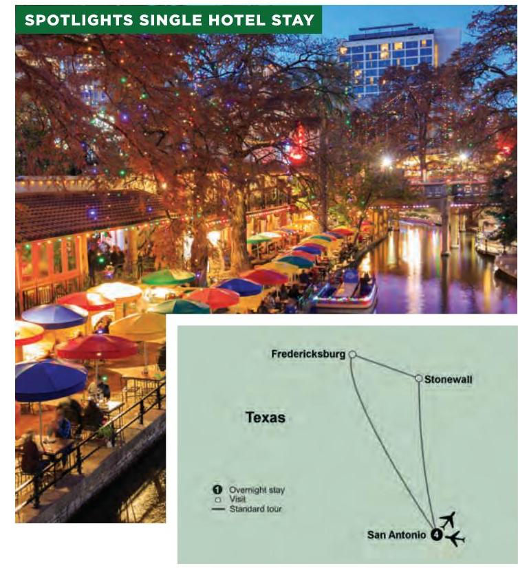

Enjoy the cheerful spirit of San Antonio, decked out in its holiday finest, on this relaxing Texan retreat.

## HIGHLIGHTS

- Discover Fredericksburg in the rural Hill Country.
- Go holiday shopping at El Mercado.
- Cruise the festively decorated Paseo del Rio by boat.
- Visit the Alamo battle site.
- Tour San Antonio with an expert local guide.

## STAYS

4 Nights San Antonio, Texas

## VISIT COLLETTE.COM/64 FOR MORE DETAILS.

## Page 26

# United States 

## MACKINAC ISLAND

8 DAYS / 11 MEALS / STARTING AT \$2,799* PP PRICE BASED ON OCTOBER 1, 2021 DEPARTURE.

View our website for additional dates.
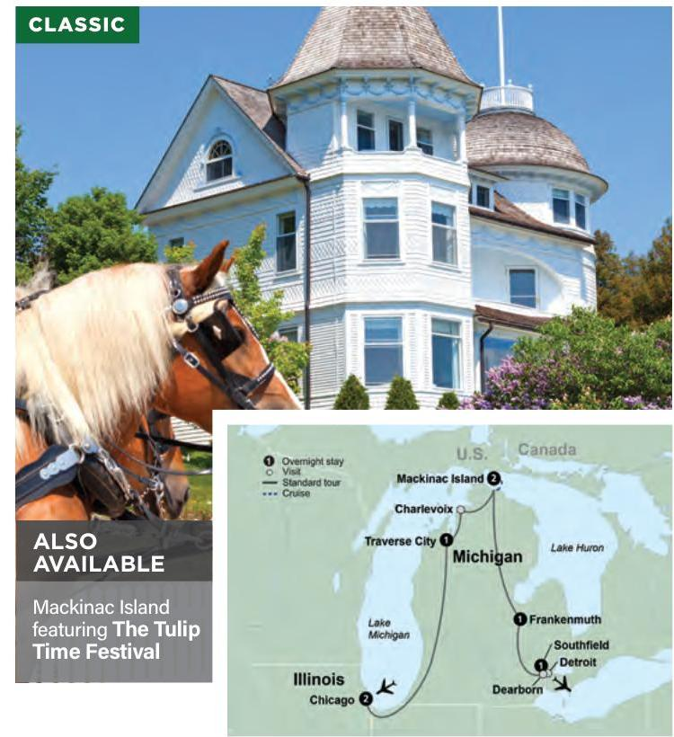

Discover the Midwest and all its charm on this delightful journey from idyllic Mackinac Island to the dynamic Great Lakes region.

## HIGHLIGHTS

- Visit the Henry Ford Museum and Greenfield Village.
- Take a horse-drawn carriage tour of Mackinac Island.
- Visit the world's largest Christmas Store.
- Stroll through Chicago's Millennium Park.
- Dine at the Grand Hotel where "every meal is an event."

## STAYS

2 Nights Chicago, Illinois / 1 Night Traverse City, Michigan / 2 Nights Mackinac Island, Michigan / 1 Night Frankenmuth, Michigan / 1 Night Southfield, Michigan

## VISIT COLLETTE.COM/57 FOR MORE DETAILS.

## BLUEGRASS COUNTRY \& THE SMOKY MOUNTAINS

9 DAYS / 13 MEALS / STARTING AT \$2,699* PP PRICE BASED ON OCTOBER 28, 2021 DEPARTURE.

View our website for additional dates.
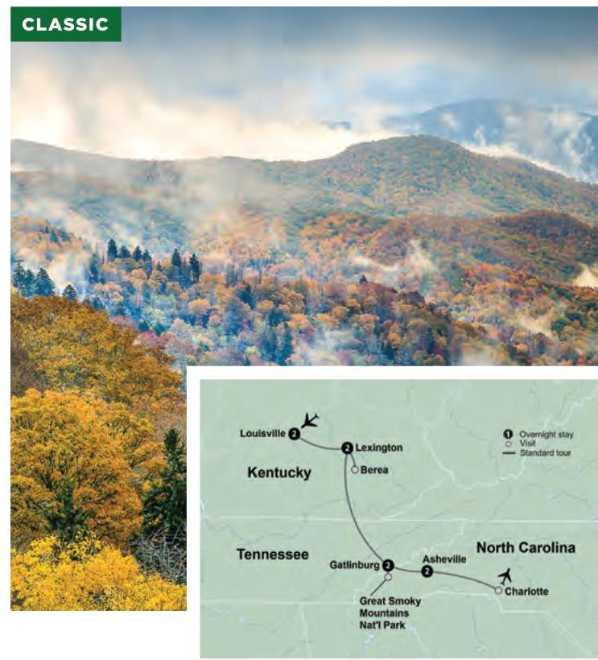

Take a delightful trip through the heart of Appalachia, discovering the culture and spirit of Kentucky, Tennessee, and North Carolina.

## HIGHLIGHTS

- Visit a private horse farm in Lexington, Kentucky.
- Watch local artist demonstrations in Berea.
- Visit Louisville and Churchill Downs.
- Explore the Great Smoky Mountains National Park.
- Taste local bourbon at a Kentucky distillery.

## STAYS

2 Nights Louisville, Kentucky / 2 Nights Lexington, Kentucky / 2 Nights Gatlinburg, Tennessee / 2 Nights Asheville, North Carolina

## VISIT COLLETTE.COM/59 FOR MORE DETAILS.

## Page 27

## NASHVILLE \& THE SMOKY MOUNTAINS HOLIDAY

8 DAYS / 11 MEALS / STARTING AT \$2,799* PP PRICE BASED ON DECEMBER 10, 2021 DEPARTURE.

View our website for additional dates.
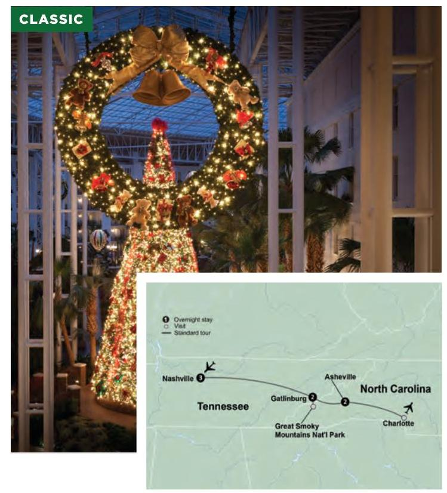

Enjoy the sights and sounds of Nashville, Gatlinburg and Asheville all decked out for the holidays.

## HIGHLIGHTS

- Take in Gaylord Opryland's magical holiday displays.
- Explore the Great Smoky Mountains National Park.
- Taste Smoky Mountain moonshine.
- Enjoy dinner with Dolly Parton's Christmas Stampede.
- Tour Music City's oldest remaining recording studio.

## STAYS

3 Nights Nashville, Tennessee / 2 Nights Gatlinburg, Tennessee / 2 Nights Asheville, North Carolina

## AMERICA'S MUSIC CITIES

8 DAYS / 10 MEALS / STARTING AT \$2,699* PP PRICE BASED ON OCTOBER 10, 2021 DEPARTURE.

View our website for additional dates.
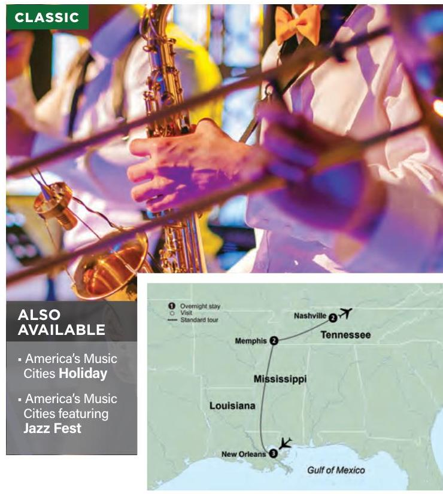

Blues, rock, soul - and all that jazz. Unearth the roots of American music and celebrate jazz in the place it was born.

## HIGHLIGHTS

- Learn about Memphis history from local musicians.
- Enjoy reserved seats at the Grand Ole Opry.
- Tour Nashville's oldest remaining recording studio.
- Visit Graceland, the palatial home of Elvis Presley.
- Explore the Country Music Hall of Fame.

## STAYS

3 Nights New Orleans, Louisiana / 2 Nights Memphis, Tennessee / 2 Nights Nashville, Tennessee

VISIT COLLETTE.COM/376 FOR MORE DETAILS.

## Page 28

# United States 

## SPOTLIGHT ON NASHVILLE

5 DAYS / 7 MEALS / STARTING AT \$1,799* PP PRICE BASED ON OCTOBER 24, 2021 DEPARTURE.

View our website for additional dates.
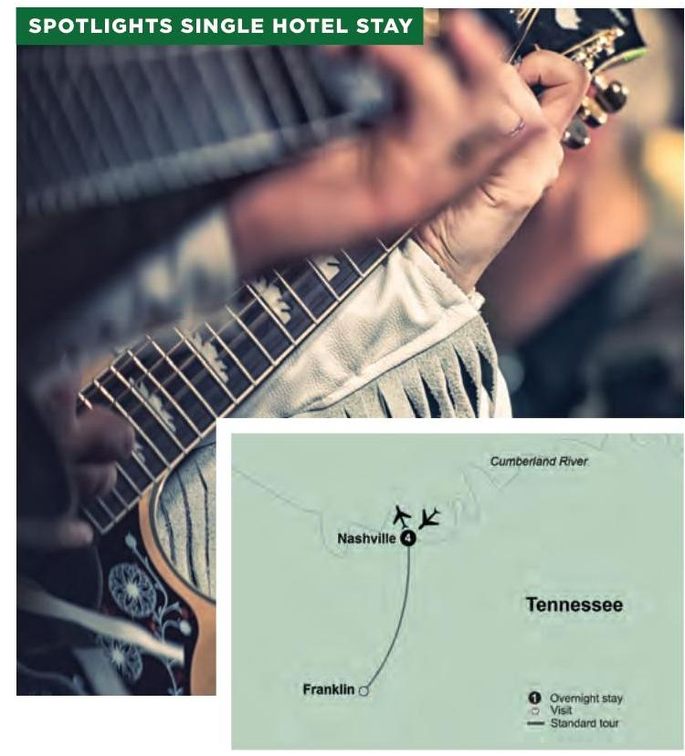

Walk in the footsteps of music legends and feel the beat of the city's dynamic energy.

This is Nashville.

## HIGHLIGHTS

- Learn to line-dance at Wild Horse Saloon.
- Tour the city with a hop-on hop-off trolley.
- Peruse the Country Music Hall of Fame.
- Tour the oldest remaining recording studio.
- Enjoy a reserved seat at the Grand Ole Opry.

## STAYS

4 Nights Nashville, Tennessee

## VISIT COLLETTE.COM/650 FOR MORE DETAILS.

## SPOTLIGHT ON NEW ORLEANS

5 DAYS / 6 MEALS / STARTING AT \$1,499* PP PRICE BASED ON OCTOBER 3, 2021 DEPARTURE.

View our website for additional dates.
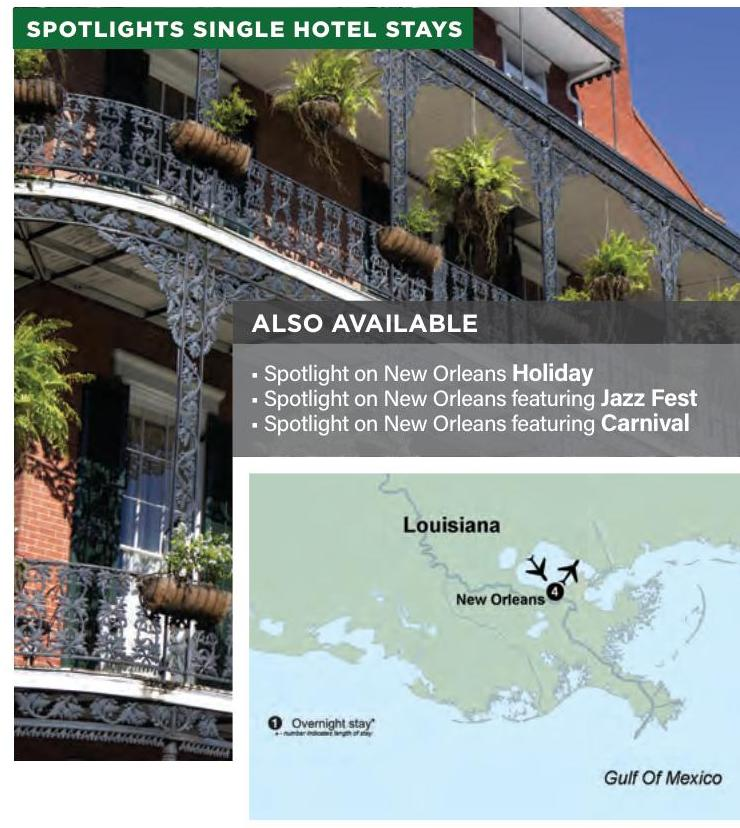

Get a taste of Louisiana's cultural melting pot as you take in the sights, sounds and flavors of "The Big Easy."

## HIGHLIGHTS

- Indulge at a jazz club in the French Quarter.
- Tour Louisiana's swamp country with a guide.
- Walk the famous French Quarter with a local guide.
- Enjoy a panoramic tour of historic New Orleans.
- Prepare New Orleans favorites at a cooking class.

## STAYS

4 Nights New Orleans, Louisiana

## VISIT COLLETTE.COM/80 FOR MORE DETAILS.

## Page 29

## SOUTHERN CHARM

7 DAYS / 9 MEALS / STARTING AT \$2,499* PP PRICE BASED ON OCTOBER 31, 2021 DEPARTURE.

View our website for additional dates.
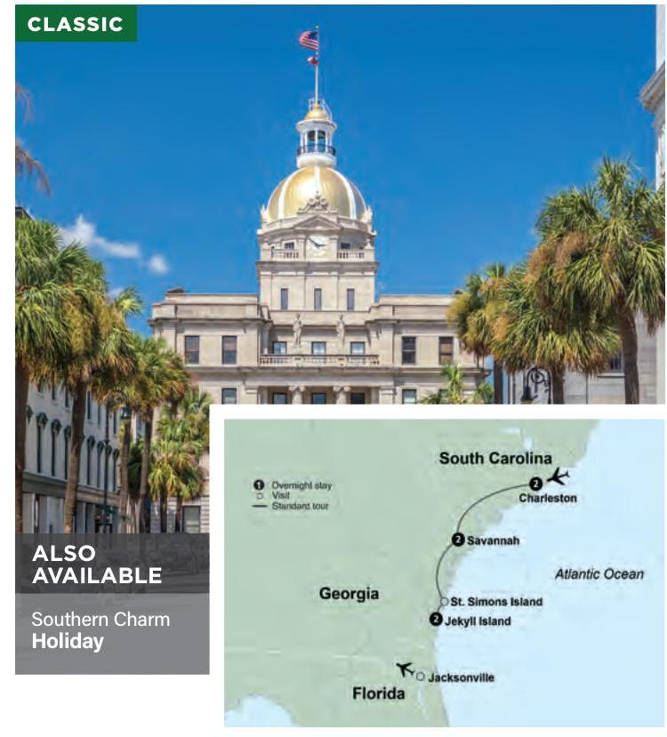

Embrace the leisurely pace and charming allure of America's southeast as you explore cobblestone streets, historic homes and unspoiled coastline.

## HIGHLIGHTS

- Explore Boone Hall Plantation \& Gardens just outside of Charleston.
- Visit St. Simons Island's 106' tall lighthouse.
- Peruse the historic Charleston City Market.
- Enjoy a trolley tour of Savannah's Historic District.
- Step back in time at the opulent Jekyll Island Club.

## STAYS

2 Nights Charleston, South Carolina / 2 Nights
Savannah, Georgia / 2 Nights Jekyll Island, Georgia

## HERITAGE OF AMERICA

9 DAYS / 12 MEALS / STARTING AT \$2,499* PP PRICE BASED ON OCTOBER 24, 2021 DEPARTURE.

View our website for additional dates.
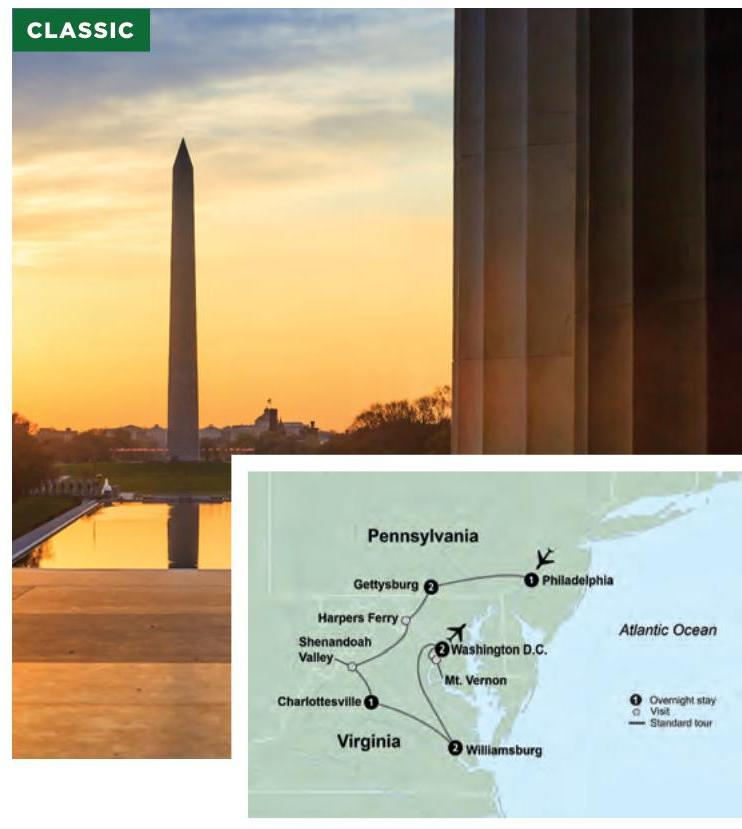

Retrace the events that shaped American history. Journey along a storied trail from Philadelphia to Washington, D.C.

## HIGHLIGHTS

- Explore the Civil War history of Gettysburg.
- Stroll the grounds of historic Colonial Williamsburg.
- Visit the National Air \& Space Museum or the National Museum of American History.
- Visit the White House and the Capitol building.
- Dine in a tavern specializing in colonial fare.

## STAYS

1 Night Philadelphia, Pennsylvania / 2 Nights Gettysburg, Pennsylvania / 1 Night Charlottesville, Virginia / 2 Nights Williamsburg, Virginia / 2 Nights Washington, D.C.

VISIT COLLETTE.COM/82 FOR MORE DETAILS.

## Page 30

# United States 

## SPOTLIGHT ON WASHINGTON, D.C.

6 DAYS / 8 MEALS / STARTING AT \$1,999* PP PRICE BASED ON OCTOBER 14, 2021 DEPARTURE.

View our website for additional dates.
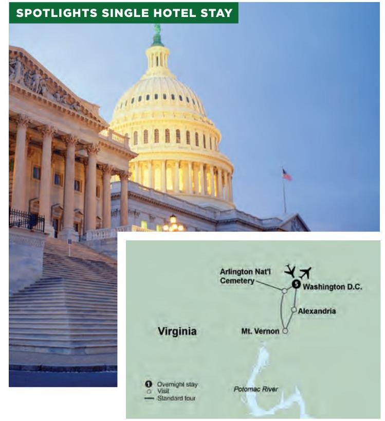

A story of liberty. A story of democracy. Walk the path forged by leaders of the free world in America's spirited capital.

## HIGHLIGHTS

- Visit the home of former president George Washington.
- Behold the impressive Washington National Cathedral.
- Stop at the infamous Ford's Theatre.
- Spend 5 nights in the heart of Washington, D.C.
- Tour the iconic and storied U.S. Capitol building.

## STAYS

5 Nights Washington, D.C.

## WASHINGTON D.C.,   NIAGARA FALLS \& NYC

9 DAYS / 11 MEALS / STARTING AT \$2,499* PP PRICE BASED ON APRIL 22, 2022 DEPARTURE.

View our website for additional dates.
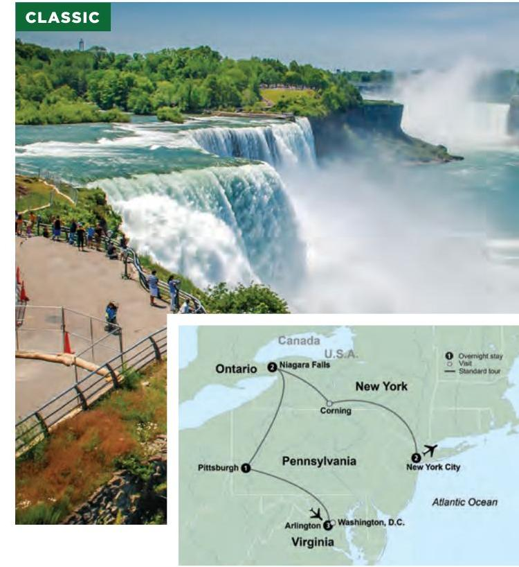

Get acquainted with some of North America's most iconic destinations on a journey that takes you from the seat of democracy in Washington, D.C. to the majestic beauty of Niagara Falls and the bustling energy of New York City.

## HIGHLIGHTS

- Get a view of Pittsburgh on the Duquesne Incline.
- Reflect at the 9/11 Memorial \& Museum.
- Enjoy dinner overlooking Niagara Falls.
- Learn the history of the White House from within.
- Explore the renowned museums of Washington, D.C.

## STAYS

3 Nights Arlington / 1 Night Pittsburgh / 2 Nights Niagara Falls / 2 Nights New York City

## VISIT COLLETTE.COM/643 FOR MORE DETAILS.

## Page 31

## SPOTLIGHT ON NEW YORK CITY   5 DAYS / 5 MEALS / STARTING AT \$1,899* PP PRICE BASED ON MARCH 23, 2022 DEPARTURE.   View our website for additional dates.

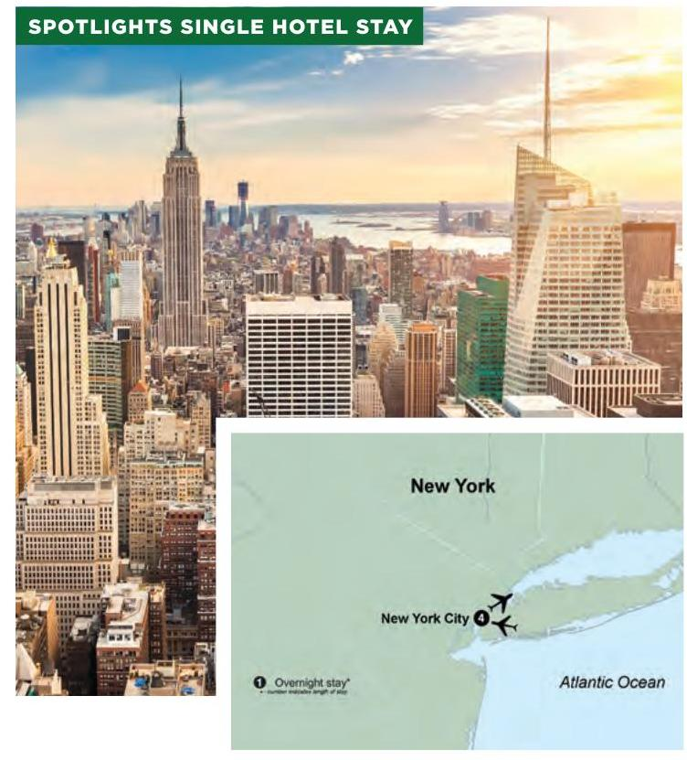

From Lady Liberty to Times Square, New York City never sleeps. The Apple is big; enjoy every bite.

## HIGHLIGHTS

- Reflect at the 9/11 Memorial and explore the 9/11 Museum.
- Experience two Broadway shows.
- Experience the Statue of Liberty up close.
- Tour New York City landmarks with a local guide.
- Enjoy a musical breakfast at Ellen's Stardust Diner.

## STAYS

4 Nights New York City, New York

## VISIT COLLETTE.COM/83 FOR MORE DETAILS.

## SPOTLIGHT ON NEW YORK CITY HOLIDAY

5 DAYS / 5 MEALS / STARTING AT \$2,599* PP PRICE BASED ON DECEMBER 13, 2021 DEPARTURE.

View our website for additional dates.
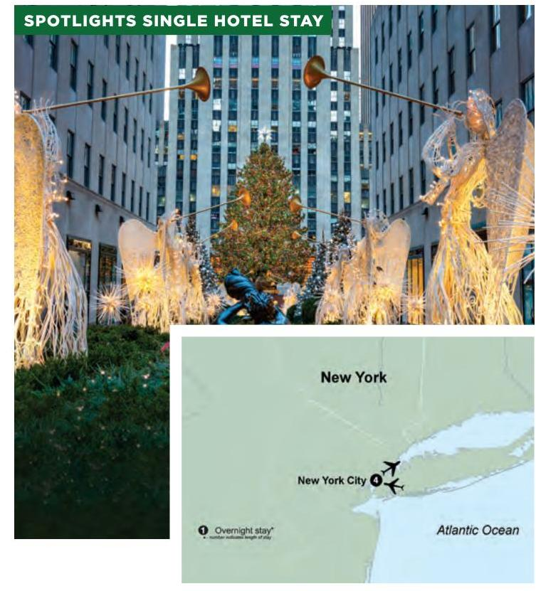

Rock around the (Rockefeller) Christmas tree. From Radio City Music Hall to Times Square, see the Big Apple dressed in its holiday best.

## HIGHLIGHTS

- See the Christmas Spectacular at Radio City Music Hall.
- Embark to see "Lady Liberty" up-close.
- Catch a Broadway Show at Times Square.
- Eat breakfast at the famous Ellen's Stardust Diner.
- Reflect at the 9/11 Memorial and Museum.

## STAYS

4 Nights New York City, New York

VISIT COLLETTE.COM/83 FOR MORE DETAILS.

## Page 32

# united states \& canada 

## ISLANDS OF NEW ENGLAND

## 8 DAYS / 11 MEALS / STARTING AT \$2,599* PP PRICE BASED ON AUGUST 27, 2021 DEPARTURE.

View our website for additional dates.
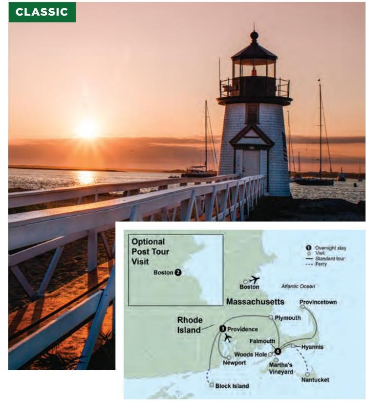

The Atlantic coast is calling.
Explore New England's majestic seabcards, from Rhode Island to Cape Cod.

## HIGHLIGHTS

- Visit a working New England cranberry bog.
- Spend time on quaint Block Island.
- Behold the oceanside mansions of Newport.
- See Plymouth Rock - where the Pilgrims landed in 1620.
- Explore the idyllic Island of Nantucket.

## STAYS

3 Nights Providence, Rhode Island / 4 Nights Falmouth, Massachusetts

## VISIT COLLETTE.COM/61 FOR MORE DETAILS.

## AUTUMN IN VERMONT

7 DAYS / 10 MEALS / STARTING AT \$2,299* PP
PRICE BASED ON SEPTEMBER 26, 2021 DEPARTURE.
View our website for additional dates.
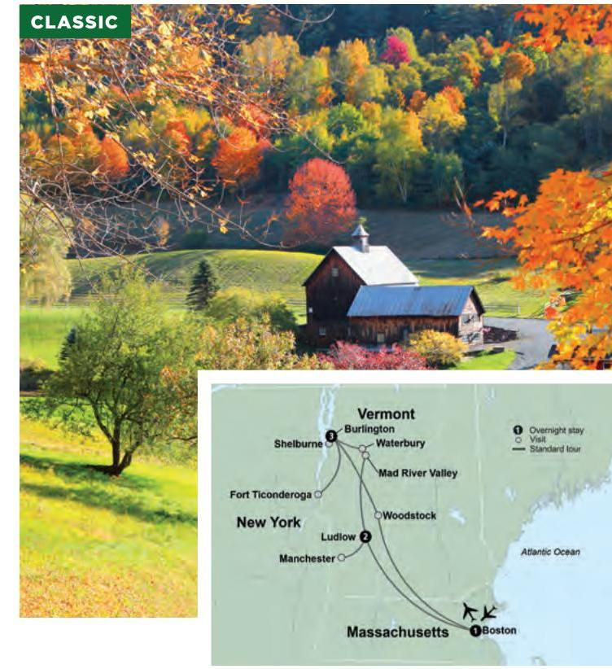

Discover Vermont's winding roads lined with autumn foliage and cozy towns with an eclectic spirit.

## HIGHLIGHTS

- Discover the history of Fort Ticonderoga.
- Taste apple cider at a family-owned apple orchard.
- Experience the vibrant fall foliage of the mountains.
- Enjoy a "Flavors of Vermont" dinner.
- Take a scenic ferry across Lake Champlain.

## STAYS

1 Night Boston, Massachusetts / 3 Nights Burlington, Vermont / 2 Nights Ludlow, Vermont

## VISIT COLLETTE.COM/67 FOR MORE DETAILS.

## Page 33

## COLORS OF NEW ENGLAND FEATURING COASTAL MAINE

8 DAYS / 10 MEALS / STARTING AT \$2,999* PP PRICE BASED ON OCTOBER 2, 2021 DEPARTURE.

View our website for additional dates.
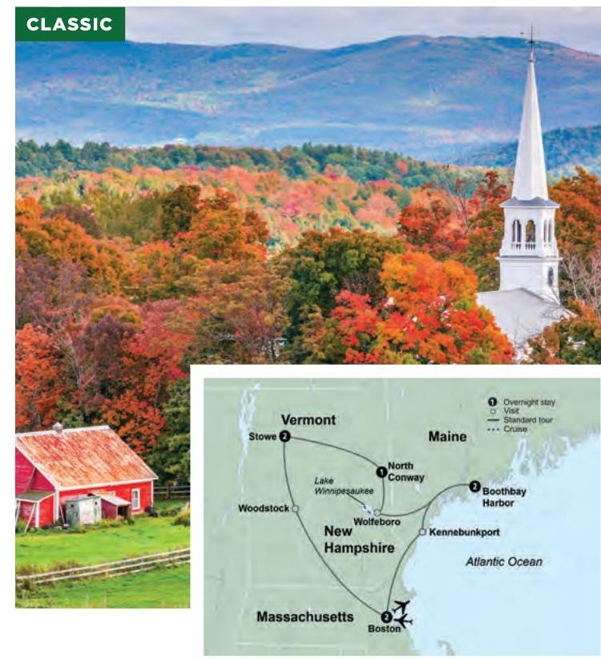

Fall in to the rustic charm of New England. See a stunning display of vibrant foliage while traveling from historic Boston to the quaint villages of the North.

## HIGHLIGHTS

- Observe old-fashioned apple cider making.
- Learn about maple sugaring on a farm tour.
- See the Rocks Estate, settled in the White Mountains.
- Embark on a cruise of stunning Lake Winnipesaukee.
- Taste a classic New England lobster dinner.

## STAYS

2 Nights Boston, Massachusetts / 2 Nights Stowe, Vermont / 1 Night North Conway, New Hampshire / 2 Nights Boothbay Harbor, Maine

## ROAMING COASTAL MAINE

7 DAYS / 9 MEALS / STARTING AT \$2,599* PP PRICE BASED ON SEPTEMBER 26, 2021 DEPARTURE.

View our website for additional dates.
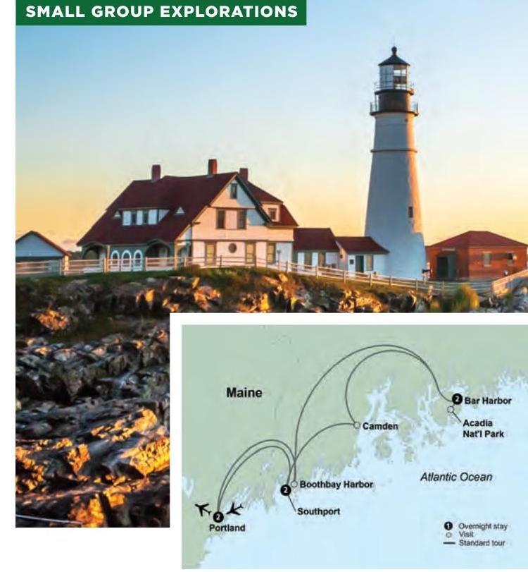

This is Maine, where rocky shores, infinite nature, and endless lobster forge a coastal New England classic.

## HIGHLIGHTS

- Watch how lobster traps are hauled from the ocean.
- Explore Acadia National Park.
- Sample the best vintages at a local winery.
- See Maine's oldest and most famous lighthouse.
- Stroll through the quaint harbor town of Camden.

## STAYS

2 Nights Portland / 2 Nights Bar Harbor / 2 Nights Southport

VISIT COLLETTE.COM/646 FOR MORE DETAILS.

## Page 34

# Canada 

## CANADIAN ROCKIES BY TRAIN

9 DAYS / 13 MEALS / STARTING AT \$4,699* PP PRICE BASED ON OCTOBER 14, 2021 DEPARTURE.

View our website for additional dates.
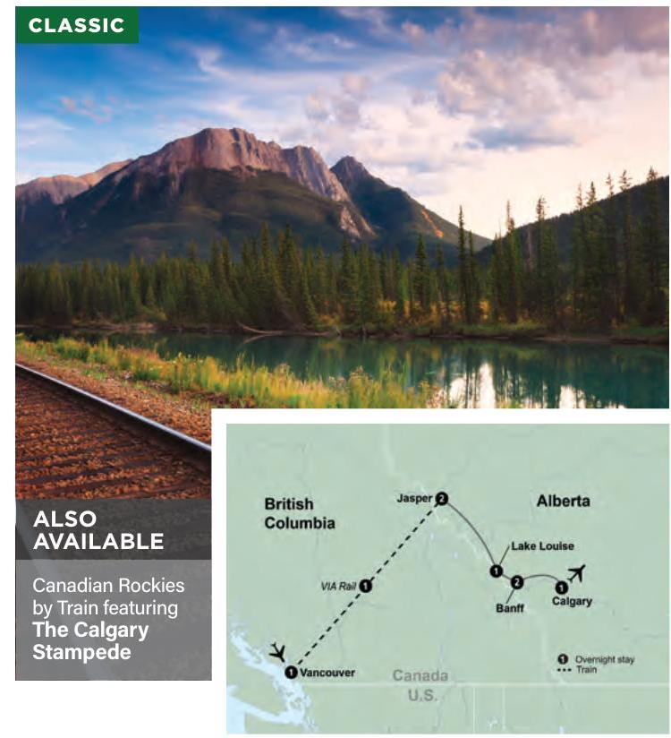

Stunning landscapes, elegant hotels, a day on the ranch and an overnight aboard a train...the perfect way to experience the Canadian Rockies.

## HIGHLIGHTS

- Discover the city of Vancouver with a sightseeing tour.
- Behold Moraine Lake and the Valley of the Ten Peaks.
- Witness spectacular views on your VIA Rail train ride.
- Enjoy breakfast at picturesque Maligne Lake.
- Drive the unforgettable Icefields Parkway.

## STAYS

1 Night Vancouver, British Columbia / 1 Night VIA Rail / 2 Nights Jasper, Alberta / 1 Night Lake Louise, Alberta / 2 Nights Banff, Alberta / 1 Night Calgary, Alberta

## VISIT COLLETTE.COM/371 FOR MORE DETAILS.

## CANADIAN ROCKIES FEATURING ROCKY MOUNTAINER

8 DAYS / 13 MEALS / STARTING AT \$4,999* PP PRICE BASED ON SEPTEMBER 25, 2021 DEPARTURE.

View our website for additional dates.
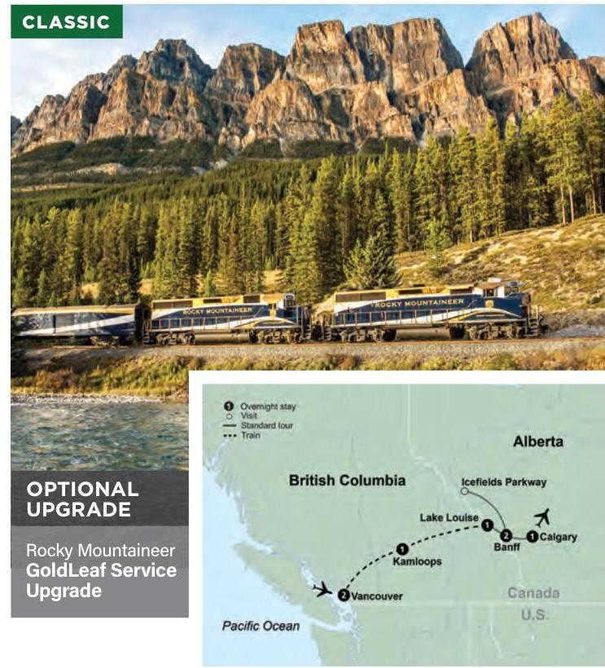

Set out to explore the best of Western Canada on a journey that opens in Vancouver and takes you to Banff onboard the famous Rocky Mountaineer train.

## HIGHLIGHTS

- Enjoy two nights at Rimrock Resort Hotel in Banff.
- Spend two days onboard the Rocky Mountaineer train in SilverLeaf Service.
- See Bow Falls on a drive through Banff.
- See snowcapped mountains along the Icefields Parkway.
- Enjoy breakfast at Capilano Suspension Bridge.

## STAYS

2 Nights Vancouver, British Columbia / 1 Night Kamloops, British Columbia / 1 Night Lake Louise, Alberta / 2 Nights Banff, Alberta / 1 Night Calgary, Alberta

VISIT COLLETTE.COM/609 FOR MORE DETAILS.

## Page 35

## CANADIAN ROCKIES \& GLACIER NATIONAL PARK

7 DAYS / 10 MEALS / STARTING AT \$2,499* PP PRICE BASED ON SEPTEMBER 4, 2021 DEPARTURE.

View our website for additional dates.
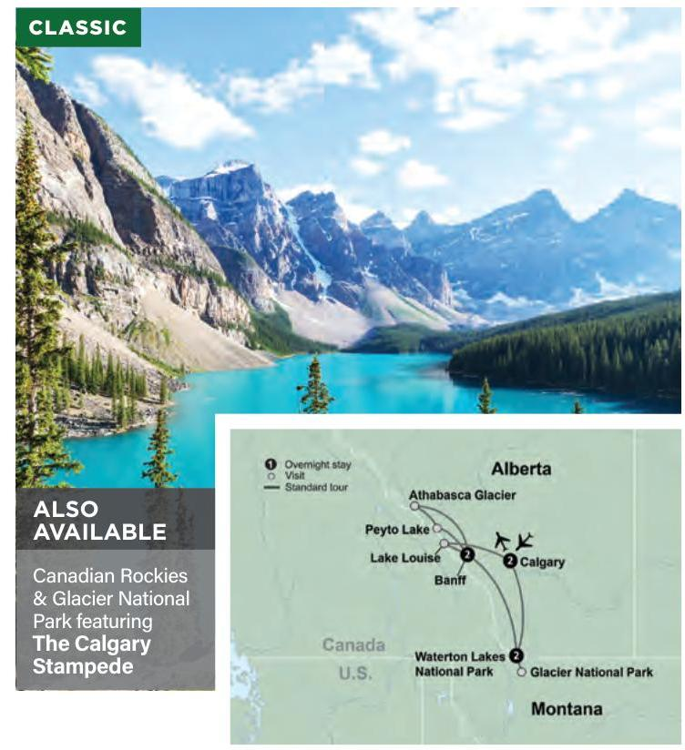

Ancient glaciers, emerald lakes and towering mountains await on a voyage that highlights Glacier National Park and the Icefields Parkway.

## HIGHLIGHTS

- Ride on a historic Jammer in Glacier National Park.
- Visit one of the world's oldest buffalo jumps.
- Witness the incredible views of Glacier National Park.
- Drive the unforgettable Icefields Parkway.
- Enjoy lunch at Lake Louise Ski Lodge.

## STAYS

1 Night Calgary, Alberta / 2 Nights Waterton Lakes National Park, Alberta / 2 Nights Banff, Alberta / 1 Night Calgary, Alberta

## WESTERN CANADA'S ROCKIES, LAKES \& WINE COUNTRY

9 DAYS / 13 MEALS / STARTING AT \$2,699* PP PRICE BASED ON MAY 28, 2022 DEPARTURE.

View our website for additional dates.
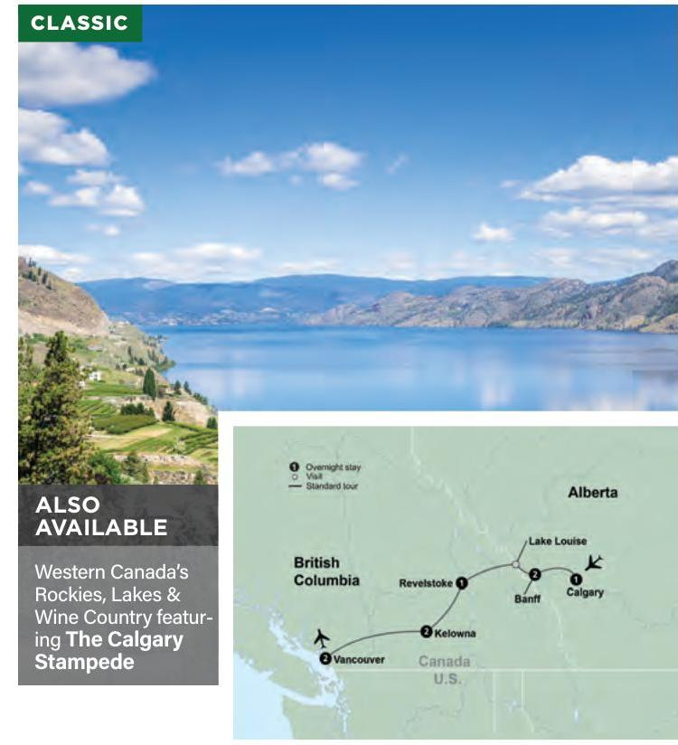

Behold beautiful views and welcoming cultures as you journey across the Canadian Rockies from Calgary to Vancouver.

## HIGHLIGHTS

- Explore the natural beauty of Banff, taking in Bow Falls.
- Spend time discovering Lake Louise.
- Step inside Stanley Park, Vancouver's urban rainforest.
- Delve into the history of the Canadian Pacific Railway.
- Tour a local orchard with a farmer and sample fresh produce.

## STAYS

1 Night Calgary, Alberta / 2 Nights Banff, Alberta / 1 Night Revelstoke, B.C. / 2 Nights Kelowna, B.C. / 2 Nights Vancouver, B.C.

VISIT COLLETTE.COM/689 FOR MORE DETAILS.

## Page 36

# canada 

## THE BEST OF EASTERN CANADA

9 DAYS / 11 MEALS / STARTING AT \$2,599* PP PRICE BASED ON OCTOBER 8, 2021 DEPARTURE.

View our website for additional dates.
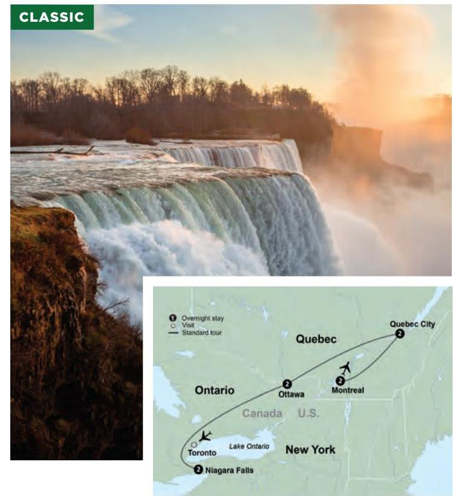

Bienvenue to Eastern Canada! From the old-world style of Quebec City to the power of Niagara Falls, this is one memorable journey.

## HIGHLIGHTS

- Discover Ontario's 300-year-old history of winemaking with a tour and tasting.
- Savor breakfast at a local sugar shack nestled in the Quebec countryside.
- Witness the power of Mother Nature at Niagara Falls.
- Tour Montréal and see Jacques Cartier Square.
- Sample French cuisine at a restaurant in Ile d'Orleans.

## STAYS

2 Nights Niagara Falls, Ontario / 2 Nights Ottawa, Ontario / 2 Nights Quebec City, Quebec / 2 Nights Montréal, Quebec

## MARITIMES COASTAL WONDERS

11 DAYS / 16 MEALS / STARTING AT \$2,999* PP PRICE BASED ON OCTOBER 3, 2021 DEPARTURE.

View our website for additional dates.
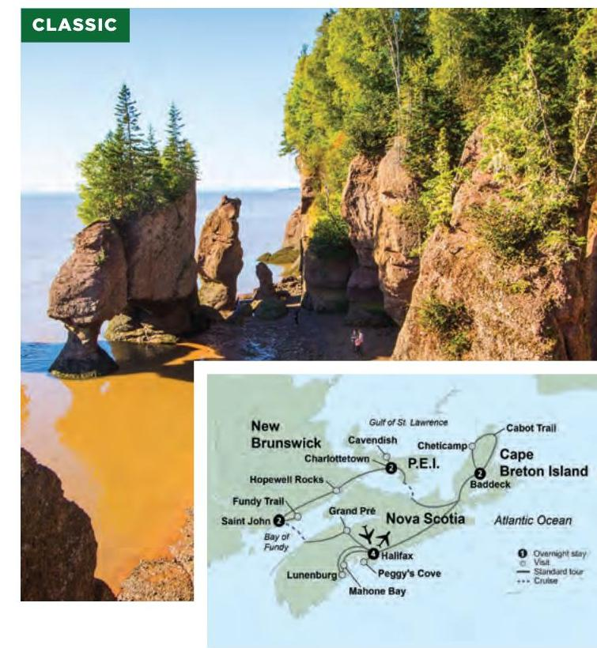

From the nautical beauty of Peggy's Cove to the rugged splendor of the Cabot Trail, the Maritimes will enchant you.

## HIGHLIGHTS

- Learn a few handy Gaelic phrases and join in the fun of a "milling frolic."
- Explore inventions at the Alexander Graham Bell Museum.
- Journey along the shoreline to Hopewell Rocks.
- Savor a traditional Maritimes lobster feast.
- Explore the Cabot Trail and its rugged terrain.

## STAYS

3 Nights Halifax, Nova Scotia / 2 Nights Baddeck, Nova Scotia / 2 Nights Charlottetown, Prince Edward Island / 2 Nights Saint John, New Brunswick / 1 Night Halifax, Nova Scotia

VISIT COLLETTE.COM/493 FOR MORE DETAILS.

## Page 37

## REFLECTIONS OF ITALY

10 DAYS / 12 MEALS / STARTING AT \$2,499* PP PRICE BASED ON DECEMBER 1, 2021 DEPARTURE.

View our website for additional dates.
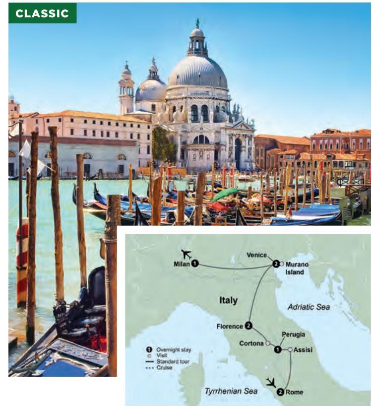

Italy shines on this enchanting journey that takes you from the historic piazzas of Rome to the storied canals of Venice and everywhere in between.

## HIGHLIGHTS

- Skip the line to see Michelangelo's statue of David.
- Cruise to Murano Island for a glass-blowing display.
- Enjoy a scenic journey through Tuscany's graceful hills.
- Set out on a locally guided panoramic tour of Rome.
- Enjoy a chef-led cooking class at a Chianti winery.

## STAYS

2 Nights Rome / 1 Night Perugia / 2 Nights Florence / 2 Nights Venice / 1 Night Milan Malpensa

## I TALIAN VISTAS

13 DAYS / 17 MEALS / STARTING AT \$3,399* PP PRICE BASED ON NOVEMBER 29, 2021 DEPARTURE.

View our website for additional dates.
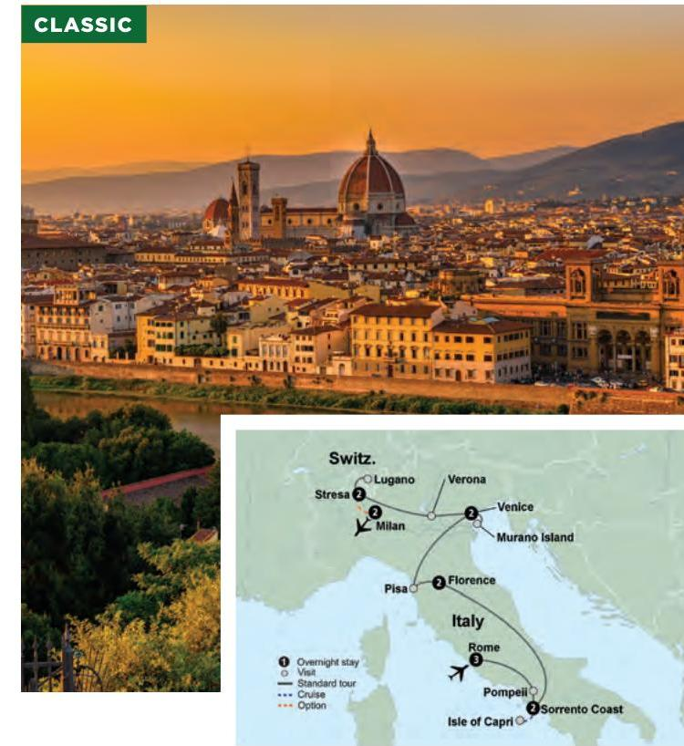

From the ancient ruins of Pompeii to the chic charm of Capri, this is one spectacular Italian getaway.

## HIGHLIGHTS

- Get an in-depth tour of the famous Colosseum.
- Relax on a scenic boat ride to the Isle of Capri.
- Stroll through Verona - the backdrop to Romeo and Juliet.
- Enjoy the magical Italian lakes in the resort town of Stresa.
- Visit a Tuscan winery and farm for lunch and local wines.

## STAYS

3 Nights Rome / 2 Nights Sorrento / 2 Nights Florence / 2 Nights Venice / 2 Nights Stresa

VISIT COLLETTE.COM/14 FOR MORE DETAILS.

## Page 38

## SPOTLIGHT ON TUSCANY

9 DAYS / 10 MEALS / STARTING AT \$1,699* PP PRICE BASED ON NOVEMBER 30, 2021 DEPARTURE.

View our website for additional dates.

Embrace vintage Italia as you savor fine wine, blissful countryside and ancient cities that inspired the Renaissance on this Tuscan getaway.

## HIGHLIGHTS

- Visit the Gothic Line, a German defense line from WWII.
- Stay in the resort town of Montecatini Terme for 7 nights.
- See WWII fortifications at the Museum of Liberation.
- Stop in the walled medieval city of Lucca.
- Taste flavorful pecorino cheese at a cheese farm.

## STAYS

7 Nights Montecatini Terme

## ROME \& THE AMALFI COAST

10 DAYS / 13 MEALS / STARTING AT \$2,399* PP PRICE BASED ON DECEMBER 3, 2021 DEPARTURE.

View our website for additional dates.
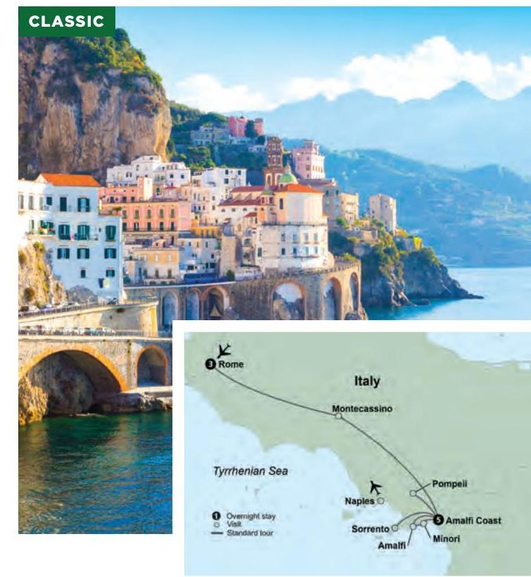

Art, food, wine, culture, and history: indulge in the finer things in life across Rome and the Amalfi Coast.

## HIGHLIGHTS

- Discover the mountaintop monastery of Montecassino.
- Tour Classical Rome, including the legendary Colosseum.
- Visit the seaside resort town of Sorrento.
- Discover the excavated ruins of the ancient city, Pompeii.
- Sample liqueur at a family-owned limoncello factory.

## STAYS

3 Nights Rome / 5 Nights Amalfi Coast

VISIT COLLETTE.COM/127 FOR MORE DETAILS.

## Page 39

## TUSCANY \& THE ITALIAN RIVIERA

9 DAYS / 11 MEALS / STARTING AT \$2,299* PP PRICE BASED ON APRIL 2, 2022 DEPARTURE.

View our website for additional dates.
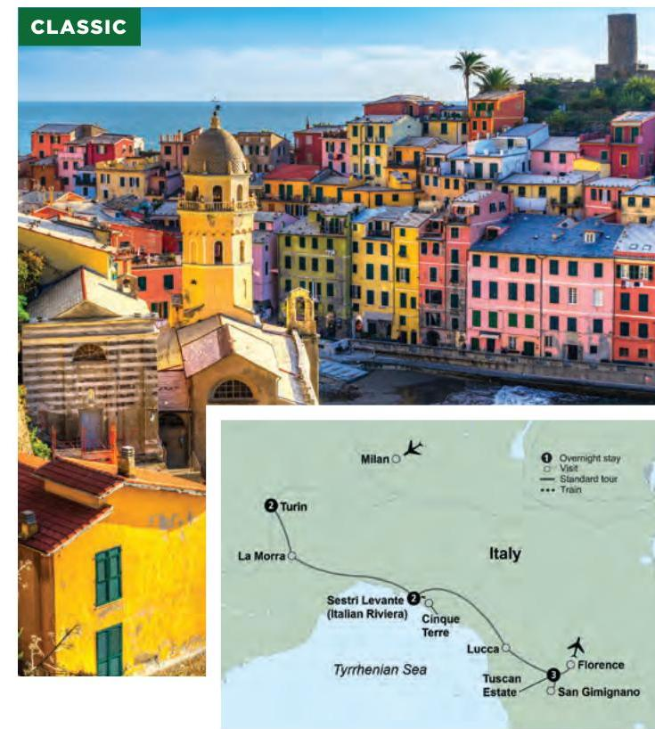

From the rolling hills of Tuscany to the sun-soaked coast of the Italian Riviera, a romantic rendezvous with Italia awaits.

## HIGHLIGHTS

- Take a guided tour of Lucca including a visit to the Cathedral of San Martino.
- Spend three nights in a beautiful Tuscan Estate.
- Visit Florence, the "Cradle of the Renaissance."
- Explore the cliff-side villages of the Cinque Terre.
- Partake in an interactive pasta-making demonstration.

## STAYS

2 Nights Turin / 2 Nights Italian Riviera / 3 Nights Tuscan Estate

## NORTHERN ITALY \& ITS LAKES

9 DAYS / 10 MEALS

View our website for additional details.
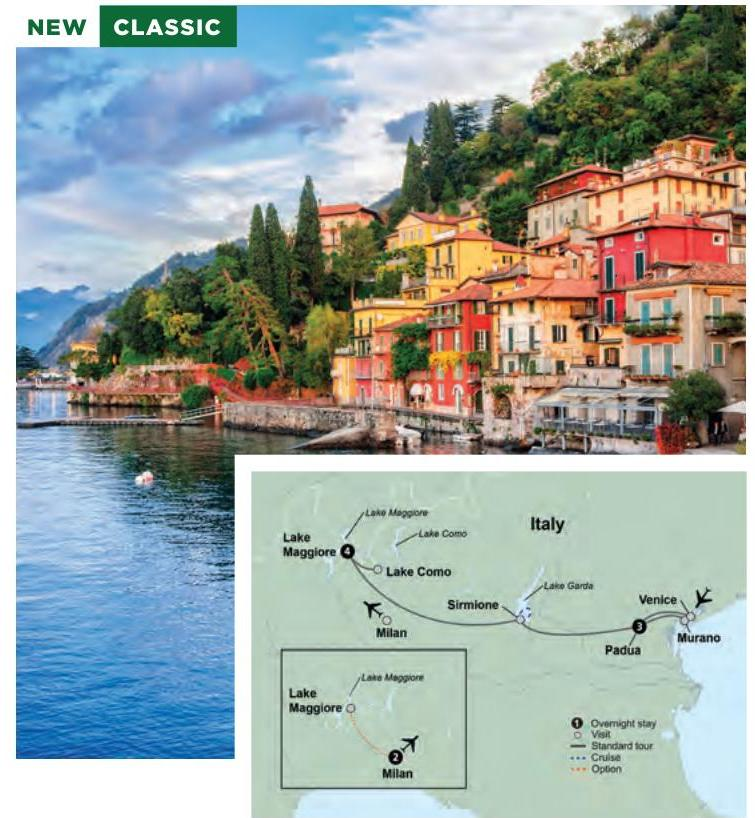

Wander along winding canals and cruise on mountain-lined lakes as you take in the essence of Northern Italy.

## HIGHLIGHTS

- Witness a glassblowing demonstration on Murano Island.
- Cruise Lake Como, a retreat of the rich and famous.
- Make your way through the iconic St. Mark's Square in Venice.
- See the famous sinking castle in the Sirmione peninsula.
- Journey by boat to Isola dei Pescatori for a farewell dinner featuring local cuisine.

## STAYS

3 Nights Padua / 4 Nights Lake Maggiore

## VISIT COLLETTE.COM/655 FOR MORE DETAILS.

## Page 40

# europe 

## ROME, FLORENCE \& VENICE

## 8 DAYS / 9 MEALS / STARTING AT \$1,899* PP PRICE BASED ON NOVEMBER 30, 2021 DEPARTURE.

View our website for additional dates.
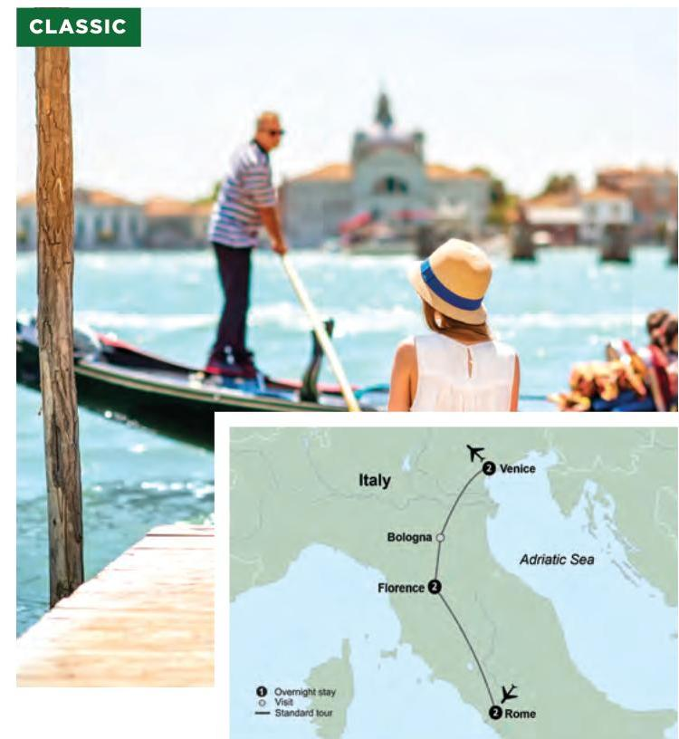

Traverse this trio of Italian cities as you encounter iconic sites, dine on traditional cuisine, and embrace a culture steeped in romance.

## HIGHLIGHTS

- Explore the history and art of the Vatican State with a local expert.
- See a glass-blowing demonstration on Murano Island.
- Embark on a walking tour of Florence's artistic gems.
- Explore the unique city of Venice with a local expert.
- Taste gelato and more during a Bologna food walking tour.

## STAYS

2 Nights Rome / 2 Nights Florence / 2 Nights Venice

## SOUTHERN ITALY \& SICILY

12 DAYS / 17 MEALS / STARTING AT \$2,799* PP PRICE BASED ON DECEMBER 3, 2021 DEPARTURE.

View our website for additional dates.
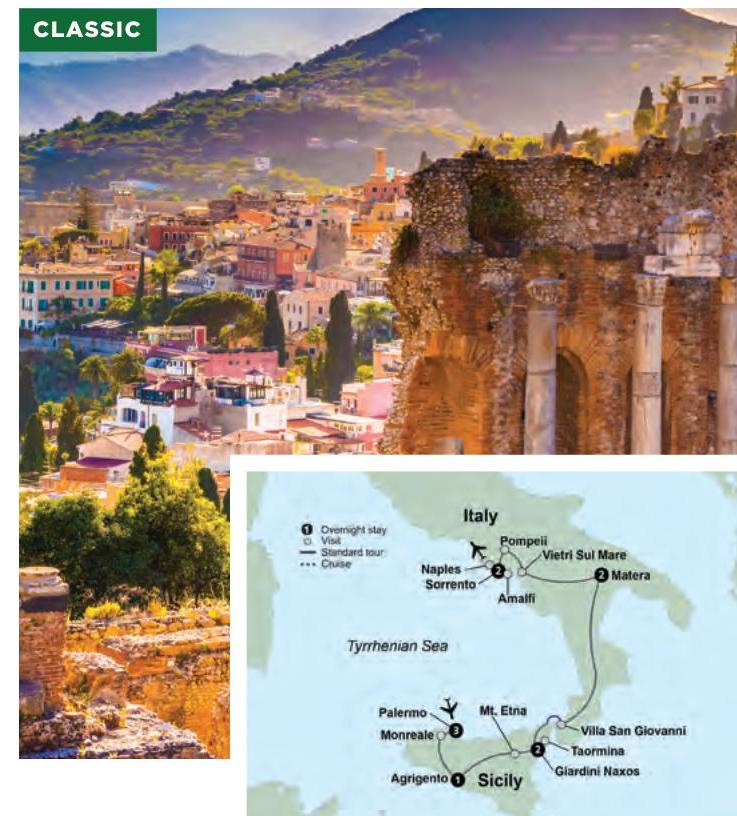

Encounter a crossroads of civilizations as you venture from Sicily to the spectacular coastlines of Southern Italy.

## HIGHLIGHTS

- Be amazed by the Greek Theatre in Taormina.
- Marvel at the Valley of the Temples, a UNESCO site.
- Venture to the breathtaking Amalfi Coast.
- Walk through the incredibly preserved ruins of Pompeii.
- Dine in a local winery's agriturismo restaurant.

## STAYS

3 Nights Palermo / 1 Night Agrigento / 2 Nights Giardini Naxos / 2 Nights Matera / 2 Nights Sorrento Coast

## Page 41

## SICILY \& ITS ISLES

14 DAYS / 19 MEALS / STARTING AT \$3,799* PP PRICE BASED ON OCTOBER 7, 2021 DEPARTURE.

View our website for additional dates.
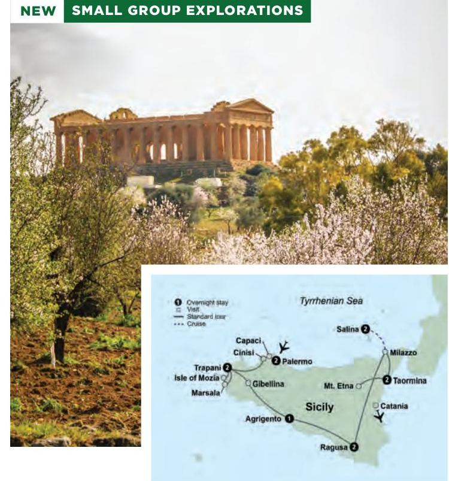

Explore Sicily - an island paradise nestled amongst the deep blue waves of the Mediterranean.

## HIGHLIGHTS

- Soak up the relaxed ambiance with a 2-night stay on the Isle of Salina.
- Ascend the sides of Mount Etna on off-road vehicles.
- Enjoy world-renowned Marsala wine on a wine cellar tour.
- Taste award-winning olive oil and learn about the Slow Food movement at a local farm.
- Visit the Valley of the Temples at dusk.

## STAYS

2 Nights Palermo / 2 Nights Trapani / 1 Night Agrigento / 2 Nights Ragusa / 2 Nights Salina / 3 Nights Taormina

## OLD WORLD SICILY \& MALTA

15 DAYS / 22 MEALS / STARTING AT \$3,599* PP PRICE BASED ON NOVEMBER 30, 2021 DEPARTURE.

View our website for additional dates.
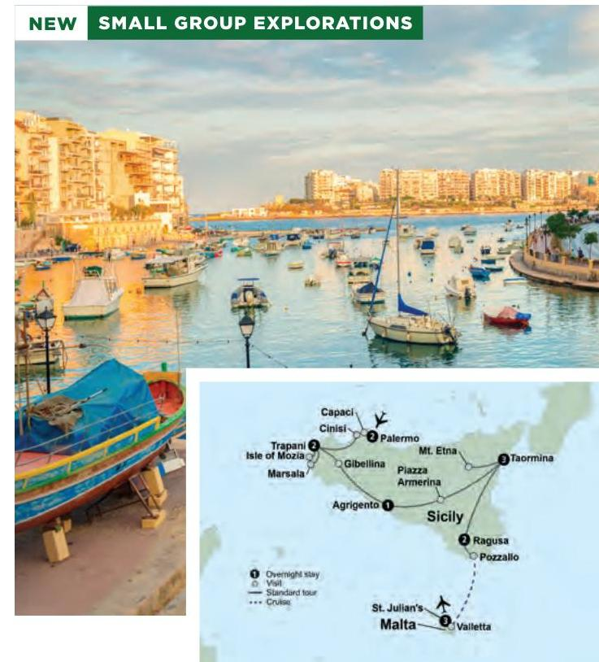

Discover how ancient traditions blend into modern society as you travel along timeless Italian and Maltese towns.

## HIGHLIGHTS

- Soak up the island ambiance of Malta with a 3-night stay in St. Julian's.
- Pass by Baroque architecture on a walking tour of Ragusa.
- Visit a medieval palace and enjoy hors d'oeuvres with a countess.
- Sample specialties in Palermo's colorful food market.
- Feel the heart of the neighborhood at a Band Club in Malta.

## STAYS

2 Nights Palermo / 2 Nights Trapani / 1 Night Agrigento / 3 Nights Taormina / 2 Nights Ragusa / 3 Nights St. Julian's

VISIT COLLETTE.COM/667 FOR MORE DETAILS.

## Page 42

## ITALY'S TREASURES

12 DAYS / 17 MEALS / STARTING AT \$3,249* PP PRICE BASED ON MARCH 26, 2022 DEPARTURE.

View our website for additional dates.
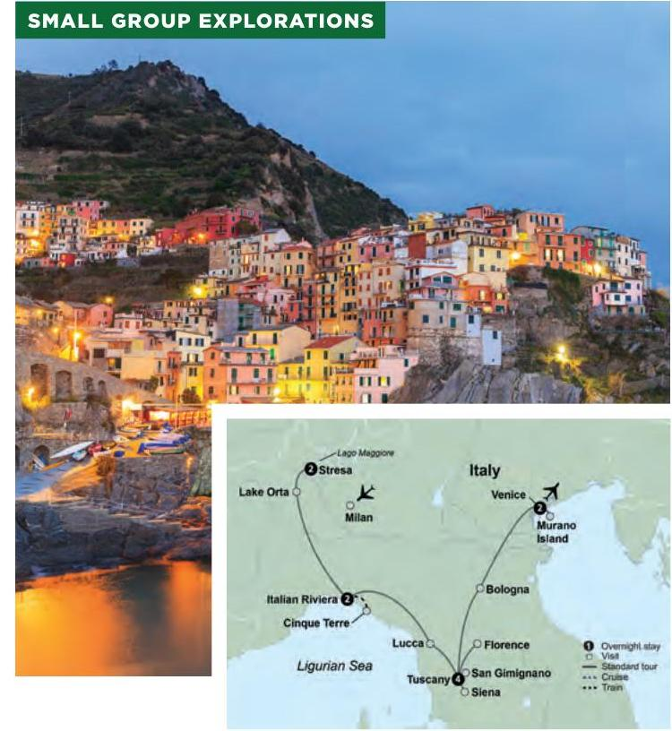

Vineyards, olive groves, and cities that float. Incredible history, indelible culture, and unforgettable cuisine.
This is I'talia at its most iconic.

## HIGHLIGHTS

- Explore Florence during an afternoon at leisure.
- Discover colorful Cinque Terre, a UNESCO site.
- Cruise to Murano Island for a glass-blowing demonstration.
- Journey by boat to Isola dei Pescatori for dinner.
- Learn Tuscan cuisine during a chef-led cooking lesson.

## STAYS

2 Nights Stresa / 2 Nights Italian Riviera /
4 Nights Tuscany / 2 Nights Venice

## TUSCAN \& UMBRIAN COUNTRYSIDE

11 DAYS / 16 MEALS / STARTING AT \$2,699* PP PRICE BASED ON NOVEMBER 2, 2021 DEPARTURE.

View our website for additional dates.
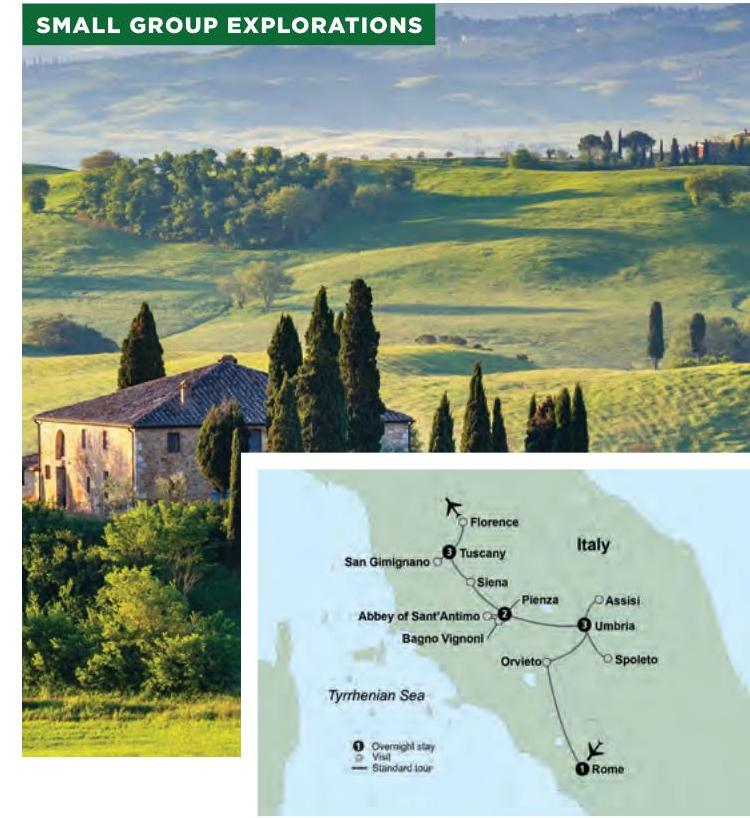

Winding country roads bounded by miles of vines, soul-warming meals paired with full-bodied vintages, quiet hill towns and ancient cities - Tuscany and Umbria are lands where time stands still.

## HIGHLIGHTS

- Take a hands-on cooking class in a 12th-century abbey.
- Experience a home-cooked meal in the Umbrian countryside.
- See Spoleto on a guided walking tour.
- Behold the Ponte delle Torri, a 13th-century aqueduct.
- Enjoy 3 nights in a restored Tuscan villa.

## STAYS

1 Night Rome / 3 Nights Umbria / 2 Nights Pienza / 3 Nights Tuscany

## Page 43

## ITALY: AMALFI COAST TO PUGLIA

14 DAYS / 18 MEALS / STARTING AT \$3,599* PP PRICE BASED ON NOVEMBER 4, 2021 DEPARTURE.

View our website for additional dates.
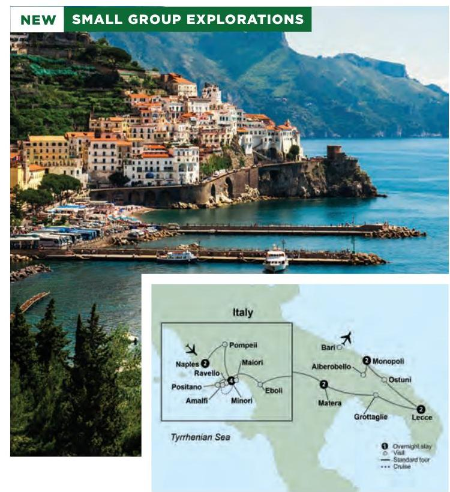

Stray off the beaten path and explore a new side to the Italy you know and love.

## HIGHLIGHTS

- Zoom through Ostuni in the backseat of a 3-wheeled Ape Calessino car.
- Spend 2 nights in a unique cave-dwelling accommodation.
- Make your way through Lecce's city center with a multistop dinner.
- Hike the Amalfi Coast's ancient Path of Lemons.
- Meet with local artisans in Naples' historic city center.

## STAYS

2 Nights Naples / 4 Nights Amalfi Coast / 2 Nights Matera / 2 Nights Lecce / 2 Nights Monopoli

## SHRINES OF ITALY

11 DAYS / 15 MEALS / STARTING AT \$1,999* PP PRICE BASED ON NOVEMBER 30, 2021 DEPARTURE.

View our website for additional dates.
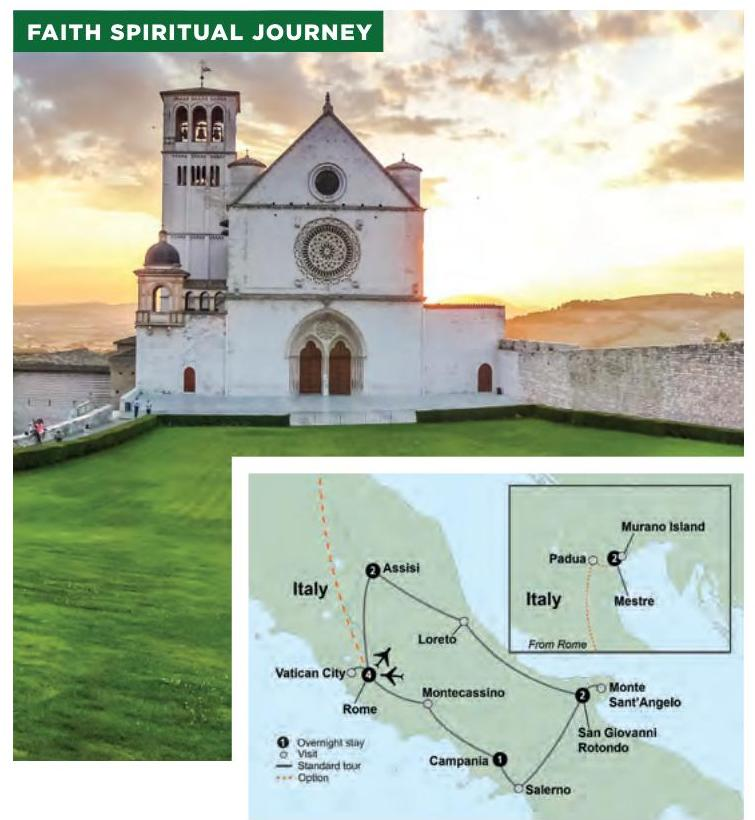

From the hallowed Basilica of St. Francis to the glorious Sistine Chapel, discover why Italy is a bastion of Catholicism.

## HIGHLIGHTS

- Spend time at the renowned Abbey of Montecassino.
- Discover the Holy House of Nazareth and the Madonna of Loreta.
- Join a local expert for a fascinating tour of Assisi.
- Attend the weekly papal audience at Vatican City.
- Explore catacombs where early Christians buried the dead.

## STAYS

1 Night Rome / 2 Nights Assisi / 2 Nights San Giovanni Rotondo / 1 Night Cava de Tirreni / 3 Nights Rome

## Page 44

# europe 

## ICELAND: LAND OF FIRE \& ICE

9 DAYS / 13 MEALS / STARTING AT \$2,999* PP PRICE BASED ON SEPTEMBER 19, 2021 DEPARTURE.

View our website for additional dates.
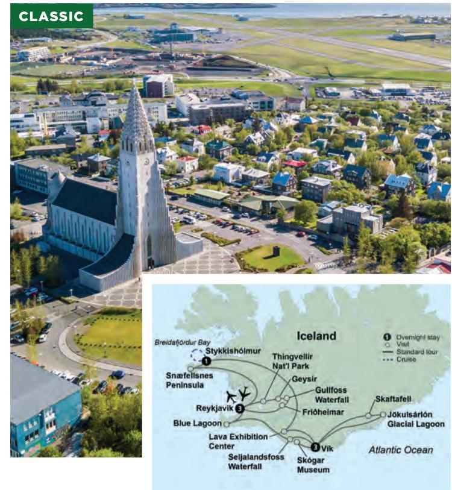

Unearth a paradise forged by ice and fire. Journey to jagged coastlines and volcanic craters, remarkable icebergs and glacial lagoons.

## HIGHLIGHTS

- Learn the traditional ways of preparing Greenland shark.
- Explore Icelandic life at the Skógar Folk Museum.
- Gain a local perspective of Reykjavik on a walking tour.
- See natural wonders as you travel the Golden Circle.
- Journey to the spectacular Gullfoss waterfall.

## STAYS

2 Nights Reykjavík / 1 Night Stykkishólmur / 3 Nights Vik / 1 Night Reykjavík

## ICELAND'S MAGICAL NORTHERN LIGHTS

7 DAYS / 10 MEALS / STARTING AT \$2,299* PP PRICE BASED ON DECEMBER 4, 2021 DEPARTURE.

View our website for additional dates.
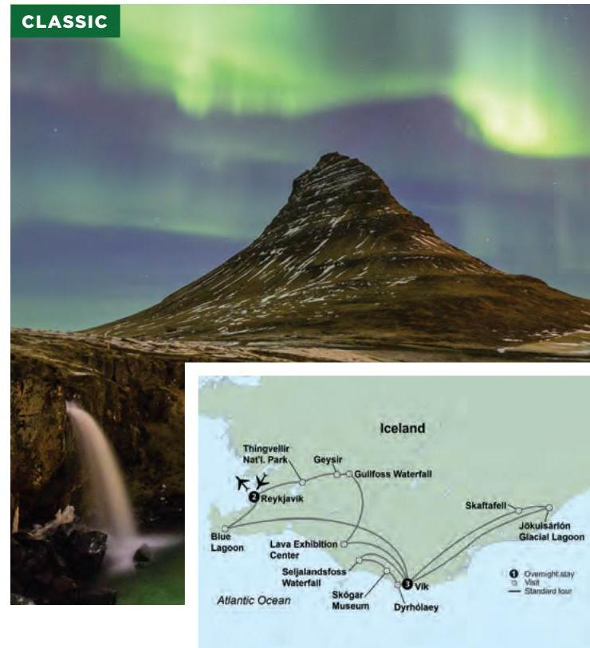

There's something magical in the air. Chase the aurora borealis across this ethereal wonderland.

## HIGHLIGHTS

- Experience the geothermal fields of Geysir and Strokkur.
- Discover volcanic nature at the Lava Exhibition Center.
- Search for the northern lights during a nighttime cruise.
- See Jókulsárlón glacial lagoon, filled with icebergs.
- Relax in the mineral-rich water of the Blue Lagoon.

## STAYS

1 Night Reykjavík / 3 Nights Vik / 1 Night Reykjavík

## VISIT COLLETTE.COM/S63 FOR MORE DETAILS.

## Page 45

## SPECTACULAR SCANDINAVIA

14 DAYS / 20 MEALS / STARTING AT \$3,999* PP PRICE BASED ON SEPTEMBER 30, 2021 DEPARTURE.

View our website for additional dates.

Three countries. Infinite intrigue. Watch a Nordic postcard unfold before your eyes, and discover the lands where Vikings reigned.

## HIGHLIGHTS

- Choose to visit the Vasa Ship Museum or the ABBA Museum.
- Visit the intricate Borgund Stave Church, built in 1180.
- Witness scenic wilderness along the Flåm Railway.
- Join a local expert for a city tour of Copenhagen.
- Savor Swedish cuisine in Stockholm's Old Town.

## STAYS

2 Nights Copenhagen / 1 Night Vittaryd / 2 Nights Stockholm / 2 Nights Oslo / 1 Night Flåm / 2 Nights Loen / 2 Nights Bergen

## HIGHLIGHTS OF NORWAY

9 DAYS / 12 MEALS / STARTING AT \$2,899* PP PRICE BASED ON APRIL 29, 2022 DEPARTURE.

View our website for additional dates.
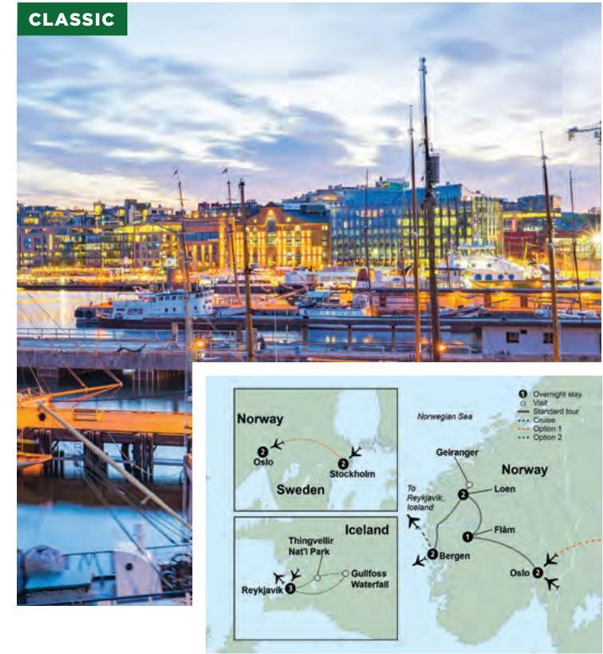

Venture to a place where crashing ocean meets craggy mountains, forging the natural majesty of the Norwegian fjords.

## HIGHLIGHTS

- Visit an ornate 900-year-old church.
- Explore Bergen's harbor on a guided walk.
- Cross the Sognefjord to the Briksdal Glacier.
- Dine in and learn the history of Oslo.
- Witness scenic wilderness along the Flåm Railway.

## STAYS

2 Nights Oslo / 1 Night Flåm / 2 Nights Loen / 2 Nights Bergen

VISIT COLLETTE.COM/642 FOR MORE DETAILS.

## Page 46

# Europe 

## THE NORTHERN LIGHTS OF FINLAND

## 8 DAYS / 11 MEALS / STARTING AT \$3,399* PP PRICE BASED ON DECEMBER 8, 2021 DEPARTURE.

View our website for additional dates.
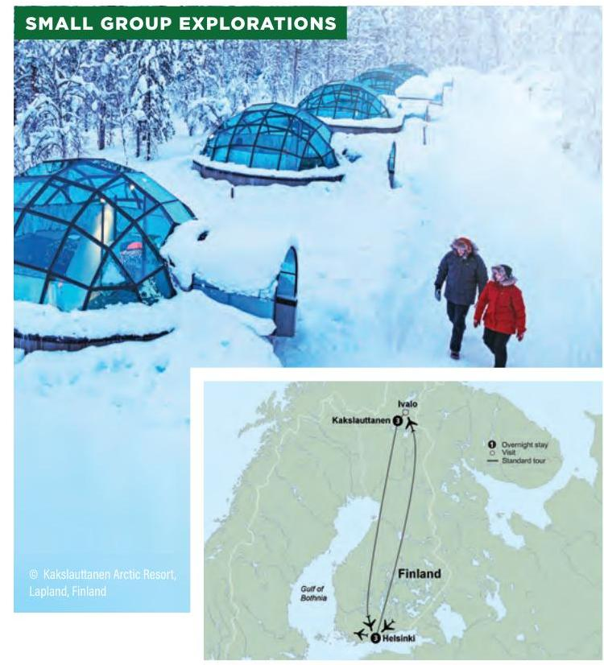

This is so much more than a hunt for stunning streaks of color in the night sky (though it's a pretty amazing part). This is a step into Finland's dynamic and intriguing culture.

## HIGHLIGHTS

- Search for the northern lights during a reindeer safari.
- Lead your very own dog sled team.
- Spend the night in a glass igloo amid the Lappish wilds.
- Sample Finnish cuisine at Helsinki's local restaurants.
- Sip warm berry juice, a Finnish winter tradition.

## STAYS

2 Nights Helsinki / 3 Nights Kakslauttanen / 1 Night Helsinki

## VISIT COLLETTE.COM/605 FOR MORE DETAILS.

## ICELANDIC ADVENTURE

10 DAYS / 14 MEALS / STARTING AT \$3,999* PP PRICE BASED ON SEPTEMBER 21, 2021 DEPARTURE.

View our website for additional dates.
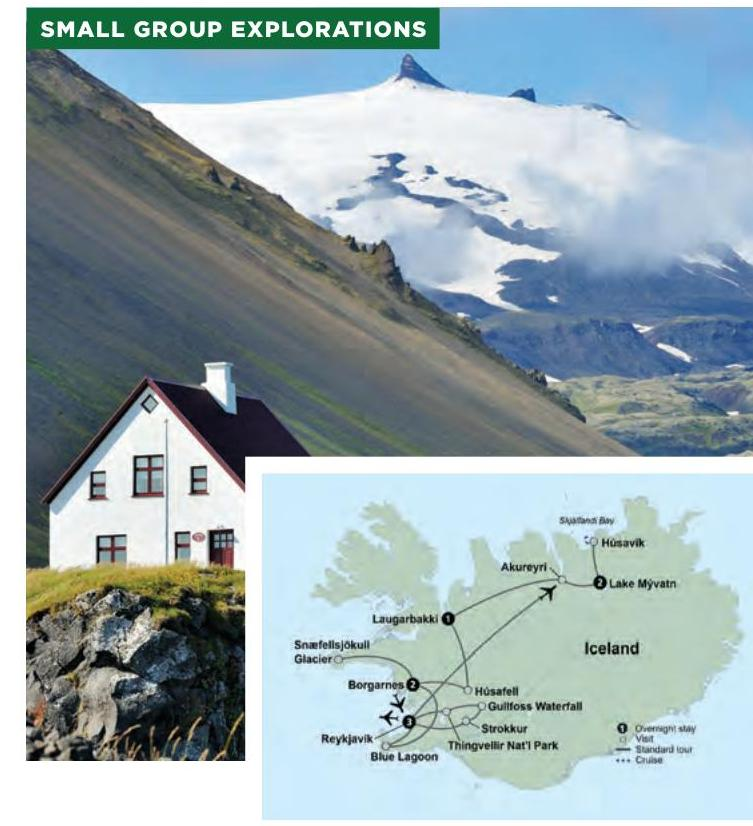

This is Iceland. A land forged by fire and ice and full of dramatic contrasts - from ethereal lava fields and thundering waterfalls to charming coastal villages.

## HIGHLIGHTS

- Tour the old section of Reykjavík on foot.
- Relax in the mineral rich waters of the iconic Blue Lagoon.
- Explore Snæfellsjökull glacier aboard a mountain truck.
- Indulge in Icelandic-inspired cuisine at a restaurant.
- Join experts for whale watching on Skjálfandi Bay.

## STAYS

2 Nights Reykjavik / 2 Nights Lake Myvatn / 1 Night Laugarbakki / 2 Nights Borgarnes / 1 Night Reykjavik

## VISIT COLLETTE.COM/604 FOR MORE DETAILS.

## Page 47

## SHADES OF IRELAND

10 DAYS / 13 MEALS / STARTING AT \$2,299* PP PRICE BASED ON NOVEMBER 1, 2021 DEPARTURE.

View our website for additional dates.
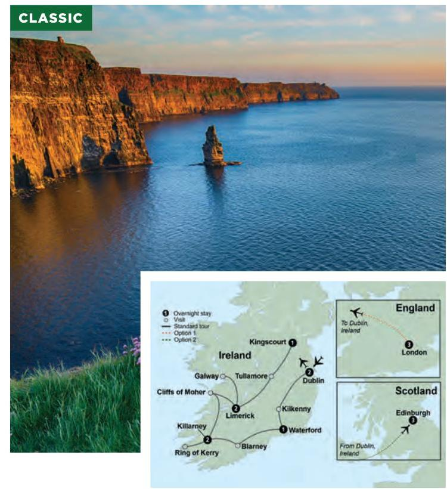

Gradations of green, rolling hills and dramatic, rugged coastline are ripe for exploring in resplendent Ireland.

## HIGHLIGHTS

- Overnight on the grounds of a regal castle.
- See sheepdogs in action when you visit a working farm.
- Stand in awe of the 700-foot-high Cliffs of Moher.
- Kiss the famed Blarney Stone at Blarney Castle.
- Taste the "water of life" during an Irish whiskey tasting.

## STAYS

2 Nights Dublin / 1 Night Waterford / 2 Nights Killarney / 2 Nights Limerick / 1 Night Kingscourt

## SHADES OF IRELAND FEATURING NORTHERN IRELAND

13 DAYS / 17 MEALS / STARTING AT \$2,999* PP PRICE BASED ON MARCH 7, 2022 DEPARTURE.

View our website for additional dates.
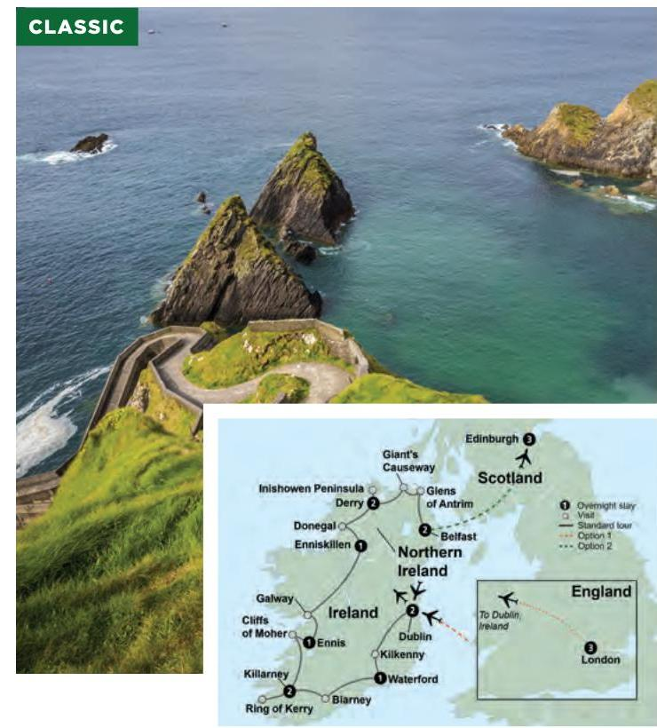

Experience Ireland in all its vibrant shades as you travel from the lively city of Dublin to the untamed natural beauty of Northern Ireland.

## HIGHLIGHTS

- See Northern Ireland's stunning Giant's Causeway.
- Choose from a "menu" of Derry's best restaurants.
- Overnight on the grounds of a historic manor house.
- Experience a traditional ceili in Ulster.
- Stand in awe of the 700-foot-high Cliffs of Moher.

## STAYS

2 Nights Dublin / 1 Night Waterford / 2 Nights Killarney / 1 Night Ennis / 1 Night Enniskillen / 2 Nights Derry / 2 Nights Belfast

VISIT COLLETTE.COM/68 FOR MORE DETAILS.

## Page 48

## COUNTRYSIDE OF THE EMERALD ISLE

10 DAYS / 12 MEALS / STARTING AT \$2,599* PP PRICE BASED ON MARCH 27, 2022 DEPARTURE.

View our website for additional dates.
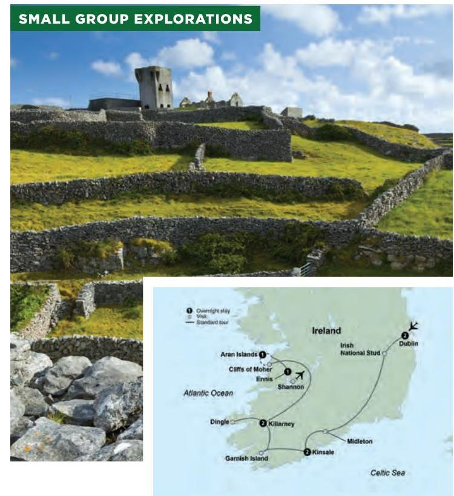

From ancient castles and historic Dublin to less-traveled roads and charming villages, this adventure brings together the best of the Emerald Isle.

## HIGHLIGHTS

- Explore the Jameson Irish Whiskey distillery.
- Spend the night on the enchanting Aran Islands.
- Enjoy a private tour of Christ Church Cathedral.
- Spend a day exploring the Dingle Peninsula.
- Take in scenic views from Ireland's Wild Atlantic Way.

## STAYS

2 Nights Dublin / 2 Nights Kinsale / 2 Nights Killarney / 1 Night Inisheer / 1 Night Ennis

## IRISH   SPLENDOR

8 DAYS / 8 MEALS / STARTING AT \$1,599* PP PRICE BASED ON JANUARY 26, 2022 DEPARTURE.

View our website for additional dates.
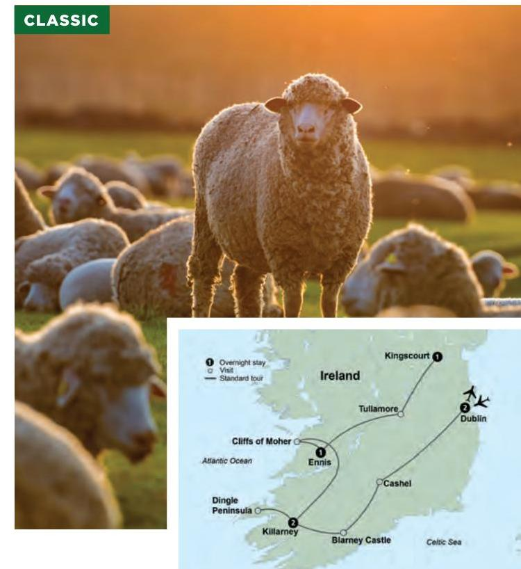

Uncover the charms of the Emerald Isle. From castles to cliffs, rolling green ranges and the "water of life," the splendor of Ireland awaits.

## HIGHLIGHTS

- Travel the coastal routes of the Dingle Peninsula.
- See the Rock of Cashel, where St. Patrick preached.
- Kiss the famous Blarney Stone at Blarney Castle.
- Sip cocktails in the crypt of Christ Church Cathedral.
- Explore Tullamore and delight in a whiskey tasting.

## STAYS

2 Nights Dublin / 2 Nights Killarney / 1 Night Ennis / 1 Night Kingscourt

VISIT COLLETTE.COM/427 FOR MORE DETAILS.

## Page 49

## SHRINES OF IRELAND

9 DAYS / 11 MEALS / STARTING AT \$2,149* PP PRICE BASED ON OCTOBER 7, 2021 DEPARTURE.

View our website for additional dates.
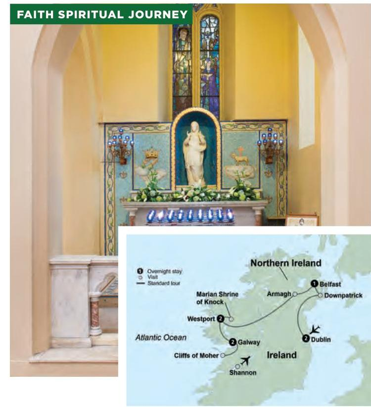

Connect with your faith on a poignant journey to Ireland's holy shrines and famous sites.

## HIGHLIGHTS

- Enjoy an evening of traditional Irish song and dance.
- Cruise beneath the incredible Cliffs of Moher.
- Take a tour of Dublin's St. Patrick's Cathedral.
- Celebrate mass at the Marian Shrine of Knock.
- Tour Kylemore Abbey, a Benedictine monastery.

## STAYS

2 Nights Dublin / 1 Night Belfast / 2 Nights Westport / 2 Nights Galway

## EXPLORING BRITAIN \& IRELAND

15 DAYS / 20 MEALS / STARTING AT \$2,999* PP PRICE BASED ON NOVEMBER 5, 2021 DEPARTURE.

View our website for additional dates.
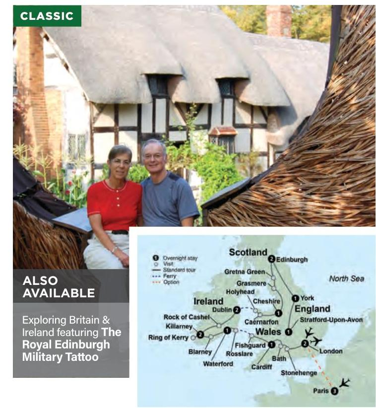

This epic journey takes you over fertile farmlands and across the Irish Sea, through England, Ireland, Scotland and Wales.

## HIGHLIGHTS

- Behold the sights of Killarney in a jaunting car.
- Visit the Lake District's charming English villages.
- Ponder ancient mysteries at Stonehenge.
- Overnight in London, Cardiff, Dublin and Edinburgh.
- Try your hand at Irish cuisine during a cooking class.

## STAYS

2 Nights London / 1 Night Cardiff / 1 Night Waterford / 2 Nights Killarney / 2 Nights Dublin / 1 Night Cheshire / 2 Nights Edinburgh / 1 Night York / 1 Night Stratford-uponAvon

VISIT COLLETTE.COM/62 FOR MORE DETAILS.

## Page 50

# Europe 

## BRITISH LANDSCAPES

10 DAYS / 12 MEALS / STARTING AT \$2,149* PP PRICE BASED ON OCTOBER 31, 2021 DEPARTURE.

View our website for additional dates.
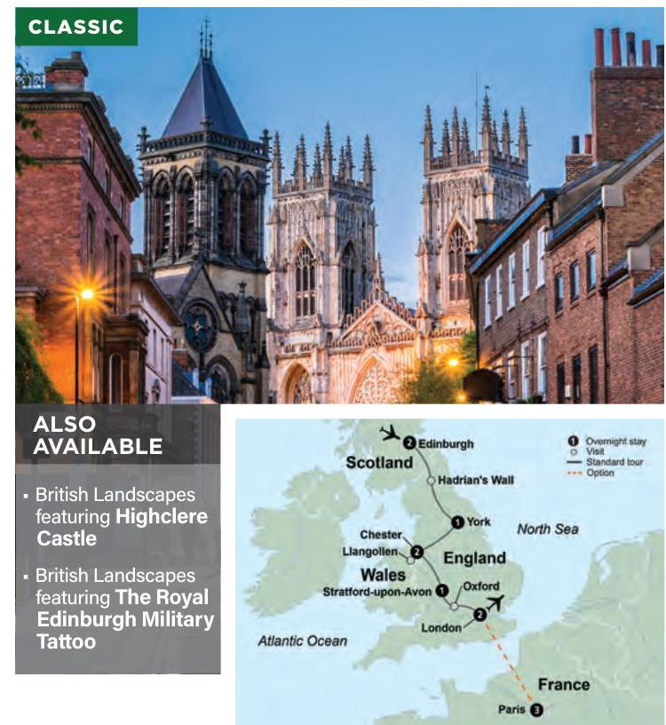

An adventure fit for a Shakespearean tale takes you from verdant hillsides and glittering lakes to bustling British cities rich with culture.

## HIGHLIGHTS

- Take a guided tour of the historic Edinburgh Castle.
- Explore the ruins of an ancient fort during a visit to Hadrian's Wall.
- Explore Wales during a tour of Llangollen.
- Enjoy dinner at Shakespeare's 400-year-old home.
- Dine like a Londoner with dinner at an English pub.

## STAYS

2 Nights Edinburgh / 1 Night York / 2 Nights Chester / 1 Night Stratford-upon-Avon / 2 Nights London

## JOURNEY THROUGH SCOTLAND \& ENGLAND

14 DAYS / 19 MEALS / STARTING AT \$3,699* PP PRICE BASED ON NOVEMBER 3, 2021 DEPARTURE.

View our website for additional dates.
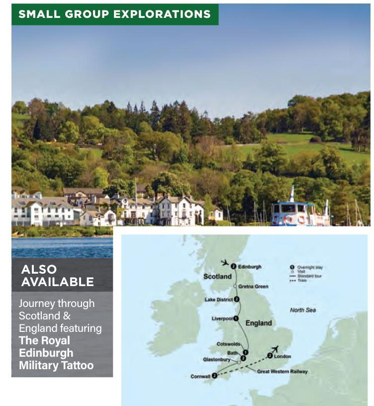

From poetic countryside to bustling capitals, experience the different sides of Scotland and England.

## HIGHLIGHTS

- Overnight in a 16th century manor house.
- Journey by scenic train from Cornwall to London.
- Spend two nights in beautiful, historic Bath.
- Discover the romantic inspiration of the Lakes District.
- Sit down for a whiskey-inspired dinner in Edinburgh.

## STAYS

2 Nights Edinburgh / 2 Nights Lake Windmere / 1 Night Liverpool / 1 Night Cotswolds / 2 Nights Bath / 2 Nights St. Austell / 2 Nights London

## VISIT COLLETTE.COM/681 FOR MORE DETAILS.

## Page 51

## EXPLORING SCOTLAND \& IRELAND

13 DAYS / 17 MEALS / STARTING AT \$3,099* PP PRICE BASED ON MARCH 27, 2022 DEPARTURE.

View our website for additional dates.
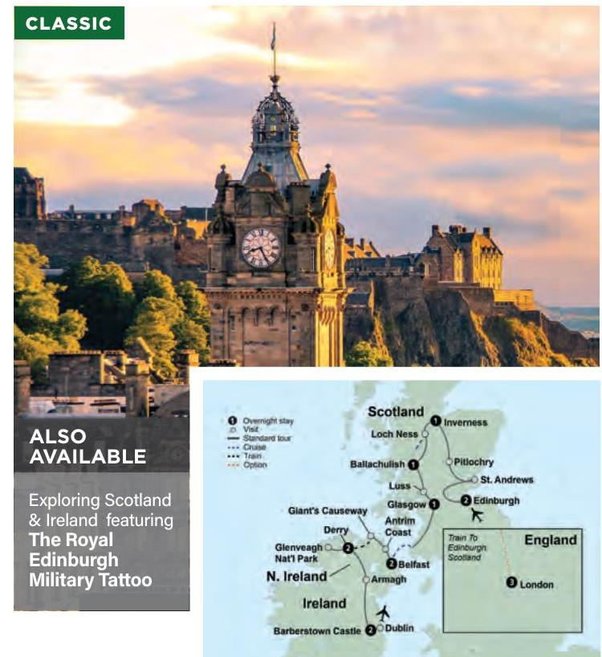

Regal cities, bucolic countryside and Celtic culture await you on a journey through Scotland and Ireland.

## HIGHLIGHTS

- Explore Urquhart Castle on the banks of Loch Ness.
- Have a "night on the town" in 20th century Ulster.
- Embark on a scenic cruise on beautiful Loch Ness.
- Take a walking tour of Derry and its medieval walls.
- Sample the spirits at a Scottish whisky distillery.

## STAYS

2 Nights Edinburgh / 1 Night Inverness / 1 Night Ballachulish / 1 Night Glasgow / 2 Nights Belfast / 2 Nights Derry / 2 Nights Kildare

## DISCOVER SCOTLAND

10 DAYS / 14 MEALS / STARTING AT \$2,499* PP PRICE BASED ON OCTOBER 24, 2021 DEPARTURE.

View our website for additional dates.
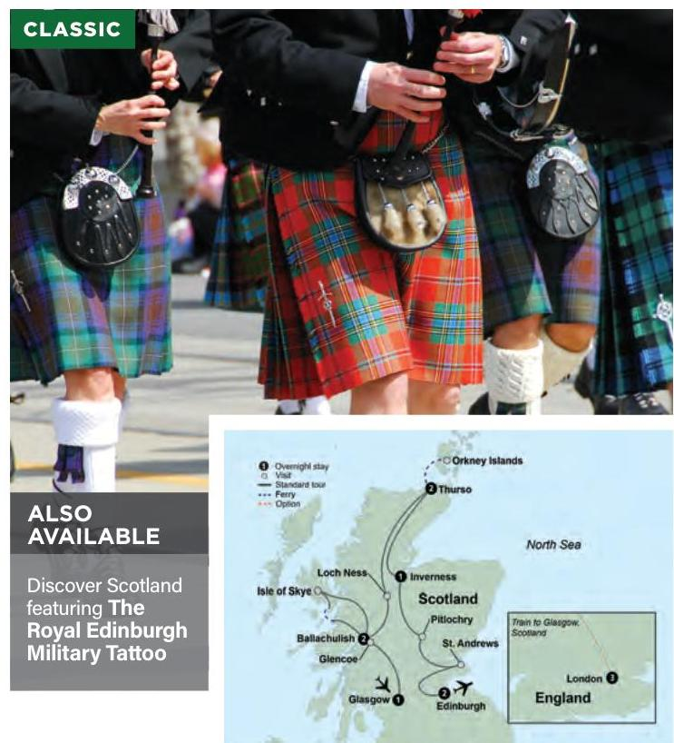

Encounter storybook castles, magical islands, legendary lakes and one mythical sea creature in majestic Scotland.

## HIGHLIGHTS

- Meet a shepherd and his sheepdogs on a working farm.
- Experience the Orkney Islands during a guided excursion.
- Visit Edinburgh Castle, a fortress set above the city.
- Explore the Isle of Skye and its dramatic views.
- Learn the art of Scotch whisky during a distillery tour.

## STAYS

1 Night Glasgow / 2 Nights Ballachulish /
2 Nights Thurso / 1 Night Grantown-on-Spey /
2 Nights Edinburgh
VISIT COLLETTE.COM/92 FOR MORE DETAILS.

## Page 52

# europe 

## SCOTTISH ADVENTURE

10 DAYS / 13 MEALS / STARTING AT \$2,799* PP PRICE BASED ON MARCH 20, 2022 DEPARTURE.

View our website for additional dates.
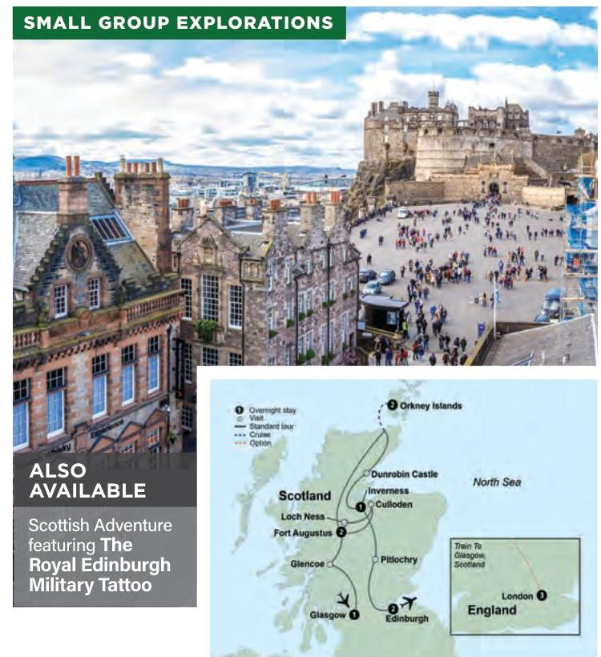

Uncover Scotland's rich cultural and historic foundation on a spirited adventure from the Highlands to high-energy cities.

## HIGHLIGHTS

- Get a taste of Scotch whisky during a distillery tour and tasting. - Cruise the legendary and scenic waters of Loch Ness.
- Spend two nights on the rugged Orkney Islands.
- See a farmer and his sheepdogs at work on a Highlands farm.
- Explore the eclectic and historic city of Edinburgh.

## STAYS

1 Night Glasgow / 2 Nights Loch Ness / 2 Nights Orkney Islands / 1 Night Inverness / 2 Nights Edinburgh

## SCOTLAND: ISLES OF LORE \& LEGEND

12 DAYS / 17 MEALS / STARTING AT \$3,299* PP PRICE BASED ON OCTOBER 23, 2021 DEPARTURE.

View our website for additional dates.
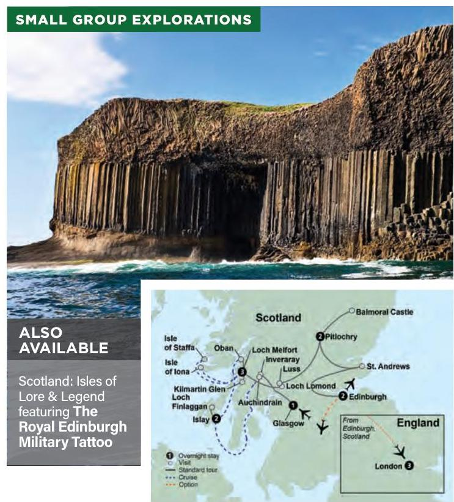

Discover the mystical side of Scotland - where rocky coastlines and rolling clouds meet a history built upon legends, whisky, and clans.

## HIGHLIGHTS

- Tour the Old Course at St. Andrews, world capital of golf.
- Head out on an off-road adventure with a kilted guide.
- Sip the famous "water of life" in a local whisky distillery.
- See the hexagonal columns of Fingal's Cave from the water.
- Enjoy a farm-to-table meal at the National Piping Centre.

## STAYS

1 Night Glasgow / 2 Nights Islay / 3 Nights Oban /
2 Nights Pitlochry / 2 Nights Edinburgh

VISIT COLLETTE.COM/663 FOR MORE DETAILS.

## Page 53

## SPOTLIGHT ON LONDON

7 DAYS / 8 MEALS / STARTING AT \$1,599* PP PRICE BASED ON OCTOBER 7, 2021 DEPARTURE.

View our website for additional dates.
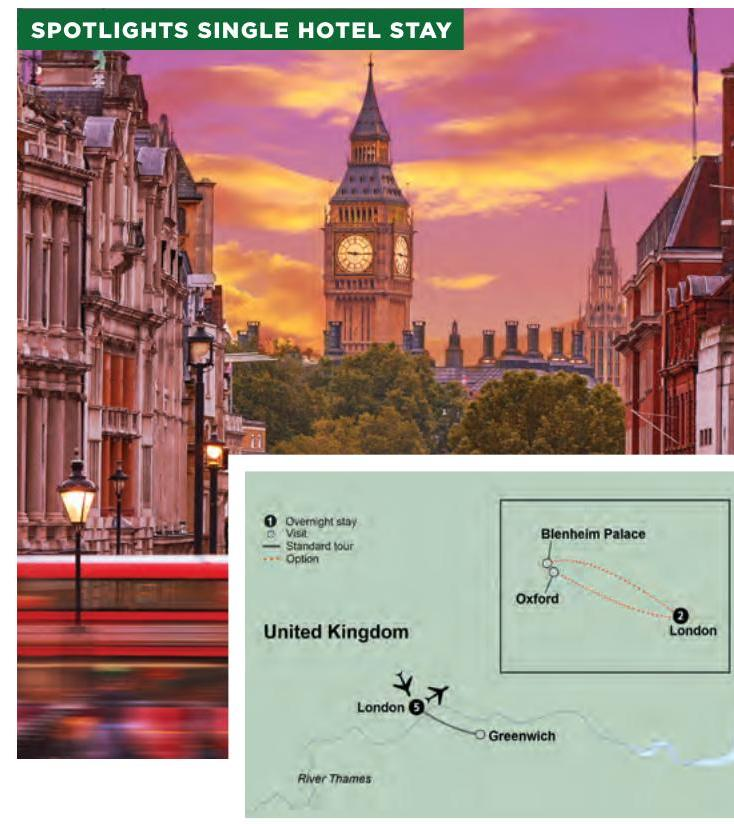

London is calling. Answer the call as you encounter majestic pageantry, storied history and grand charm.

## HIGHLIGHTS

- Ride London's famous Underground, known as "the Tube."
- Experience an eye-opening panoramic tour of London.
- Visit Kensington Palace.
- Choose to attend a London theatre performance or afternoon tea at Covent Garden.
- Take a culinary walking tour through London's East End.

## STAYS

5 Nights London

## CHRISTMAS IN LONDON

7 DAYS / 8 MEALS / STARTING AT \$1,499* PP PRICE BASED ON DECEMBER 9, 2021 DEPARTURE.

View our website for additional dates.
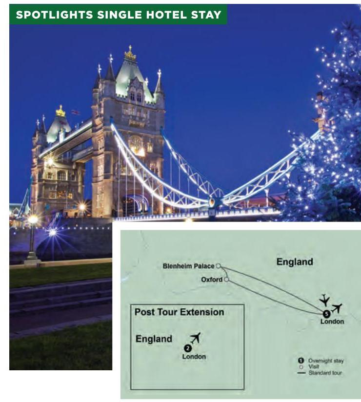

Feel the holiday spirit when you experience the Christmas season in London, a world within a city.

## HIGHLIGHTS

- Feast upon a dinner inspired by the Christmas season.
- Enjoy afternoon tea in Covent Garden.
- See Blenheim Palace adorned for the season.
- Explore Westminster Abbey with a local expert.
- See one of London's finest theatre performances.

## STAYS

5 Nights London

## Page 54

## LONDON \& PARIS

8 DAYS / 9 MEALS / STARTING AT \$2,299* PP PRICE BASED ON JANUARY 27, 2022 DEPARTURE.

View our website for additional dates.

Cross the English Channel via train as you journey from cosmopolitan London to romantic Paris, taking in their stunning landmarks along the way.

## HIGHLIGHTS

- Cruise the Seine River with views of Paris' skyline.
- A local expert leads you on tours of London and Paris.
- Take in stunning views when dining at the Eiffel Tower.
- Enjoy London's culinary renaissance at a dinner featuring contemporary British cuisine.
- Sit down to dinner at Paris' oldest cabaret theatre.

## STAYS

3 Nights London / 3 Nights Paris

## VISIT COLLETTE.COM/7 FOR MORE DETAILS.

## TREASURES OF EUROPE

12 DAYS / 15 MEALS / STARTING AT \$3,499* PP PRICE BASED ON NOVEMBER 11, 2021 DEPARTURE.

View our website for additional dates.
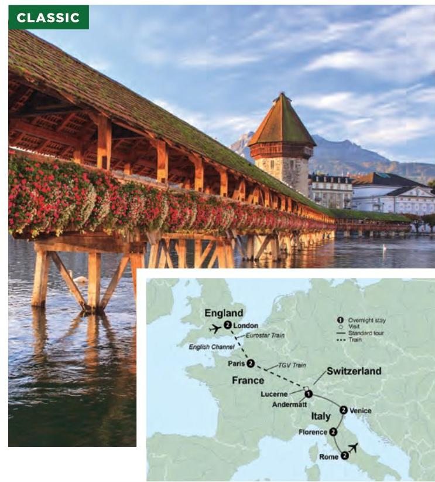

Set your sights on a European journey of a lifetime and discover all the must-sees of England, France and Italy.

## HIGHLIGHTS

- Enjoy free time in Paris and Rome to explore at leisure.
- Stroll through the floating city of Venice.
- Cross the majestic Swiss Alps into Italy.
- See the stunning artistry of Michelangelo's David.
- Enjoy an unforgettable dinner cruise on the River Seine.

## STAYS

2 Nights London / 2 Nights Paris / 1 Night Lucerne / 2 Nights Venice /2 Nights Florence / 2 Nights Rome

VISIT COLLETTE.COM/636 FOR MORE DETAILS.

## Page 55

## NETHERLANDS, BELGIUM \& FRANCE

12 DAYS / 15 MEALS / STARTING AT \$3,799* PP PRICE BASED ON NOVEMBER 6, 2021 DEPARTURE.

View our website for additional dates.
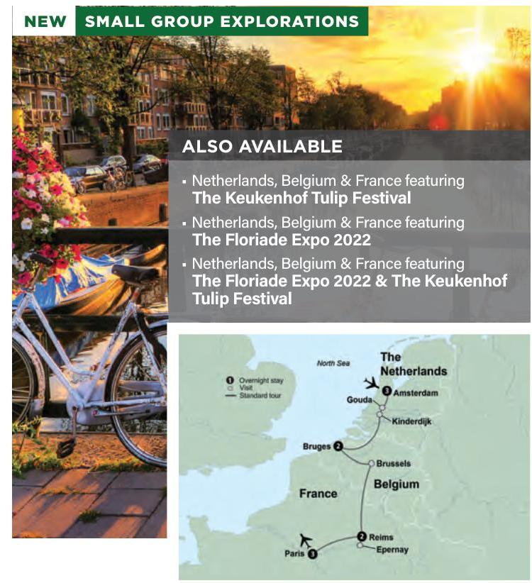

Dutch windmills, cozy streets, bubbling champagne, and the "City of Light" - experience the essence of 3 must-visit European countries.

## HIGHLIGHTS

- Ride through the "City of Light" in an open-roof retro car.
- Spend 2 nights in the quaint Belgian town of Bruges.
- Meet a local cheese producer and sample the famous cheese.
- Cook up local flavors at a hands-on culinary class in Paris.
- Enjoy a full day of exploration along the Route de Champagne.

## STAYS

3 Nights Amsterdam / 2 Nights Bruges / 2 Nights Reims / 3 Nights Paris

## SPOTLIGHT ON THE FRENCH RIVIERA

9 DAYS / 11 MEALS / STARTING AT \$1,999* PP PRICE BASED ON NOVEMBER 6, 2021 DEPARTURE.

View our website for additional dates.
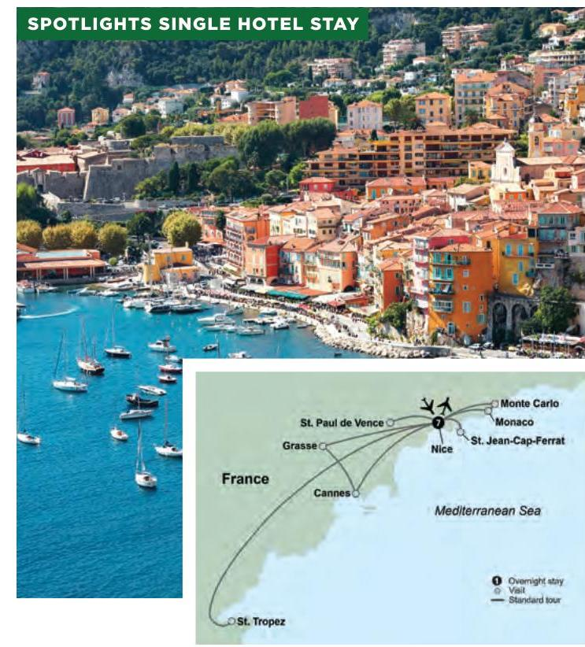

Uncover the chic resorts, sun-soaked beaches, and elegant allure that attract the rich and famous to the exquisite French Riviera.

## HIGHLIGHTS

- Visit Villa Ephrussi de Rothschild and its gardens.
- Experience perfume making during a hands-on workshop.
- Tour Nice, the sunny playground of the rich and famous.
- Explore Monaco and take in its iconic sites.
- Enjoy a vineyard tour and tasting of local rosé wines.

## STAYS

7 Nights Nice

VISIT COLLETTE.COM/248 FOR MORE DETAILS.

## Page 56

# Europe 

## FRANCE MAGNIFIQUE

15 DAYS / 19 MEALS / STARTING AT \$3,599* PP PRICE BASED ON OCTOBER 28, 2021 DEPARTURE.

View our website for additional dates.
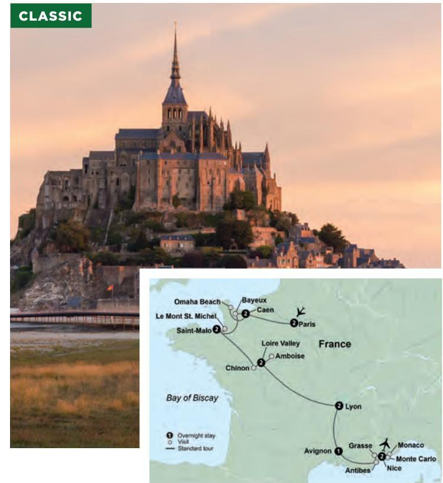

Grab your beret and rendezvous with romantic Paris, picturesque Provence, historic Normandy, and stunning Le Mont Saint-Michel.

## HIGHLIGHTS

- Enjoy a cruise along the River Seine.
- Step back in time and see the UNESCO Bayeux Tapestry.
- Delight in a tour and tasting at a local winery.
- Learn the secrets of perfume making in Grasse.
- Dine at a traditional bouchon and sample Lyon's cuisine.

## STAYS

2 Nights Paris / 2 Nights Caen / 2 Nights Saint-Malo / 2 Nights Loire Valley / 2 Nights Lyon / 1 Night Avignon / 2 Nights Nice

## JOURNEY THROUGH SOUTHERN FRANCE COMING SOON

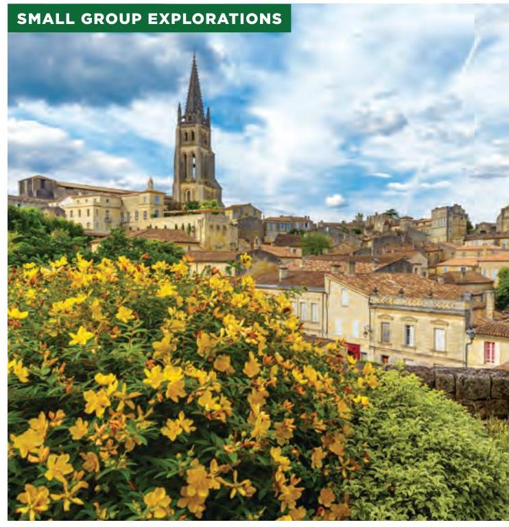

## Page 57

## LA BELLE SEINE

9 DAYS / 20 MEALS / STARTING AT \$3,899* PP PRICE BASED ON SEPTEMBER 28, 2021 DEPARTURE.
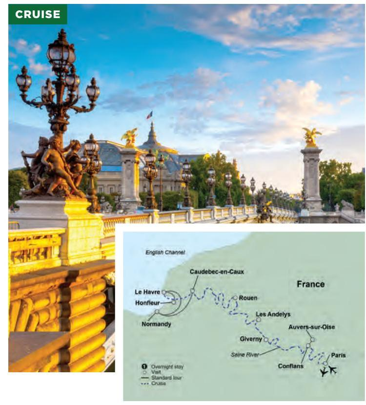

Relax and settle in for a tranquil river cruise that takes you from Paris through the resplendent Normandy region.

## HIGHLIGHTS

- Explore Normandy on a full-day excursion.
- View the Gros Horloge, Rouen's astronomical clock.
- Visit Honfleur, a remarkable maritime city.
- Take a panoramic coach tour of Paris.
- Celebrate your journey during a Captain's Gala dinner.

## STAYS

7 Night Cruise Aboard the MS Amadeus Diamond

VISIT COLLETTE.COM/638 FOR MORE DETAILS.

## what our travelers are saying:

66 The tour hit all the sites I had on my France bucket list. The hotels were conveniently located near restaurants and within walking distance of sites of interest. 99

- Collette Traveler on France Magnifique

66 Seine River Cruise was wonderful. Ship was comfortable, food delicious and staff exceptional. We had a great time. 99

- Collette Traveler on La Belle Seine

66 Our Southern France tour was outstanding in every aspect. Terrific guide, wonderful hotels, great meals and wine, a wide variety of tour sites...You couldn't find a better trip. 99

- Collette Traveler on Journey Through Southern France

## captured on tour

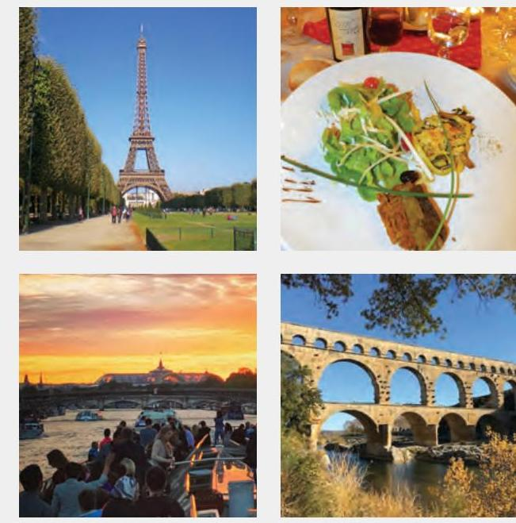

## we love hearing from our travelers!

Access thousands of honest, first-hand reviews for all of our tours at collette.com

## Page 58

## SHRINES OF FRANCE

11 DAYS / 16 MEALS / STARTING AT \$2,699* PP PRICE BASED ON MARCH 26, 2022 DEPARTURE.

View our website for additional dates.

FAITH SPIRITUAL JOURNEY
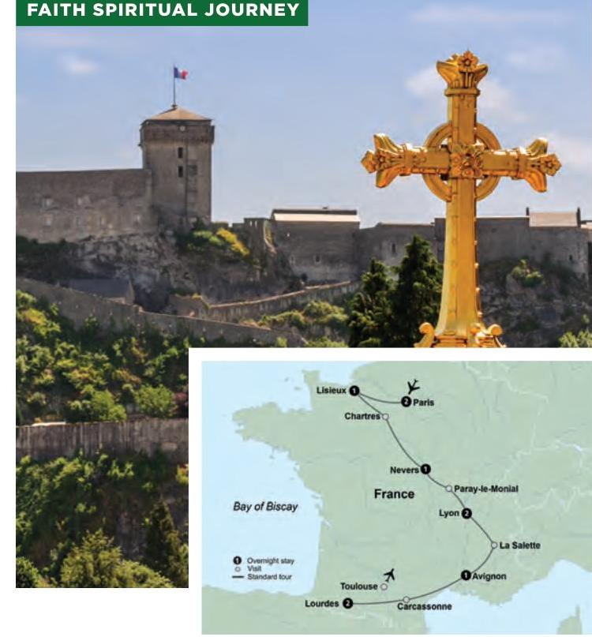

Feel the irresistible spirit of France on a pilgrimage to the country's holiest sites and most revered shrines.

## HIGHLIGHTS

- See Paris on a sightseeing cruise along the Seine.
- Discover the crypts of the Basilica of St. Thérèse.
- Worship at La Salette, a notorious pilgrimage site.
- Kneel in prayer at the glass tomb of St. Bernadette.
- Experience Lyon's traditional cuisine at a local bouchon.

## STAYS

2 Nights Paris / 1 Night Lisieux / 1 Night Nevers / 2 Nights Lyon / 1 Night Avignon / 2 Nights Lourdes

## SPOTLIGHT ON PARIS

7 DAYS / 8 MEALS / STARTING AT \$2,099* PP PRICE BASED ON FEBRUARY 22, 2022 DEPARTURE.

View our website for additional dates.

## SPOTLIGHTS SINGLE HOTEL STAY

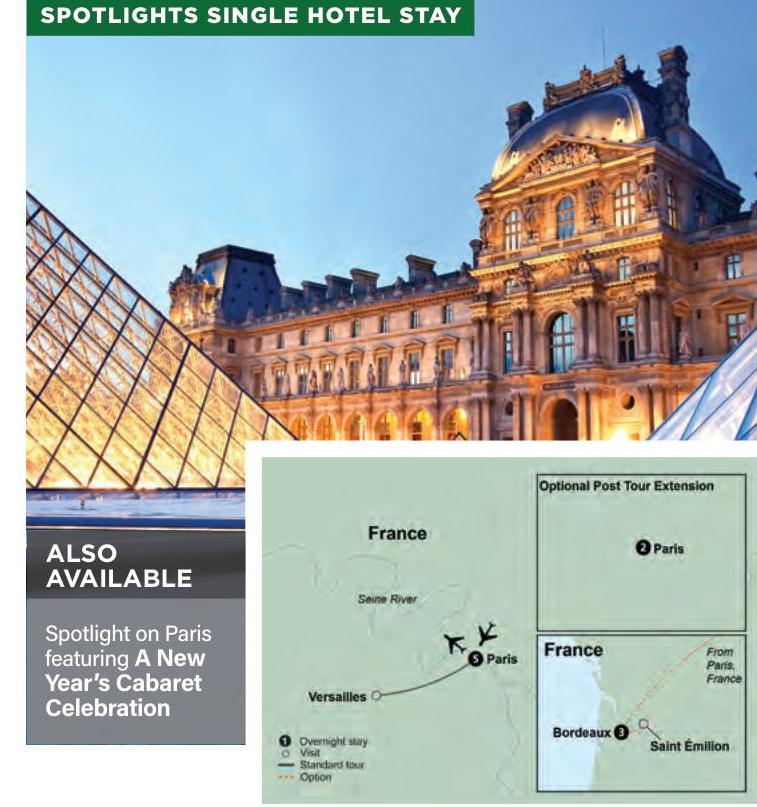

Be filled with the joie de vivre (the joy of life) as you soak in the romance and unmistakable charm of Paris.

## HIGHLIGHTS

- Explore the Louvre Museum with an expert.
- See Paris at its best as you uncover the Champs-Elysees, Notre Dame and the Arc de Triomphe.
- Admire Paris' stunning skyline on a Seine River cruise.
- Tour the Palace of Versailles with a local guide.
- Dine on French cuisine and wine at the Eiffel Tower.

## STAYS

5 Nights Paris

## VISIT COLLETTE.COM/533 FOR MORE DETAILS.

## Page 59

## THE AZORES: JEWELS OF PORTUGAL

12 DAYS / 17 MEALS / STARTING AT \$2,649* PP PRICE BASED ON OCTOBER 8, 2021 DEPARTURE.

View our website for additional dates.

## SMALL GROUP EXPLORATIONS

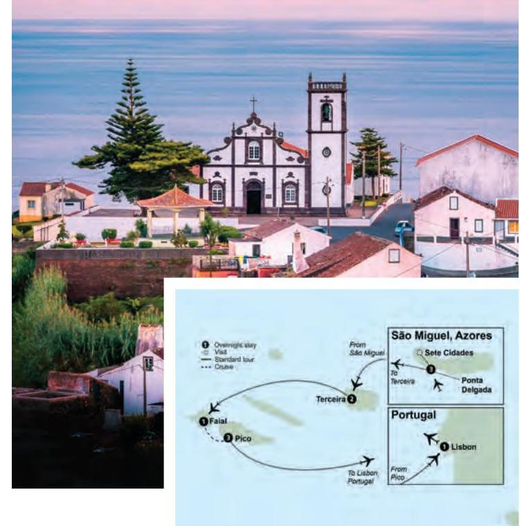

Enter an untouched paradise on an adventure through the Azores, the archipelago gems of Portugal.

## HIGHLIGHTS

- Traverse the entire rim of the Sete Cidades caldera.
- Stay in the lava stone houses of Aldeia da Fonte.
- Discover Pico's volcanic vineyards and try its wines.
- Descend into Algar do Carvão, an ancient lava tube.
- Experience a truly unique cozido das Furnas lunch.

## STAYS

3 Nights Sao Miguel / 2 Nights Terceira / 1 Night Faial / 3 Nights Pico / 1 Night Lisbon

## SPAIN'S CLASSICS

12 DAYS / 16 MEALS / STARTING AT \$2,899* PP PRICE BASED ON DECEMBER 3, 2021 DEPARTURE.

View our website for additional dates.
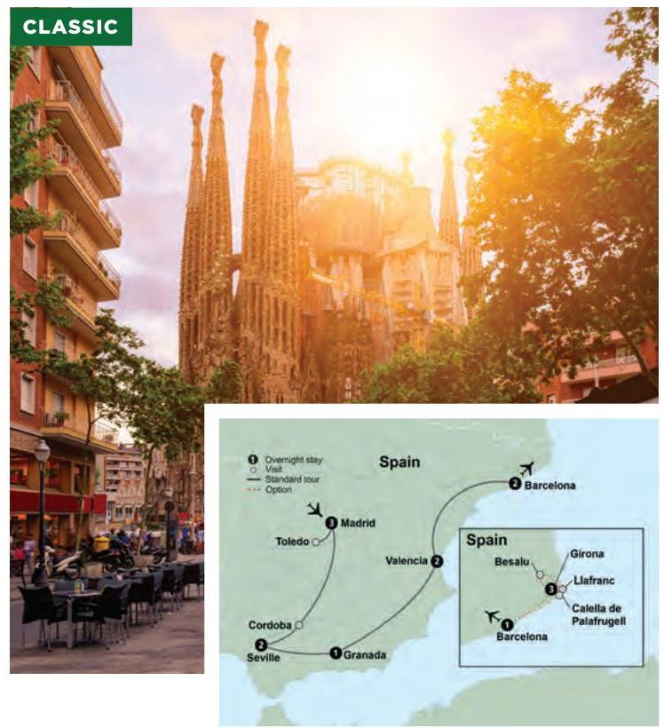

Embrace Spain's zest for life as you discover architectural masterpieces, grand palaces, and sun-drenched Mediterranean coastline.

## HIGHLIGHTS

- Feel the energy of Spain at a flamenco performance.
- In Cordoba, tour the Mezquita, a religious marvel.
- Step back in time as you explore Toledo.
- Tour the world-famous Alhambra palace.
- Enjoy a paella-making demonstration and lunch.

## STAYS

3 Nights Madrid / 2 Nights Seville / 1 Night Granada / 2 Nights Valencia / 2 Nights Barcelona

VISIT COLLETTE.COM/263 FOR MORE DETAILS.

## Page 60

# Europe 

## SPAIN'S CLASSICS \& PORTUGAL

15 DAYS / 20 MEALS / STARTING AT \$3,499* PP PRICE BASED ON MARCH 19, 2022 DEPARTURE.

View our website for additional dates.
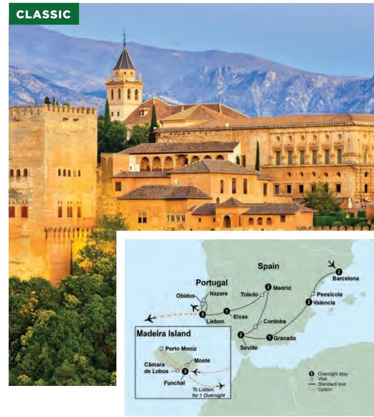

Embark on an Iberian adventure as you take in medieval architecture, idyllic landscapes, and the delectable cuisine of two countries.

## HIGHLIGHTS

- Visit Antonio Gaudi's final masterpiece, La Sagrada Familia.
- Feel the energy of Spain at a flamenco performance.
- In Cordoba, tour the Mezquita, a religious marvel.
- Take in Portugal's stunning "Silver Coast".
- See UNESCO World Heritage sites in Portugal.

## STAYS

2 Nights Barcelona / 2 Nights Valenica / 1 Night Granada / 2 Nights Seville / 2 Nights Madrid / 1 Night Elvas / 3 Nights Lisbon

## VISIT COLLETTE.COM/665 FOR MORE DETAILS.

## SPAIN \& MOROCCO

14 DAYS / 18 MEALS / STARTING AT \$2,999* PP PRICE BASED ON NOVEMBER 6, 2021 DEPARTURE.

View our website for additional dates.
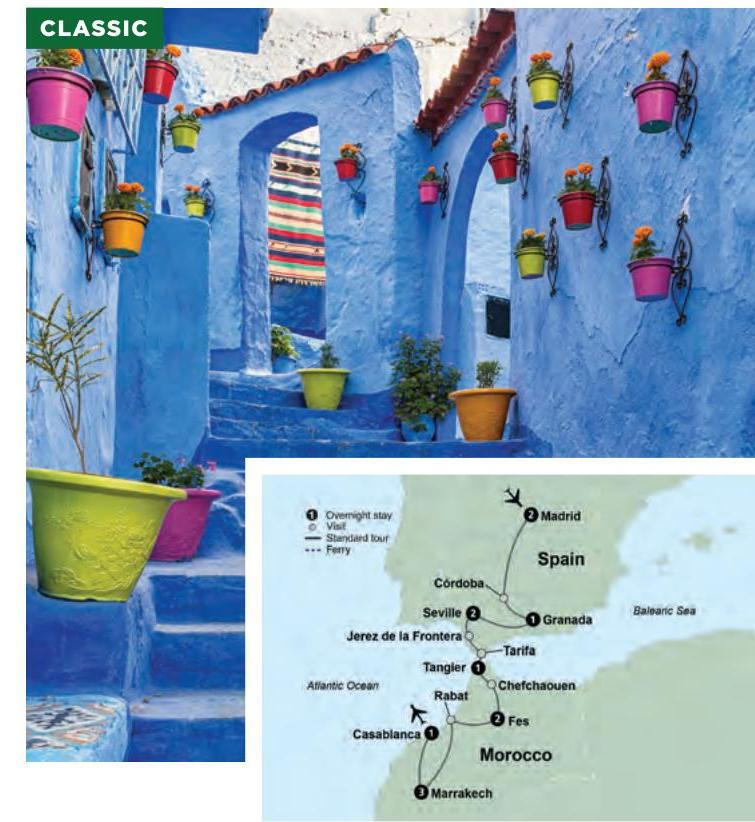

Make your way across two continents and discover a vivid tapestry of cultures, customs, and cuisine on this journey through Spain and Morocco.

## HIGHLIGHTS

- Stroll through the cobbled alleyways of Medina of Fes.
- Visit the final resting place of the Catholic Monarchs.
- Explore Marrakech's ancient El Bahia Palace.
- Visit Chefchaouen, the "Blue City" of Morocco.
- Enjoy a tour and tasting of sherry at a bodega.

## STAYS

2 Nights Madrid / 1 Night Granada / 2 Nights Seville / 1 Night Tangier / 2 Nights Fes / 3 Nights Marrakech / 1 Night Casablanca

VISIT COLLETTE.COM/632 FOR MORE DETAILS.

## Page 61

## SUNNY PORTUGAL

10 DAYS / 12 MEALS / STARTING AT \$1,799* PP PRICE BASED ON DECEMBER 4, 2021 DEPARTURE.

View our website for additional dates.
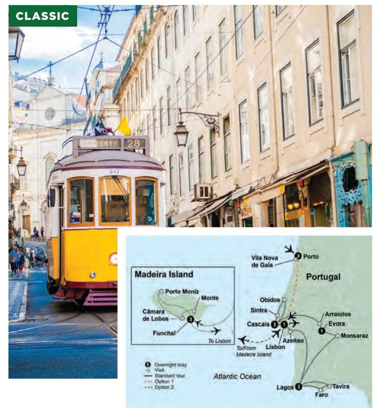

Encounter miles of picturesque shoreline as you make your way from the coastal capital of Lisbon to the beautiful Algarve.

## HIGHLIGHTS

- Stop in Evora, the "Museum City of Portugal."
- Spend three nights on the sunny coast of the Algarve.
- Stay at a coastal resort on the Portuguese Riviera.
- Tour Portugal's capital that overlooks the Tagus River.
- Taste the Alentejo region's wines during a winery tour.

## STAYS

3 Nights Cascais / 1 Night Evora / 3 Nights Algarve / 1 Night Lisbon

## VISIT COLLETTE.COM/51 FOR MORE DETAILS.

## PORTUGAL \& ITS ISLANDS

13 DAYS / 18 MEALS / STARTING AT \$2,299* PP PRICE BASED ON MARCH 12, 2022 DEPARTURE.

View our website for additional dates.
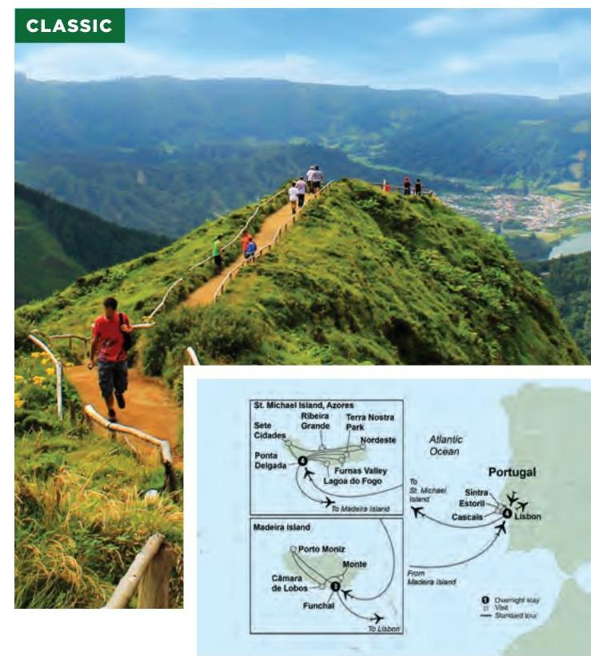

Beauty, history, cuisine, and culture. Experience the best of Portugal as you explore its capital city, coastal villages, and remote islands.

## HIGHLIGHTS

- Enjoy a cozido das Furnas lunch in Furnas Valley.
- Experience the beauty of Portugal's Riviera.
- Gaze upon the pristine twin lakes of Sete Cidades.
- Tour Lisbon and uncover its treasures.
- Explore the Azorean island of St. Michael.

## STAYS

3 Nights Lisbon / 4 Nights Sao Miguel / 3 Nights Madeira Island / 1 Night Lisbon

VISIT COLLETTE.COM/414 FOR MORE DETAILS.

## Page 62

## PILGRIMAGE TO FATIMA \& LOURDES WITH BARCELONA

10 DAYS / 16 MEALS / STARTING AT \$1,999* PP PRICE BASED ON OCTOBER 24, 2021 DEPARTURE.

View our website for additional dates.
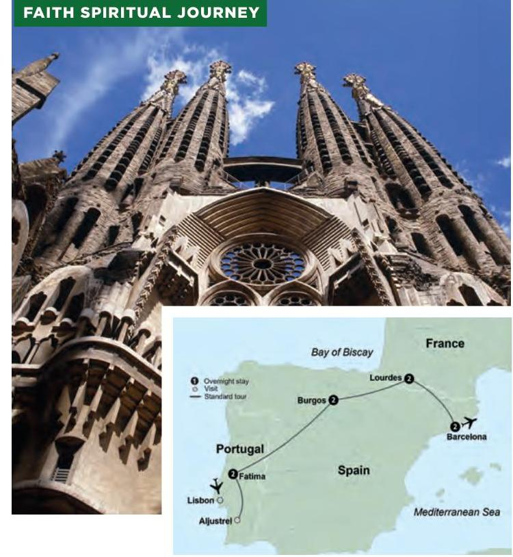

Find inspiration on a sojourn of faith. Discover some of Europe's most revered sites and immerse yourself in a coalescence of culture.

## HIGHLIGHTS

- Worship in the holy basilicas of Fatima and Lourdes.
- Spend time at the magnificent Cathedral of Burgos.
- View the site of the fifth apparition in Valinhos.
- Celebrate mass at the stunning "La Sagrada Familia."

## STAYS

2 Nights Fatima / 2 Nights Burgos / 2 Nights Lourdes / 2 Nights Barcelona

## DISCOVER CROATIA, SLOVENIA \& THE ADRIATIC COAST

12 DAYS / 16 MEALS / STARTING AT \$2,649* PP PRICE BASED ON NOVEMBER 4, 2021 DEPARTURE.

View our website for additional dates.
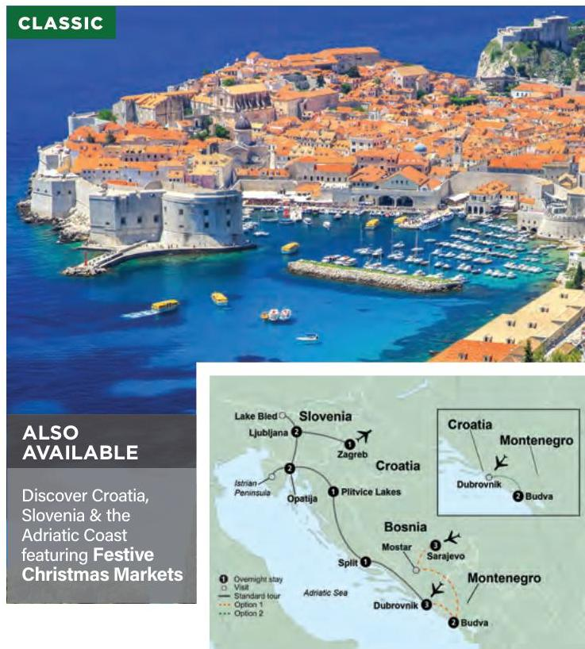

Ancient towns, tranquil lakes, and shining sands. Delight in the old-world charm found in this sunny Adriatic paradise.

## HIGHLIGHTS

- In Dubrovnik, visit Europe's oldest pharmacy.
- Stroll through Split and see Diocletian's Palace.
- Spend three nights in Dubrovnik.
- Explore Opatija, "Croatia's Riviera."
- Sample farm-to-table delicacies at a local restaurant.

## STAYS

3 Nights Dubrovnik / 1 Night Split / 1 Night Plitvice / 2 Nights Opatija / 2 Nights Ljubljana / 1 Night Zagreb

VISIT COLLETTE.COM/258 FOR MORE DETAILS.

## Page 63

## CROATIA \& ITS ISLANDS

12 DAYS / 19 MEALS / STARTING AT \$3,299* PP PRICE BASED ON APRIL 12, 2023 DEPARTURE.

View our website for additional dates.
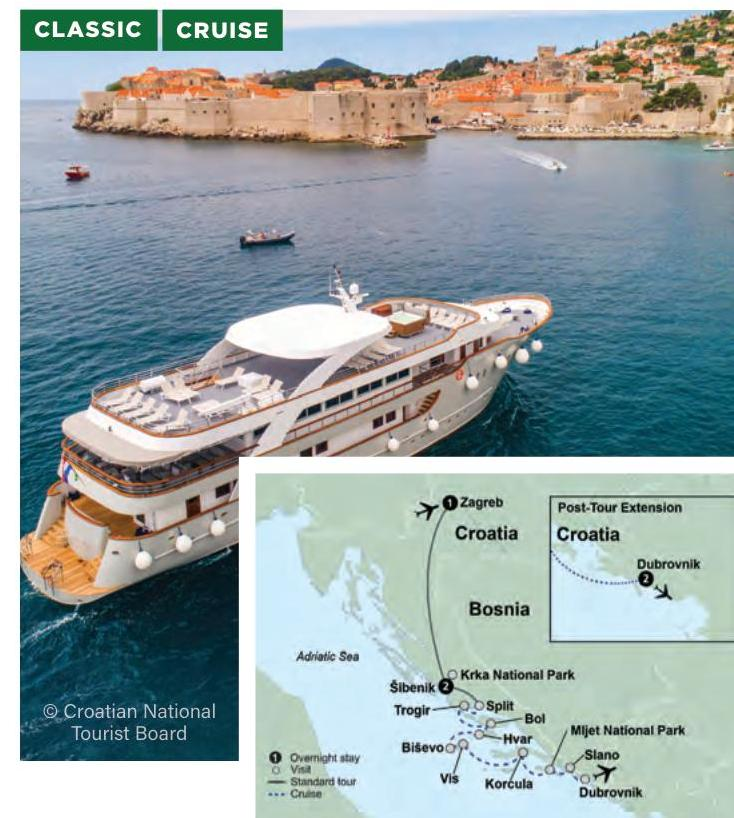

From medieval architecture to ethereal waterfalls, coast along the sparkling Adriatic Sea and experience the best of Croatia.

## HIGHLIGHTS

- Explore historic Dubrovnik with a local expert.
- Partake in a traditional Croatian folklore show.
- Take in the waterfalls of Krka National Park.
- Relax on the "Golden Cape" beaches of Bol.
- Enjoy ancient Dalmatian delicacies.

## STAYS

1 Night Zagreb / 2 Nights Sibenik / 7 Night Cruise
Aboard the MS San Spirito

## IT'S YOUR CHOICE

Choose an excursion before departure, and personalize your adventure!

SEE OLD DUBROVNIK YOUR WAY
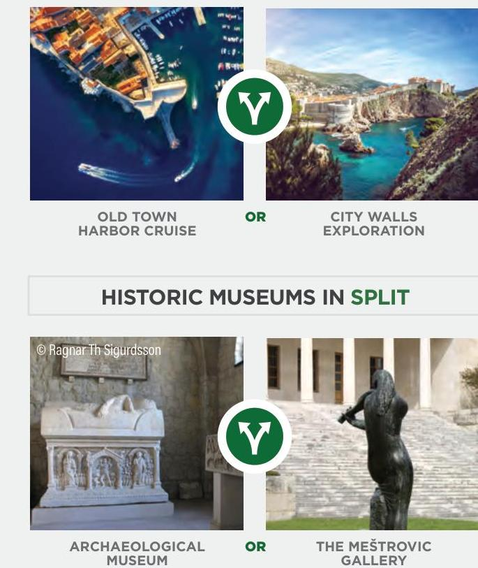

HISTORIC MUSEUMS IN SPLIT

Before you leave for your trip, select the included It's Your Choice excursions that you like the best. On select days during your tour, you'll set out on these customized included experiences.

## Page 64

# europe 

## GREECE ISLAND HOPPER FEATURING ATHENS, MYKONOS \& SANTORINI

11 DAYS / 13 MEALS / STARTING AT \$2,699* PP PRICE BASED ON OCTOBER 22, 2021 DEPARTURE.

View our website for additional dates.
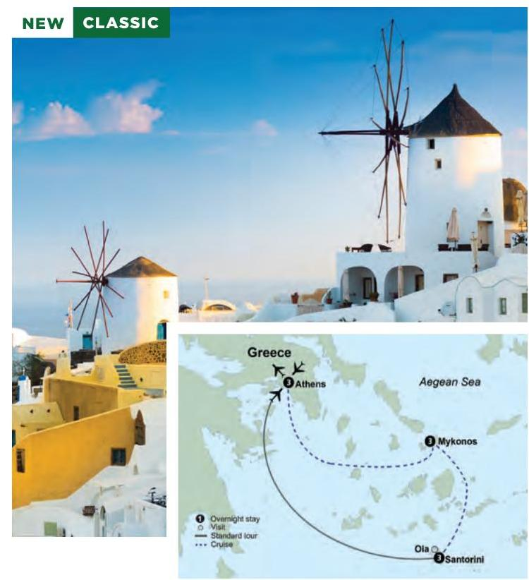

In Greece, discover a place where age-old legends and monuments intertwine with Mediterranean beauty and sunshine.

## HIGHLIGHTS

- Explore Athens' historic sites with a local expert.
- Enjoy 2 days at leisure on the island of Mykonos.
- Admire the view from the legendary Acropolis.
- Discover the picture-perfect village of Oia.
- Glimpse into the past at the Akrotiri excavation site.

## STAYS

2 Nights Athens / 3 Nights Mykonos /
3 Nights Santorini / 1 Night Athens

## VISIT COLLETTE.COM/658 FOR MORE DETAILS.

## EXPLORING GREECE \& ITS ISLANDS

15 DAYS / 22 MEALS / STARTING AT \$3,499* PP PRICE BASED ON OCTOBER 4, 2021 DEPARTURE.

View our website for additional dates.
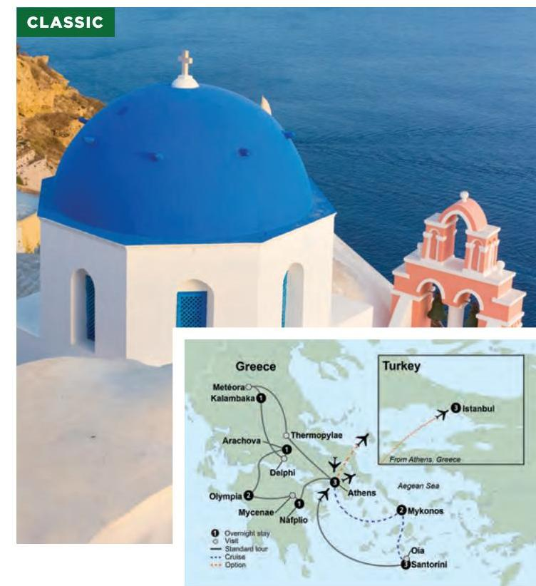

Discover the magnificent ruins of ancient Greece and bask in the brilliance of the Mediterranean.

## HIGHLIGHTS

- Join a local expert exploring the monuments of Athens.
- Explore Olympia, the birthplace of the Olympic Games.
- Visit two breathtaking monasteries in Meteora.
- Discover the ancient artifacts at the Delphi Museum.
- Enjoy a Mediterranean cooking experience.

## STAYS

2 Nights Athens / 1 Night Kalambaka / 1 Night Arachova / 2 Nights Olympia / 1 Night Nafplio / 2 Nights Mykonos / 3 Nights Santorini / 1 Night Athens

## VISIT COLLETTE.COM/2 FOR MORE DETAILS.

## Page 65

## CLASSICAL GREECE

10 DAYS / 15 MEALS / STARTING AT \$1,999* PP PRICE BASED ON NOVEMBER 28, 2021 DEPARTURE.

View our website for additional dates.
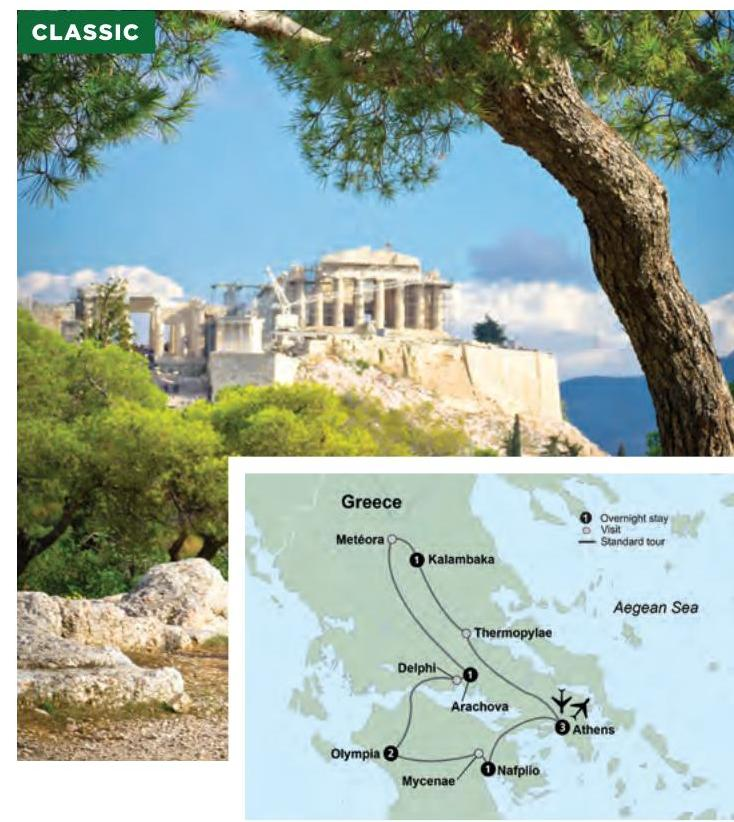

Learn the storied history of Greece as you explore the ancient and modern sites of Athens, Meteora, Delphi, Olympia, and Corinth.

## HIGHLIGHTS

- Visit two Byzantine monasteries in Meteora.
- Discover the ancient artifacts at the Delphi Museum.
- Enjoy a Greek dance class with traditional Greek music.
- Join a local expert exploring the monuments of Athens.
- Explore Olympia, the birthplace of the Olympic Games.

## STAYS

2 Nights Athens / 1 Night Kalambaka / 1 Night Arachova / 2 Nights Olympia / 1 Night Nafplio / 1 Night Athens

VISIT COLLETTE.COM/635 FOR MORE DETAILS.

## GREECE: IN THE FOOTSTEPS OF PAUL THE APOSTLE

11 DAYS / 20 MEALS / STARTING AT \$3,099* PP
PRICE BASED ON MARCH 23, 2022 DEPARTURE.
View our website for additional dates.
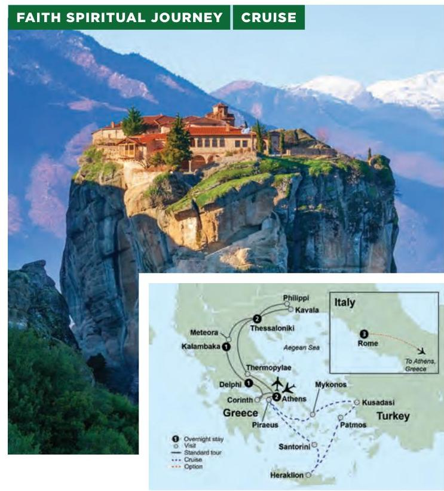

Follow the path of Paul the Apostle as you discover bucolic beauty and ancient history on this Grecian sojourn.

## HIGHLIGHTS

- Visit two breathtaking monasteries in Meteora.
- See where Paul gave his "Men of Athens" speech.
- Visit one of the finest museums of Byzantine art.
- Explore Corinth on a guided tour featuring the Agora.
- Join a local expert exploring the monuments of Athens.

## STAYS

1 Night Athens / 3 Night Cruise Aboard the Olympia /
2 Nights Thessaloniki / 1 Night Kalambaka /
1 Night Arachova / 1 Night Athens

VISIT COLLETTE.COM/346 FOR MORE DETAILS.

## Page 66

## THE BALTICS REVEALED

11 DAYS / 14 MEALS / STARTING AT \$2,899* PP PRICE BASED ON OCTOBER 4, 2021 DEPARTURE.

View our website for additional dates.

## SMALL GROUP EXPLORATIONS

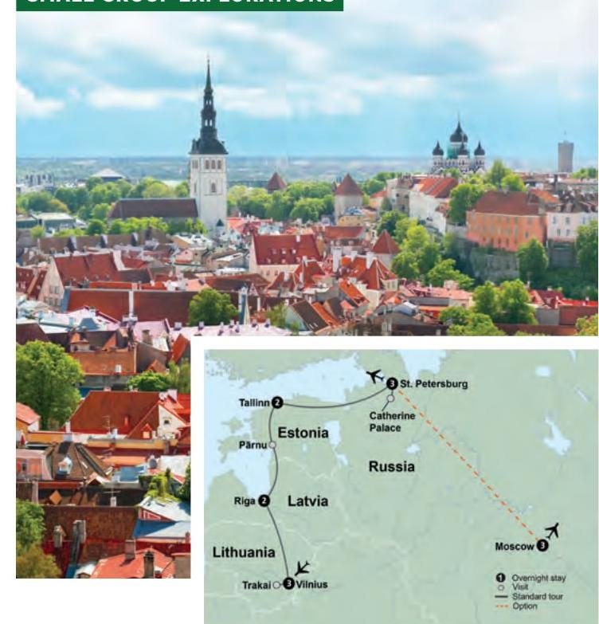

From the Middle Ages to the height of the Russian Empire, experience the kaleidoscope of influences in Lithuania, Latvia, Estonia, and Russia.

## HIGHLIGHTS

- Explore Vilnius by bike or on foot.
- Embark on a bogging adventure with a local naturalist.
- Discover a rural past at the Estonian Open-Air Museum.
- Visit the Trakai Island Castle, isolated on an island.
- Sample authentic medieval cuisine at a candlelit dinner.

## STAYS

3 Nights Vilnius / 2 Nights Riga / 2 Nights Tallinn / 3 Nights St. Petersburg

## IMPERIAL RUSSIA

9 DAYS / 11 MEALS / STARTING AT \$2,499* PP PRICE BASED ON APRIL 21, 2022 DEPARTURE.

View our website for additional dates.
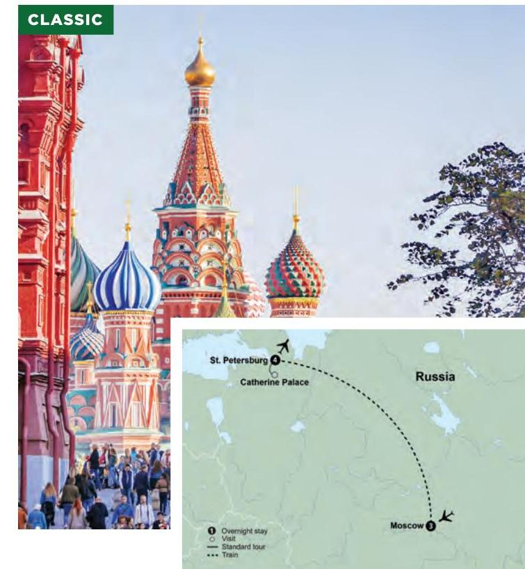

Get a glimpse into the world's largest country and experience the distinctive allure of Russia, a land abundant with intrigue and history.

## HIGHLIGHTS

- Navigate Russia via the stunning Moscow Metro system.
- Ride through St. Petersburg in a vintage Soviet car.
- Take a guided tour of the Hermitage Museum.
- Enjoy a relaxing boat cruise along the Moscow River.
- Try dishes popularized during Imperial Russian times.

## STAYS

3 Nights Moscow / 4 Nights St. Petersburg

VISIT COLLETTE.COM/637 FOR MORE DETAILS.

## Page 67

## EXPLORING THE ALPINE COUNTRIES

13 DAYS / 17 MEALS / STARTING AT \$2,999* PP PRICE BASED ON OCTOBER 7, 2021 DEPARTURE.

View our website for additional dates.
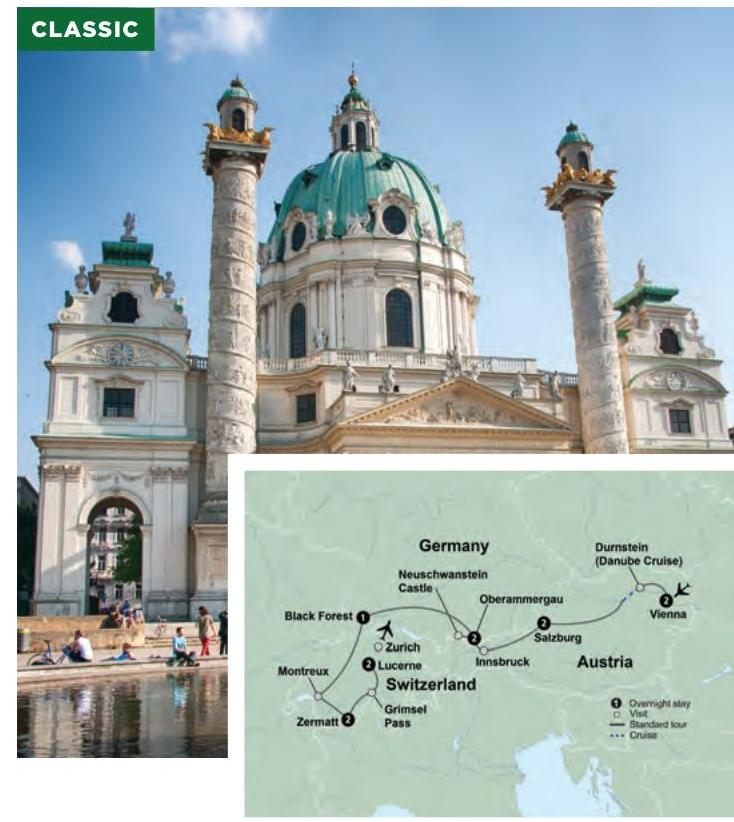

Storybook castles and opulent palaces set among Alpine vistas await on this getaway that takes you through Austria, Germany, and Switzerland.

## HIGHLIGHTS

- Walk through the charming streets of Innsbruck.
- Tour Bavaria's famous Neuschwanstein Castle.
- Dine at the 1,200-year-old St. Peter's Restaurant.

## STAYS

2 Nights Vienna / 2 Nights Salzburg / 2 Nights Oberammergau / 1 Night Titisee / 2 Nights Zermatt / 2 Nights Lucerne

## ALPINE LAKES \& SCENIC TRAINS

9 DAYS / 11 MEALS / STARTING AT \$3,199* PP PRICE BASED ON OCTOBER 2, 2021 DEPARTURE.

View our website for additional dates.
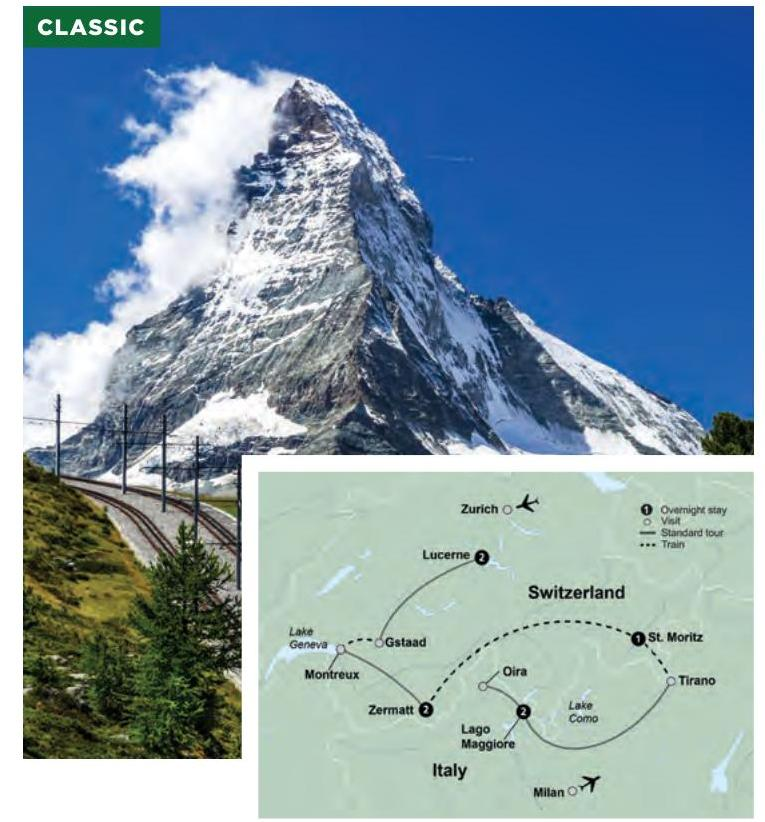

Experience resplendent countryside, lakeside trails, and majestic locales fit for a poem on this English voyage.

## HIGHLIGHTS

- Board a lake boat and cruise to the most beautiful of the Borromean Islands.
- Stroll along the lakes of Lucerne and St. Moritz.
- Enjoy stunning views on the GoldenPass panoramic train.
- Spend two nights in the Alpine village of Zermatt.
- Explore the "Swiss Paradise on the Lake," Lucerne.

## STAYS

2 Nights Lucerne / 2 Nights Zermatt /
1 Night St. Moritz / 2 Nights Lago Maggiore

VISIT COLLETTE.COM/416 FOR MORE DETAILS.

## Page 68

## SWITZERLAND: HIDDEN TRAILS \& MAJESTIC PEAKS

12 DAYS / 15 MEALS / STARTING AT \$4,499* PP PRICE BASED ON OCTOBER 22, 2021 DEPARTURE.

View our website for additional dates.
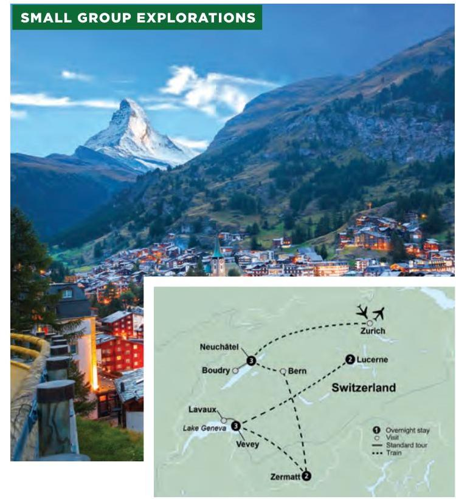

Set your sights on an active, immersive journey across Switzerland from the soaring Alps to the picturesque Swiss Riviera - all while traveling by train.

## HIGHLIGHTS

- Explore the vineyards of Swiss wine country on foot.
- Use your Swiss Travel Pass as an all-access pass.
- Visit Zermatt and marvel at views of the Matterhorn.
- Soak in the best views of the Alps and the Swiss Riviera.
- Participate in an immersive chocolate workshop.

## STAYS

3 Nights Neuchâtel / 2 Nights Zermatt /
3 Nights Vevey / 2 Nights Lucerne

## DISCOVER SWITZERLAND, AUSTRIA \& BAVARIA

10 DAYS / 12 MEALS / STARTING AT \$2,599* PP PRICE BASED ON NOVEMBER 4, 2021 DEPARTURE.

View our website for additional dates.
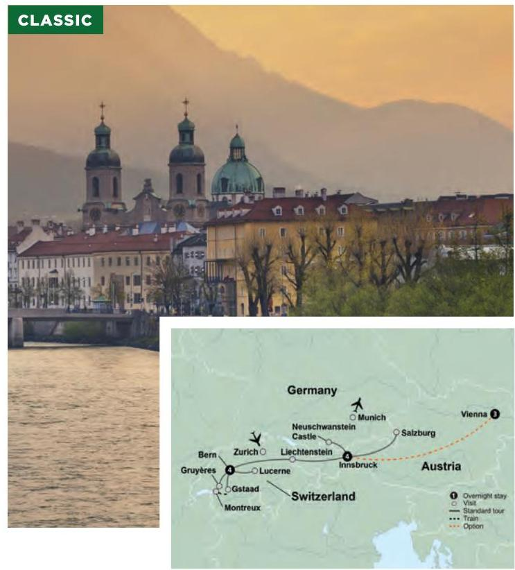

Mozart, Oberammergau, Lucerne, fondue. The hills are alive on an enchanting journey across three Alpine countries.

## HIGHLIGHTS

- Enjoy stunning views on the GoldenPass Panoramic Train.
- Witness the musical tradition of Austria during a Tyrolean folklore show.
- Spend a day exploring Salzburg's historic past.
- Enjoy a walking tour of Lucerne's Alstadt (Old Town).
- Travel to Bavaria and see the Neuschwanstein Castle.

## STAYS

4 Nights Bern / 4 Nights Innsbruck

VISIT COLLETTE.COM/45 FOR MORE DETAILS.

## Page 69

## IMPERIAL CITIES

11 DAYS / 14 MEALS / STARTING AT \$2,649* PP PRICE BASED ON DECEMBER 1, 2021 DEPARTURE.

View our website for additional dates.
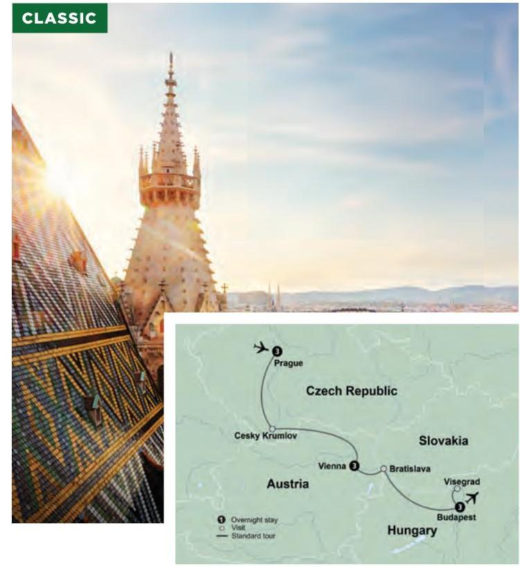

Bask in the splendor and storybook charm of Prague, Vienna and Budapest - a trio of cities with infinite majesty.

## HIGHLIGHTS

- Enjoy a stop in the fairy-tale town of Cesky Krumlov.
- Tour majestic Prague Castle.
- Get to know Bratislava's history on a city tour.
- In Vienna, choose between a cruise on the Danube River, a visit to the Belvedere Museum, or a Viennese Waltz lesson.

## STAYS

3 Nights Prague / 3 Nights Vienna / 3 Nights Budapest

## MAGNIFICENT CITIES OF CENTRAL \& EASTERN EUROPE

15 DAYS / 18 MEALS / STARTING AT \$2,999* PP PRICE BASED ON MARCH 13, 2022 DEPARTURE.

View our website for additional dates.
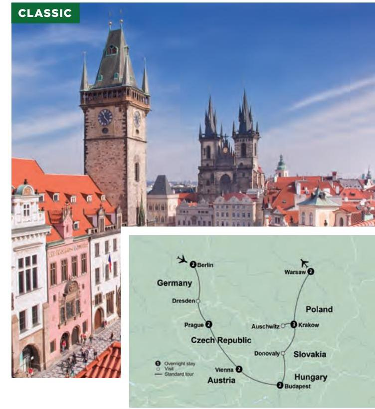

A blend of world history and fairy-tale charm comes to life in the culturally-rich cities of Central \& Eastern Europe.

## HIGHLIGHTS

- Experience the cultures of various European countries.
- Take a poignant journey through history at Auschwitz.
- Visit Hradcany Castle in the fairy-tale city of Prague.
- Come to know Vienna and its lavish Schönbrunn Palace.
- Dine at one of Vienna's most beloved restaurants.

## STAYS

2 Nights Berlin / 2 Nights Prague / 2 Nights Vienna / 2 Nights Budapest / 3 Nights Krakow / 2 Nights Warsaw

VISIT COLLETTE.COM/135 FOR MORE DETAILS.

## Page 70

## DISCOVERING POLAND

12 DAYS / 14 MEALS / STARTING AT \$1,999* PP PRICE BASED ON MARCH 19, 2022 DEPARTURE.

View our website for additional dates.
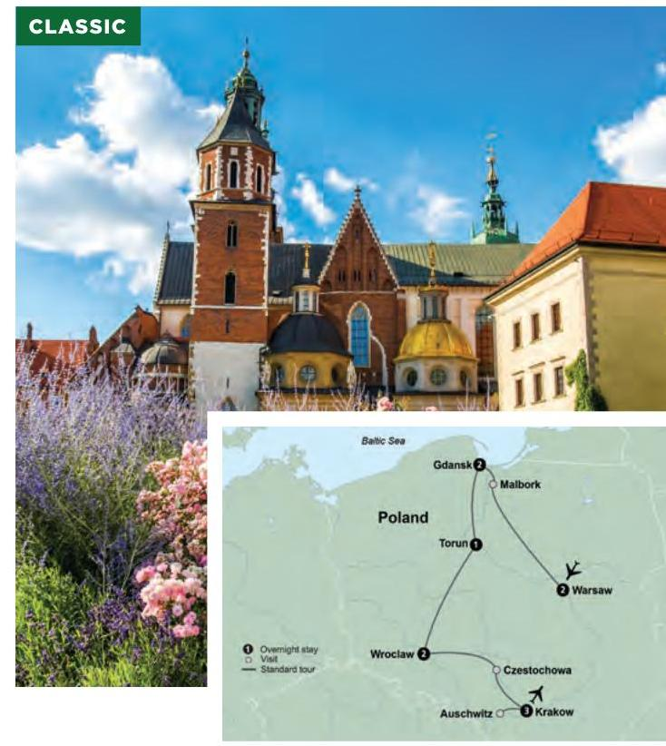

Poland's treasures, uncovered. Embark on a poignant, engaging journey from Warsaw to the shores of Gdansk.

## HIGHLIGHTS

- Immerse yourself in Polish culture at a folklore show.
- Explore the poignant history of Auschwitz.
- Journey through Warsaw and see remnants of its ghetto.
- A tour of Wroclaw brings you up-close to this diverse city.
- Overnight in medieval Torun, a UNESCO World Heritage site.

## STAYS

2 Nights Warsaw / 2 Nights Gdansk / 1 Night Torun / 2 Nights Wroclaw / 3 Nights Krakow

## VISIT COLLETTE.COM/470 FOR MORE DETAILS.

## CLASSIC CHRISTMAS MARKETS

9 DAYS / 11 MEALS / STARTING AT \$1,999* PP PRICE BASED ON DECEMBER 12, 2021 DEPARTURE.

View our website for additional dates.
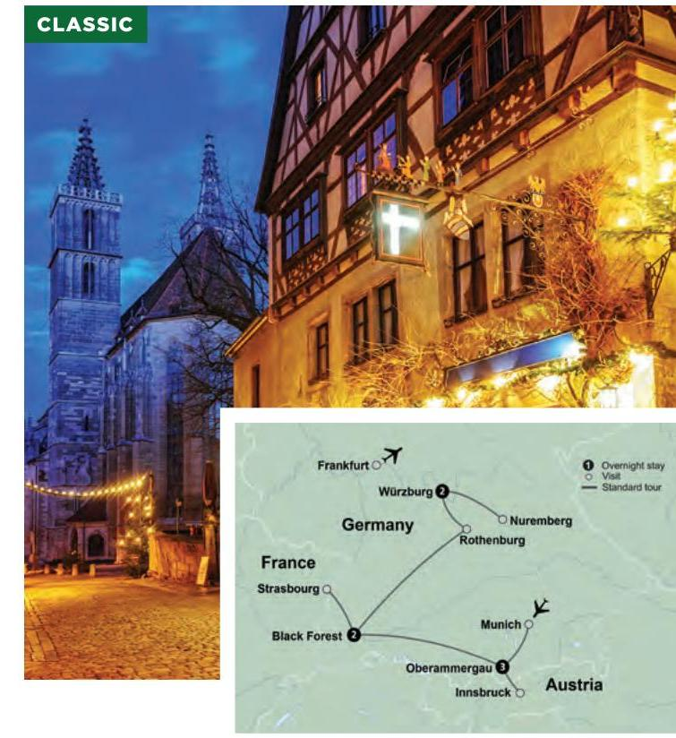

Feel the warmth of the holiday spirit as you sip mulled wine, shop for handicrafts and peruse the Christmas markets of Germany, Austria, and France.

## HIGHLIGHTS

- Experience the holiday spirit of "Christkindlesmarkts."
- See the 18th-century residence of the prince-bishops.
- View the oldest bridge on the River Main.
- Set out on a panoramic tour of Munich.
- Enjoy a city tour of Nuremberg.

## STAYS

3 Nights Oberammergau / 2 Nights Black Forest / 2 Nights Würzburg

VISIT COLLETTE.COM/420 FOR MORE DETAILS.

## Page 71

## MAGICAL CHRISTMAS MARKETS

8 DAYS / 10 MEALS / STARTING AT \$1,849* PP PRICE BASED ON DECEMBER 12, 2021 DEPARTURE.

View our website for additional dates.
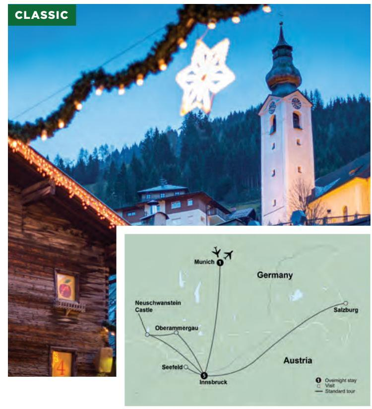

Get caught up in the holiday spirit as you explore Germany and Austria, where you'll enjoy traditional Christmas markets, Alpine villages and festive fun.

## HIGHLIGHTS

- Tour Munich to see the Glockenspiel and Olympic Park.
- Visit the picture-perfect Alpine village, Oberammergau.
- Venture to Seefeld for a horse-drawn carriage ride.
- Experience a traditional strudel demonstration.
- Experience the holiday spirit of "Christkindlesmarkts."

## STAYS

5 Nights Innsbruck / 1 Night Munich

## CLASSIC DANUBE

11 DAYS / 24 MEALS / STARTING AT \$3,749* PP PRICE BASED ON OCTOBER 15, 2021 DEPARTURE.

View our website for additional dates.
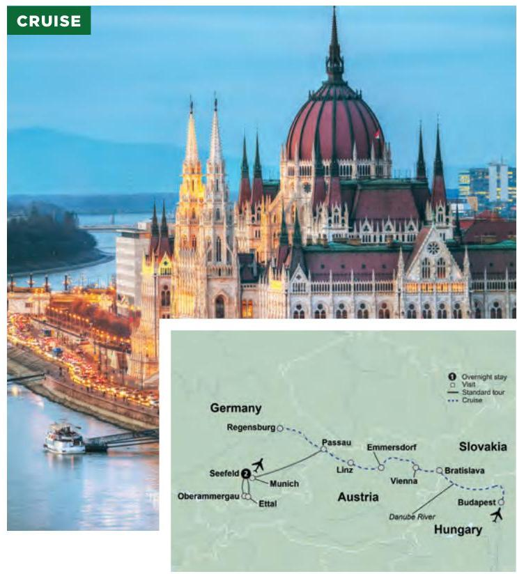

Drift blissfully along the iconic Danube River, stopping along the way to admire storybook villages, lively cities and unparalleled scenery.

## HIGHLIGHTS

- Partake in a fun-filled Hungarian folklore show.
- Take a walking tour of Passau, a 2,000-year-old city.
- Explore Slovakia's remarkable capital, Bratislava.
- Discover Munich and its world-famous Glockenspiel.
- Enjoy unlimited wine and beer with each dinner onboard.

## STAYS

7 Night Cruise Aboard the MS Amadeus Brilliant / 2 Nights Seefeld

VISIT COLLETTE.COM/539 FOR MORE DETAILS.

## Page 72

# europe \& the middle east 

## CHRISTMAS ON THE DANUBE

9 DAYS / 19 MEALS / STARTING AT \$2,699* PP PRICE BASED ON DECEMBER 9, 2021 DEPARTURE.

View our website for additional dates.
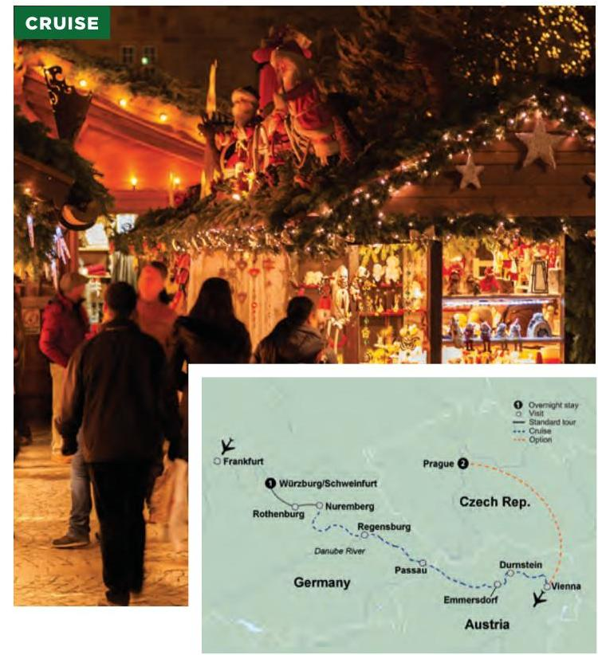

See this breathtaking region dressed in its holiday best. Explore charming Christmas markets and relax aboard a cruise along the Danube.

## HIGHLIGHTS

- Enjoy a walking tour of Passau, a 2,000-year-old city.
- Browse the famous Christmas markets along the Danube.
- Discover Würzburg, Nuremberg, Regensburg and Vienna.
- Explore the 900-year-old Benedictine Melk Abbey.
- Enjoy unlimited wine and beer with each dinner onboard.

## STAYS

1 Night Würzburg / 6 Night Cruise Aboard the MS Amadeus Brilliant

## HOLLAND \& BELGIUM SPRINGTIME RIVER CRUISE

9 DAYS / 20 MEALS / STARTING AT \$3,599* PP PRICE BASED ON APRIL 4, 2022 DEPARTURE.

View our website for additional dates.
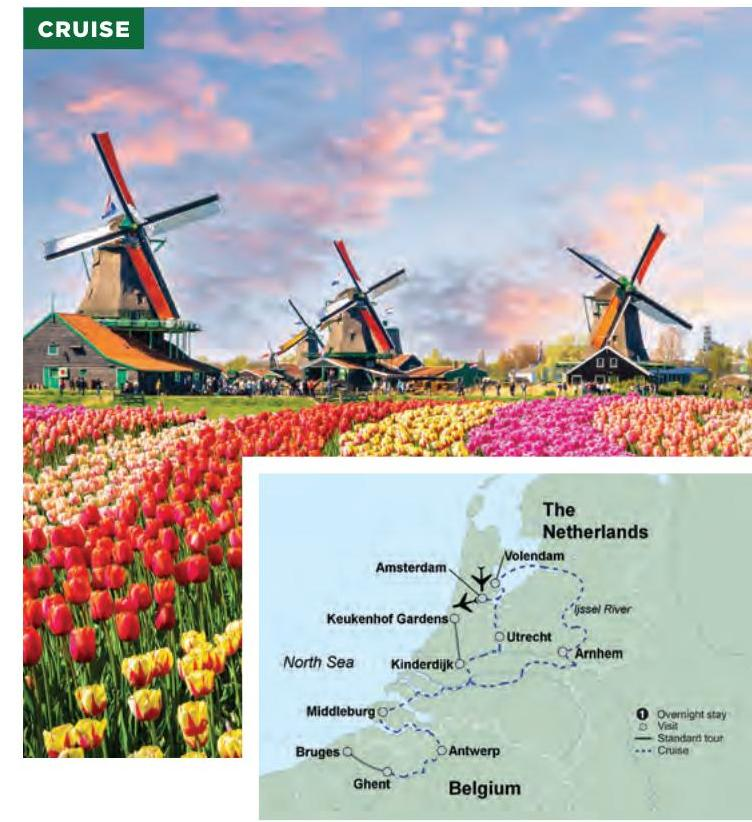

Float by blooming fields of flowers and windmills on a resplendent tulip river cruise through Holland and Belgium.

## HIGHLIGHTS

- Explore the world-famous Keukenhof Gardens.
- Return to medieval times on a walking tour of Bruges.
- Dock in Middelburg, known as "the monumental city."
- Set out on a city tour of Amsterdam.
- Visit a local cheese farm for a tasting.

## STAYS

7 Night Cruise Aboard the MS Amadeus Brilliant or Queen

## VISIT COLLETTE.COM/209 FOR MORE DETAILS.

## Page 73

## MAGICAL RHINE \& MOSELLE

10 DAYS / 22 MEALS / STARTING AT \$3,899* PP PRICE BASED ON SEPTEMBER 27, 2021 DEPARTURE.

View our website for additional dates.
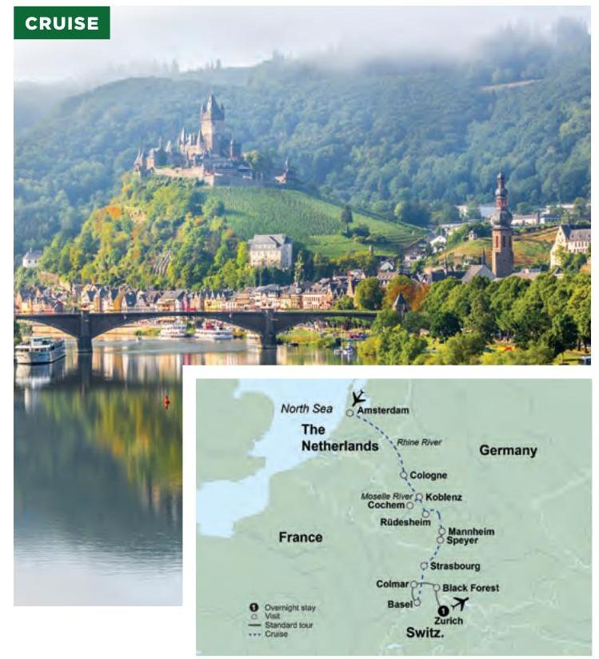

Glide along the enchanting Rhine and Moselle rivers on a leisurely journey to the Netherlands, Germany, and France.

## HIGHLIGHTS

- Set out on a 7-night cruise along the Rhine.
- Discover the lovely town of Cochem on a guided tour.
- Cruise the famous canals of Amsterdam.
- Explore Cologne's Old Town during a walking tour.
- Visit one of Cochem's renowned wine cellars.

## STAYS

7 Night Cruise Aboard the MS Amadeus Silver III / 1 Night Zurich

## ICONIC ISRAEL

10 DAYS / 16 MEALS / STARTING AT \$2,699* PP PRICE BASED ON DECEMBER 7, 2021 DEPARTURE.

View our website for additional dates.
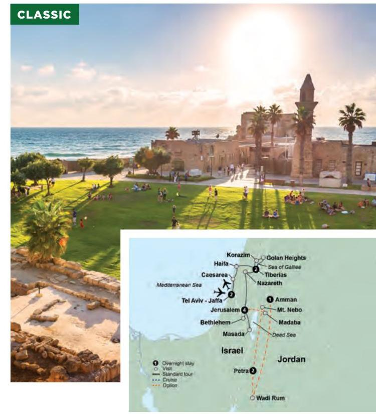

Travel back in time and discover the ancient world of Israel where legendary stories of mankind's collective history come to life.

## HIGHLIGHTS

- Venture to the ancient Roman capital of Caesarea.
- Ascend the ancient walls of Masada by cable car.
- Discover the ancient cities of Nazareth and Bethlehem.
- Engage in a conversation with a Holocaust survivor at Yad Vashem.
- Delight in the wonder of the Dead Sea.

## STAYS

2 Nights Tel Aviv / 2 Nights Tiberias / 4 Nights Jerusalem

VISIT COLLETTE.COM/238 FOR MORE DETAILS.

## Page 74

# the middle east 

## ISRAEL: A JOURNEY OF FAITH

9 DAYS / 15 MEALS / STARTING AT \$1,999* PP PRICE BASED ON DECEMBER 6, 2021 DEPARTURE.

View our website for additional dates.
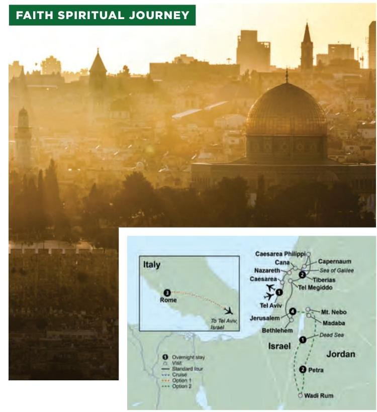

Walk in the hallowed footsteps of Jesus Christ and see some of the most ancient cities in the world on this spirited passage to Israel.

## HIGHLIGHTS

- Reflect during a visit to the synagogue in Capernaum.
- Visit the center of Jesus' ministry in Galilee.
- Stop at the holy Shepherds' Field and Tel Megiddo.
- Discover the ancient cities of Nazareth and Bethlehem.
- Visit the Upper Room, near the site of the Last Supper.

## STAYS

1 Night Tel Aviv / 2 Nights Tiberias / 4 Nights Jerusalem

## ISRAEL: PILGRIMAGE TO THE HOLY LAND

9 DAYS / 15 MEALS / STARTING AT \$1,999* PP PRICE BASED ON DECEMBER 8, 2021 DEPARTURE.

View our website for additional dates.
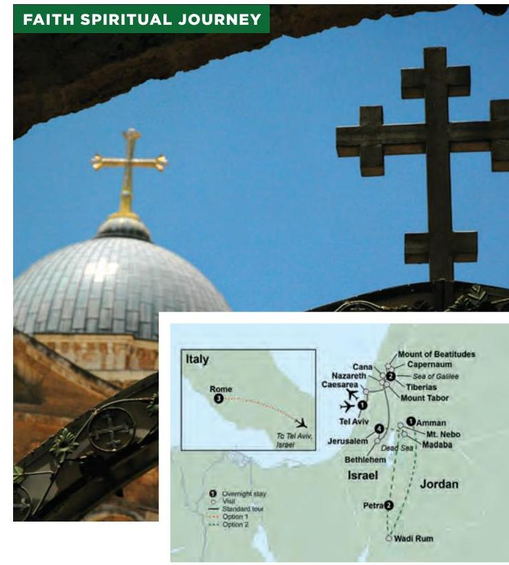

On a powerful journey of faith, follow the path of Jesus of Nazareth to discover the historic and sacred lands of Israel.

## HIGHLIGHTS

- Visit the Church of All Nations.
- Celebrate Mass at several significant religious sites.
- Visit the ancient cities of Nazareth and Bethlehem.
- Walk where Jesus walked on the way to his crucifixion.
- Stop at the site of Christ's betrayal by Judas.

## STAYS

1 Night Tel Aviv / 2 Nights Tiberias / 4 Nights Jerusalem

## Page 75

## JORDAN \& ISRAEL

15 DAYS / 24 MEALS / STARTING AT \$3,999* PP PRICE BASED ON DECEMBER 28, 2021 DEPARTURE.

View our website for additional dates.
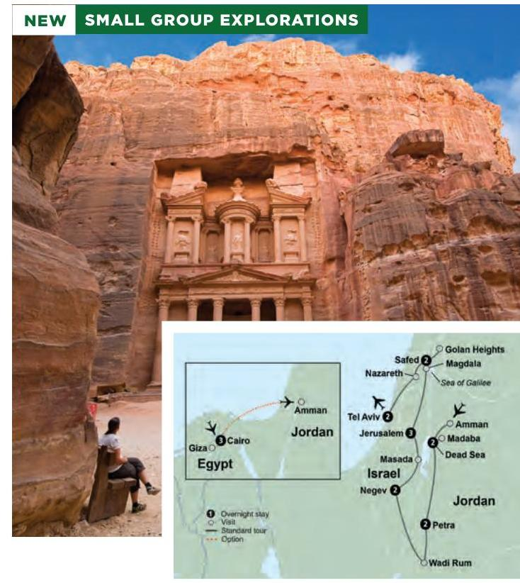

Delve into the past and present of Jordan and Israel, uncovering a land of quiet deserts, modern coastlines, ancient ruins, and spiritual roots.

## HIGHLIGHTS

- See the striking landscape of Wadi Rum via 4x4.
- Engage in a discussion with a Holocaust survivor.
- Learn a traditional craft from local women at a non-profit center.
- Partake on an in-depth tour of Jerusalem.
- Meander through Petra, the "Rose Red City".

## STAYS

2 Nights Jordan / 2 Nights Petra / 2 Nights Negev Desert / 3 Nights Jerusalem / 2 Nights Safed / 2 Nights Tel Aviv

## explore more

## PRE- \& POST-NIGHTS TAKE YOUR TRIP TO THE NEXT LEVEL

Spend more time and see more sights in the city that starts or ends your tour by adding a pre-night or post-night stay to your trip.
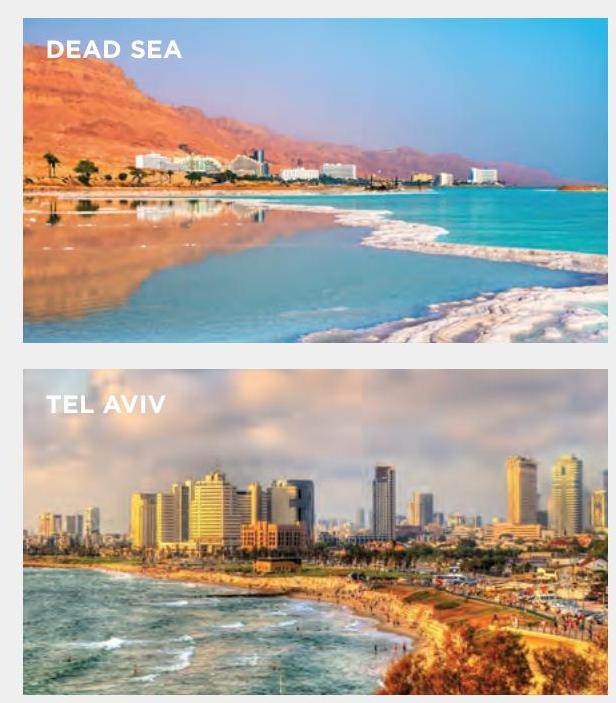

## EXTENSIONS TAKE YOUR TRIP TO THE NEXT LEVEL

Add an extension to the start or end of a tour, and make even more unforgettable memories while exploring the world.
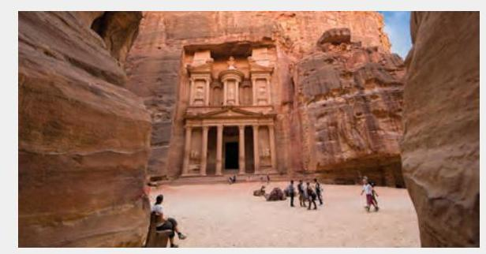

JORDAN / 3-NIGHT POST TOUR

## Page 76

## THE PASSION PLAY

## Oberammergau

## OBERAMMERGAL

## Oberammergau Passion! / Day 2022

Don't miss out on this once-in-a-
decade experience!
Nested in the foothills of the Bavarian Alps, less than a two-hour drive from Munich, the quaint village of Oberammergau is one of Europe's most unique destinations. Every ten years, this town draws visitors from across the globe as host to what is regarded as the most important Passion Play in the world. The Passion Play, an epic event that traces Jesus' life, death and resurrection, is a moving feast of drama and music.

In 1653 soldiers returning home from the Thirty Years War brought with them the Black Plaque. After much death and suffering, leaders of the community in Oberammergau came together, Hedging to hold a play honoring the life of Christ every ten years. From that dayforward, no additional villagers perished from the plaque. The event continues today with performers all native to the village.

When you choose one of our special departures that includes the Passion Play, you'll receive your ticket and stay right in Oberammergau at a hotel conveniently located near the auditorium. The auditorium where the play will be held offers comfortable seats set on an incline, providing everyone with a good view. During a break in the performance, you'll join your fellow travelers for dinner before returning for the remainder of your Passion Play performance. This powerful play is not to be missed.

## IMPERIAL CITIES

## WITH THE OBERAMMERGAU PASSION PLAY 11 DAYS / 16 MEALS / STARTING AT \$4,199* PP PRICE BASED ON MAY 21, 2022 DEPARTURE.

Departures available May - September 2022.
View our website for additional dates.
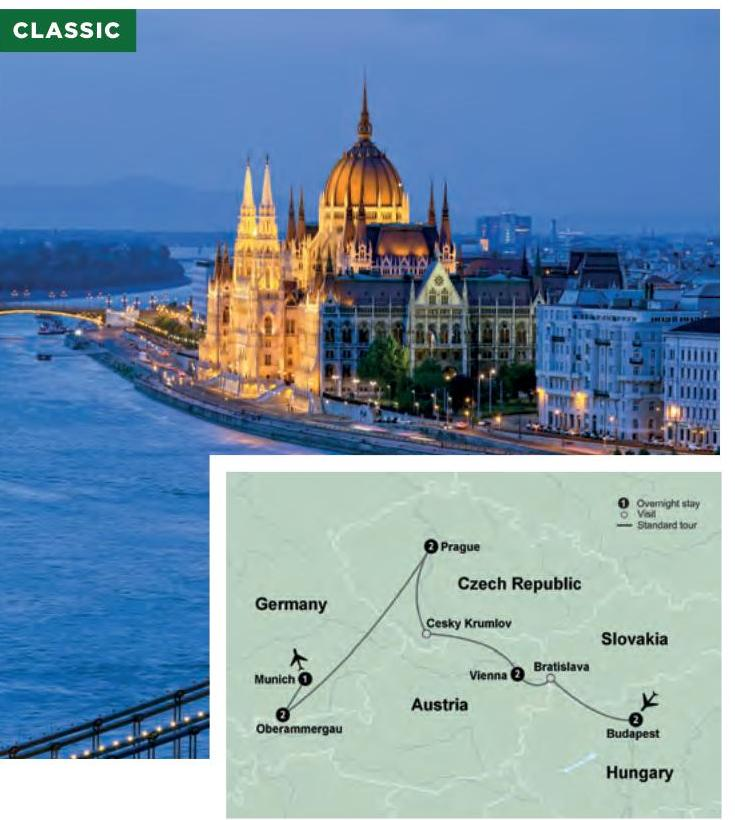

Set out on an exciting cultural experience in the Imperial Cities of Central Europe featuring traditional entertainment and the stunning Oberammergau Passion Play.

## HIGHLIGHTS

- Enjoy a stop in the fairy-tale town of Cesky Krumlov.
- Tour majestic Hradcany Castle in Prague.
- Get to know Bratislava's history on a city tour.
- Visit the famous Schönbrunn Palace.
- Take your seat for the Oberammergau Passion Play.

## STAYS

2 Nights Budapest / 2 Nights Vienna / 2 Nights Prague / 2 Nights Oberammergau / 1 Night Munich

## Page 77

# oberammergau 

## EXPLORING THE ALPINE COUNTRIES

WITH THE OBERAMMERGAU PASSION PLAY 13 DAYS / 19 MEALS / STARTING AT \$5,149* PP PRICE BASED ON MAY 13, 2022 DEPARTURE.

Departures available May - September 2022.
View our website for additional dates.

Discover storybook castles and glittering palaces amidst stunning Alpine vistas as you explore Austria, Germany, and Switzerland, and experience the epic Passion Play.

## HIGHLIGHTS

- Take a cruise along the Danube River.
- Explore Vienna and its stunning Schönbrunn Palace.
- Discover Munich and its world-famous Glockenspiel.
- Make a stop at the impressive Benedictine Melk Abbey.
- Take your seat for the Oberammergau Passion Play.

## STAYS

2 Nights Vienna / 2 Nights Salzburg / 2 Nights Oberammergau / 1 Night Black Forest / 2 Nights Zermatt / 2 Nights Lucerne

VISIT COLLETTE.COM/PASSIONPLAY FOR MORE DETAILS.

## GERMANY'S CULTURAL CITIES \& THE ROMANTIC ROAD WITH THE OBERAMMERGAU PASSION PLAY 13 DAYS / 19 MEALS / STARTING AT \$4,999* PP PRICE BASED ON JUNE 6, 2022 DEPARTURE.

Departures available May - September 2022.
View our website for additional dates.
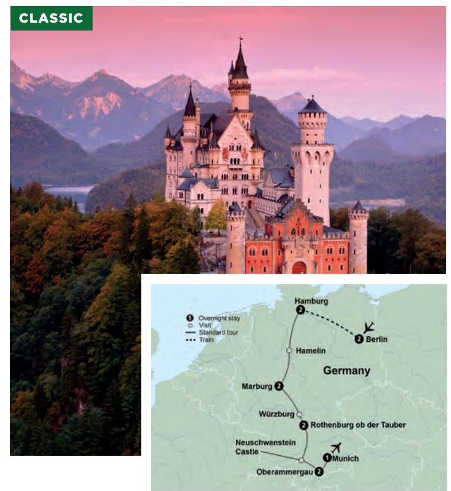

This enchanting journey offers the best of Germany. Travel to some of the country's most iconic cities, view its stunning countryside and experience the epic Oberammergau Passion Play.

## HIGHLIGHTS

- Discover Hamelin with a flute-playing "Pied Piper."
- Join a local guide on a Beatles tour through Hamburg.
- Tour Berlin and Munich's famed landmarks with a guide.
- Tour the stunning Neuschwanstein Castle.
- Take your seat for the Oberammergau Passion Play.

## STAYS

2 Nights Berlin / 2 Nights Hamburg / 2 Nights Marburg / 2 Nights Rothenburg ob der Tauber / 2 Nights Oberammergau / 1 Night Munich

## VISIT COLLETTE.COM/PASSIONPLAY FOR MORE DETAILS.

## Page 78

# oberammergau 

## SWITZERLAND \& GERMANY   WITH THE OBERAMMERGAU PASSION PLAY

9 DAYS / 13 MEALS / STARTING AT \$3,999* PP PRICE BASED ON JUNE 12, 2022 DEPARTURE.

Departures available May - September 2022.
View our website for additional dates.

Experience the grand cities of Europe's Alpine region and witness history when you enjoy a performance of the legendary Passion Play in the Bavarian village of Oberammergau.

## HIGHLIGHTS

- See the art of cuckoo clock making in the Black Forest.
- Tour Lucerne's romantic Old Town and Chapel Bridge.
- Visit the most visited Swiss castle, Château de Chillon.
- Take in the snowcapped mountains of Grimsel Pass.
- Experience the powerful Oberammergau Passion Play.

## STAYS

2 Nights Oberammergau / 1 Night Black Forest
2 Nights Zermatt / 2 Nights Lucerne

## ALPINE EXPLORER

## WITH THE OBERAMMERGAU PASSION PLAY

12 DAYS / 18 MEALS / STARTING AT \$4,999* PP PRICE BASED ON AUGUST 16, 2022 DEPARTURE.

Departures available May - September 2022.
View our website for additional dates.
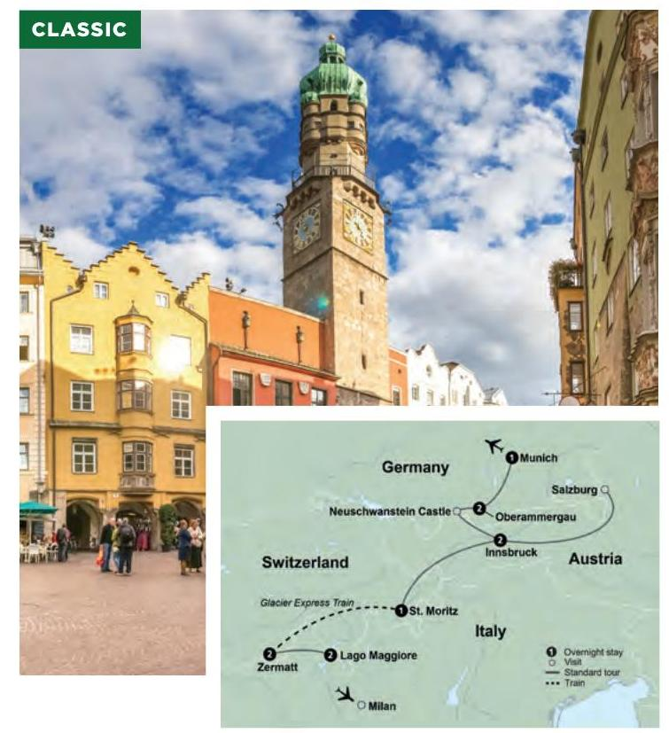

Behold Alpine vistas and enjoy a performance of the Oberammergau Passion Play on this journey through Italy, Switzerland, Austria, and Germany.

## HIGHLIGHTS

- Spend 2 nights on the banks of Lago Maggiore in Stresa.
- Ride the legendary Glacier Express.
- Delight in dinner and a Mozart concert at the 1,200-yearold St. Peter's Restaurant.
- Enjoy a wine and cheese pairing at an Italian family farm.
- Witness the Oberammergau Passion Play.

## STAYS

2 Nights Stresa / 2 Nights Zermatt / 1 Night St. Moritz / 2 Nights Innsbruck / 2 Nights Oberammergau / 1 Night Munich

VISIT COLLETTE.COM/PASSIONPLAY FOR MORE DETAILS.

## Page 79

## DISCOVER SWITZERLAND, AUSTRIA \& BAVARIA WITH THE OBERAMMERGAU PASSION PLAY 10 DAYS / 14 MEALS / STARTING AT \$3,499* PP PRICE BASED ON AUGUST 12, 2022 DEPARTURE.

Departures available May - September 2022.
View our website for additional dates.

Set out on an exciting journey and experience Switzerland, Austria, and the Oberammergau Passion Play.

## HIGHLIGHTS

- Ride the GoldenPass Train from Montreux to Gstaad.
- Walk the halls of the medieval Château de Chillon.
- Explore Salzburg's historic and charming Old Town.
- Visit Linderhof Palace, one of the most stylistically complex ensembles of the 19th century.
- Take your seat for the Oberammergau Passion Play.

## STAYS

3 Nights Bern / 3 Nights Innsbruck / 1 Night Oberammergau / 1 Night Munich

## CLASSIC DANUBE

WITH THE OBERAMMERGAU PASSION PLAY 11 DAYS / 24 MEALS / STARTING AT \$4,999* PP PRICE BASED ON JUNE 5, 2022 DEPARTURE.

Departures available May - September 2022.
View our website for additional dates.
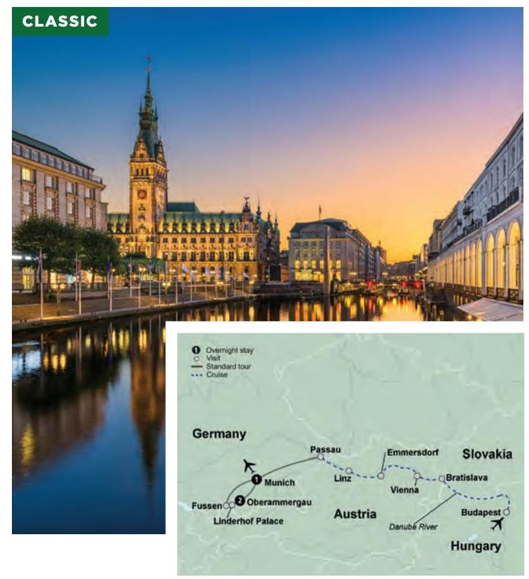

Cruise past breathtaking scenery, stop in quaint villages and lively cities, and see a spectacular performance of the Oberammergau Passion Play, all on a trip down the Danube River.

## HIGHLIGHTS

- Take a walking tour of Passau, a 2,000-year-old fairytale city.
- Visit Linderhof Palace.
- Board a cruise to view Budapest's stunning night skyline.
- Discover Slovakia's remarkable capital, Bratislava.
- Take your seat for the Oberammergau Passion Play.

## STAYS

6 Night Cruise on MS Amadeus Silver II, III or Brilliant / 2 Nights Oberammergau / 1 Night Munich

VISIT COLLETTE.COM/PASSIONPLAY FOR MORE DETAILS.

## Page 80

# the floriade expo 2022 

## EUROPE'S COSMOPOLITAN CITIES: AMSTERDAM, BRUSSELS \& PARIS WITH THE FLORIADE EXPO 2022

10 DAYS / 12 MEALS / STARTING AT \$2,999* PP PRICE BASED ON CHANGE TO JULY 16, 2022 DEPARTURE.

View our website for additional dates.
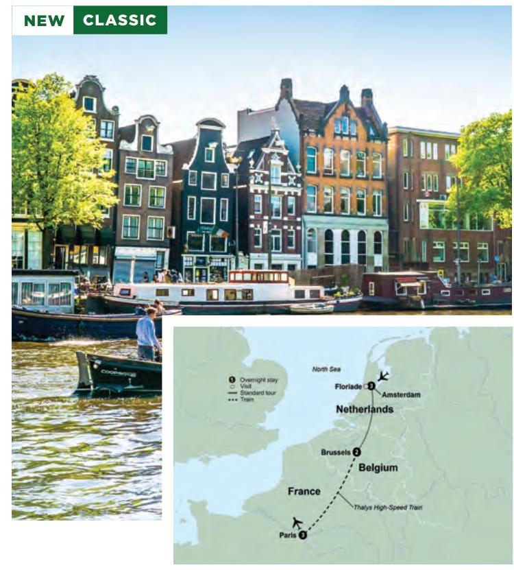

Delve into the cosmopolitan allure of three of Europe's most culturally engaging cities, plus experience the once-a-decade Floriade expo.

## HIGHLIGHTS

- Behold the once-a-decade Floriade garden expo.
- Cruise Amsterdam's iconic canals on a private boat.
- Taste your way through Amsterdam on a lunch tour.
- Spend the day in medieval Bruges, or take a city tour of Brussels.
- Admire the Paris skyline on a dinner cruise down the Seine.

## STAYS

3 Nights Amsterdam / 2 Nights Brussels / 3 Nights Paris

## CHELSEA FLOWER SHOW WITH THE FLORIADE EXPO 2022

9 DAYS / 11 MEALS / STARTING AT \$3,499* PP PRICE BASED ON MAY 23, 2022 DEPARTURE.

View our website for additional dates.
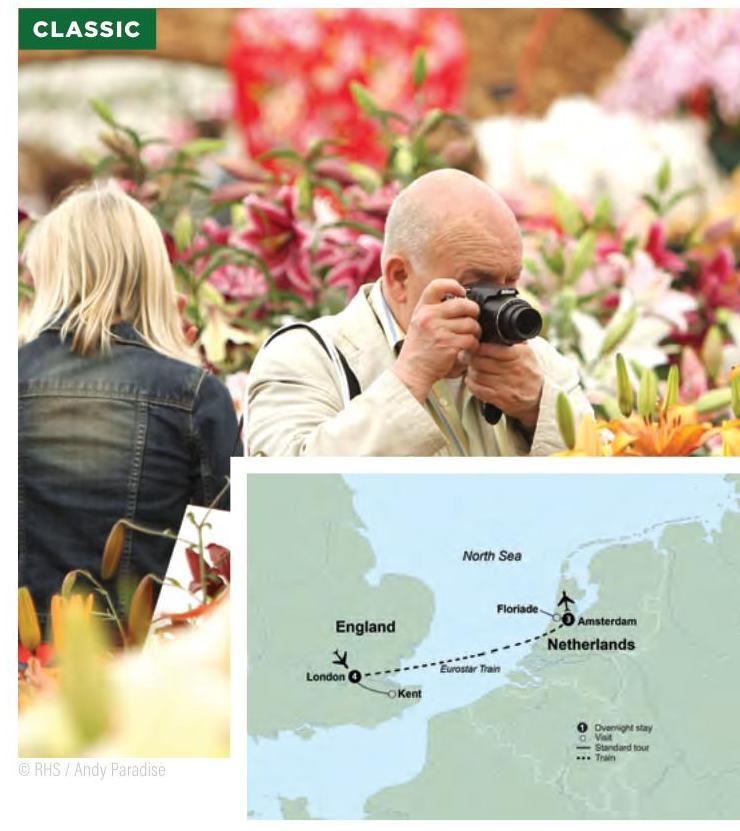

Explore iconic gardens, sustainable greenhouses, and the botanical wonders of London and Amsterdam - from the world-renowned Chelsea Flower Show to the once-a-decade Floriade expo.

## HIGHLIGHTS

- Experience the garden grandeur of the Chelsea Flower Show.
- Behold the once-a-decade ode to horticulture at Floriade.
- Travel from London to Amsterdam via Eurostar train.
- Wander the impressive gardens of Sissinghurst Castle.
- Cruise the beautiful canals of Amsterdam.

## STAYS

3 Nights London / 3 Nights Amsterdam

VISIT COLLETTE.COM/683 FOR MORE DETAILS.

## Page 81

## HOLLAND \& BELGIUM SPRINGTIME RIVER CRUISE WITH THE FLORIADE EXPO 2022

9 DAYS / 20 MEALS / STARTING AT \$3,599* PP PRICE BASED ON APRIL 21, 2022 DEPARTURE.

View our website for additional dates.
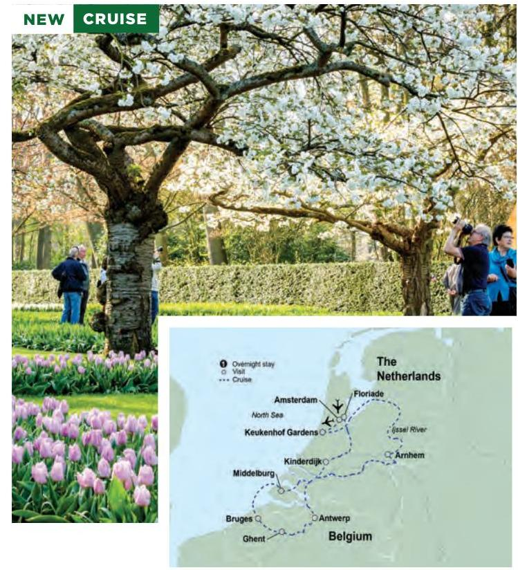

Savor springtime in Holland and Belgium with a cruise that features blooming fields, iconic windmills, and the Floriade garden expo.

## HIGHLIGHTS

- Behold the once-a-decade ode to horticulture and nature at Floriade.
- Relax on a 7-night cruise through Holland and Belgium.
- Explore the world-famous Keukenhof Gardens, spanning 70 acres.
- Float under picturesque bridges on a canal tour of Amsterdam.
- Stand in awe before the iconic windmills of Kinderdijk.

## STAYS

7 Nights MS Amadeus Brilliant

## VISIT COLLETTE.COM/209 FOR MORE DETAILS.

## NETHERLANDS, BELGIUM \& FRANCE WITH THE FLORIADE EXPO 2022

12 DAYS / 15 MEALS / STARTING AT \$4,199* PP PRICE BASED ON MAY 14, 2022 DEPARTURE.

View our website for additional dates.
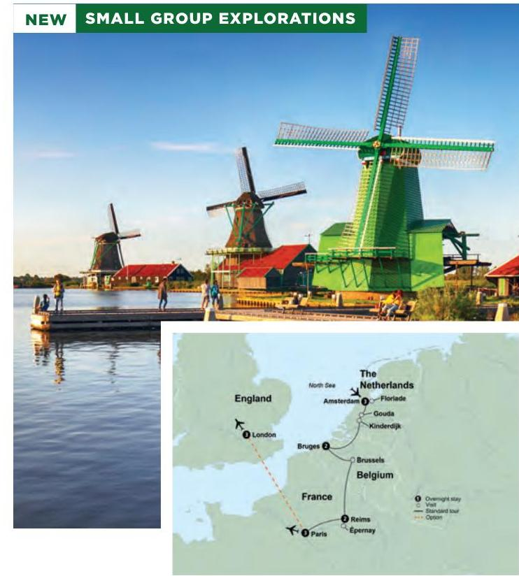

Dutch windmills, cozy streets, bubbling champagne, and the "City of Light" - experience the essence of 3 European countries, along with the once-in-adecade horticultural experience of the Floriade Expo.

## HIGHLIGHTS

- Explore new trends in the horticultural world at the Floriade Expo.
- Spend 2 nights in the quaint Belgian town of Bruges (UNESCO).
- Explore Brussels, the bustling capital of Belgium.
- Immerse yourself in France's champagne country.

## STAYS

3 Nights Amsterdam / 2 Nights Bruges / 2 Nights Reims / 3 Nights Paris

VISIT COLLETTE.COM/669 FOR MORE DETAILS.

## Page 82

# australia \& new Zealand 

## AUSTRALIA'S OUTBACK TO NEW ZEALAND'S SOUTH ISLAND

21 DAYS ・ 28 MEALS ・ STARTING AT \$4,999* PP PRICE BASED ON APRIL 11, 2022 DEPARTURE.

View our website for additional dates.
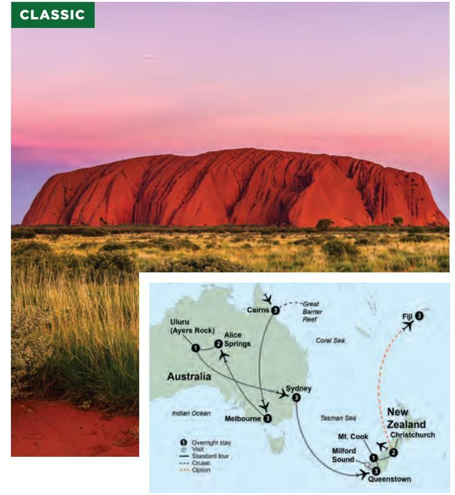

Satisfy your curiosity of lands Down Under and uncover the culture of the Aborigines, the rugged Outback, and the alpine paradise of Mt. Cook.

## HIGHLIGHTS

- Visit Hartley's Croc Farm for a chance to get up close and personal with crocodiles.
- Take a guided tour of the Sydney Opera House.
- Explore the Great Barrier Reef.
- Witness Uluru at sunset while you sip champagne.
- Cruise Milford Sound taking in the beauty that surrounds you.

## STAYS

3 Nights Cairns / 3 Nights Melbourne /
2 Nights Alice Spring / 1 Night Uluru / 3 Nights Sydney / 3 Nights Queenstown / 1 Night Mount Cook / 2 Nights Christchurch

## THE COMPLETE SOUTH PACIFIC

27 DAYS / 36 MEALS / STARTING AT \$6,999* PP PRICE BASED ON MARCH 20, 2022 DEPARTURE.

View our website for additional dates.

Toss a boomerang, meet a Tasmanian devil, savor an Outback bush dinner - this is the South Pacific in all its glory.

## HIGHLIGHTS

- Discover the origins of the Aboriginal people.
- Explore the Great Barrier Reef.
- Tour the sandstone domes known as Kata Tjuta.
- See the Little Penguins on the beach at Phillip Island.
- Savor a bush dinner in the Australian Outback.

## STAYS

3 Nights Cairns / 1 Night Uluru / 2 Nights Barossa Valley / 2 Nights Melbourne / 3 Nights Hobart / 3 Nights Sydney / 3 Nights Queenstown / 1 Night Mount Cook / 1 Night Christchurch / 2 Nights Wellington / 2 Nights Rotorua / 1 Night Auckland

VISIT COLLETTE.COM/105 FOR MORE DETAILS.

## Page 83

## SOUTH PACIFIC WONDERS

## 15 DAYS ・ 21 MEALS ・ STARTING AT \$3,999* PP PRICE BASED ON APRIL 5, 2022 DEPARTURE.

View our website for additional dates.
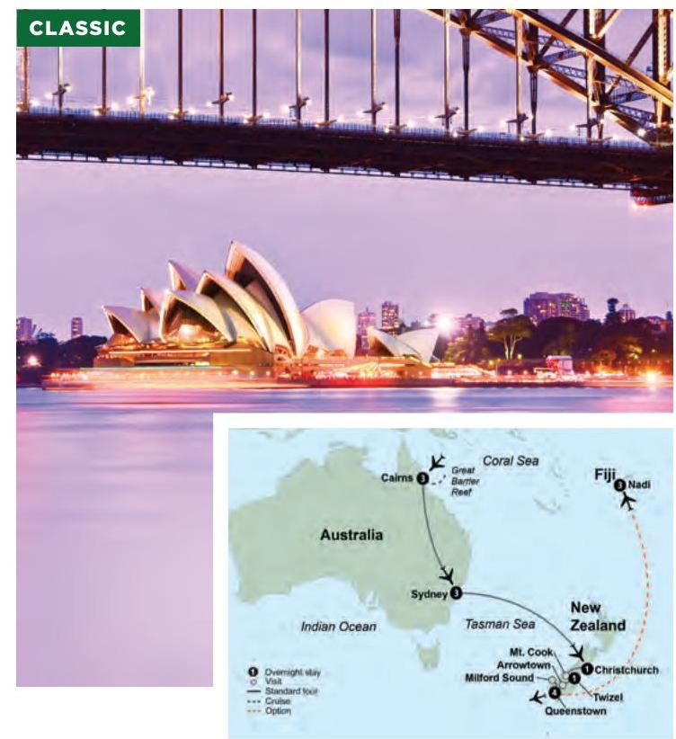

From the marvelous Sydney Opera House to the magical Southern Alps of New Zealand, this is the land "Down Under."

## HIGHLIGHTS

- Discover koalas and crocodiles at Hartley's Croc Farm.
- Take a guided tour of the famous Sydney Opera House.
- Board a catamaran and explore the Great Barrier Reef.
- Enjoy a delightful dinner cruise of Sydney Harbour.
- Enjoy dinner in the home of a New Zealand family.

## STAYS

3 Nights Cairns / 3 Nights Sydney /
2 Nights Christchurch / 4 Nights Queenstown

## SOUTH PACIFIC WONDERS WITH NEW ZEALAND'S NORTH ISLAND

## 18 DAYS ・ 26 MEALS ・ STARTING AT \$4,799* PP PRICE BASED ON MARCH 15, 2022 DEPARTURE.

View our website for additional dates.
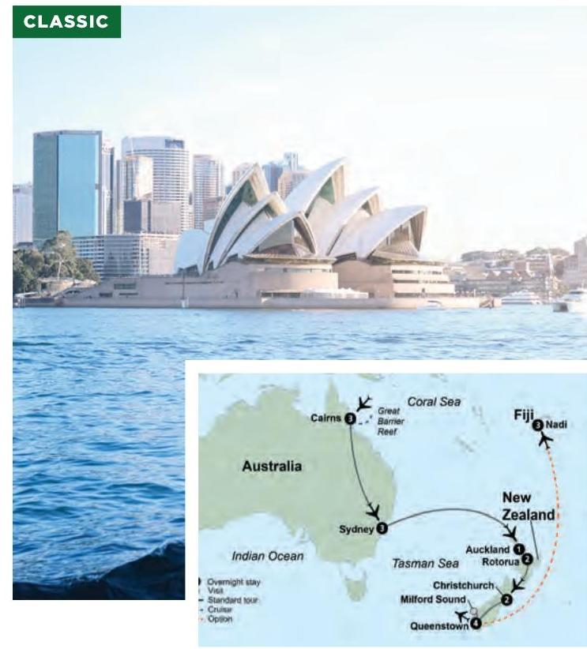

A sojourn to the South Pacific leads you to New Zealand's North and South Islands along with Sydney, Australia and the tropical gateway of Cairns.

## HIGHLIGHTS

- Visit the Tjapukai Aboriginal Cultural Center.
- Explore Te Puia, a cultural and geothermal experience.
- Board a catamaran and explore the Great Barrier Reef.
- Experience an authentic Hangi dinner celebration.
- Enjoy dinner in the home of a New Zealand family.

## STAYS

3 Nights Cairns / 3 Nights Sydney / 1 Night Auckland / 2 Nights Rotorua /2 Nights Christchurch / 4 Nights Queenstown

VISIT COLLETTE.COM/95 FOR MORE DETAILS.

## Page 84

# australia \& new Zealand 

## EXPLORING NEW ZEALAND'S WONDERS

19 DAYS / 25 MEALS / STARTING AT \$4,799* PP PRICE BASED ON MARCH 23, 2022 DEPARTURE.

View our website for additional dates.
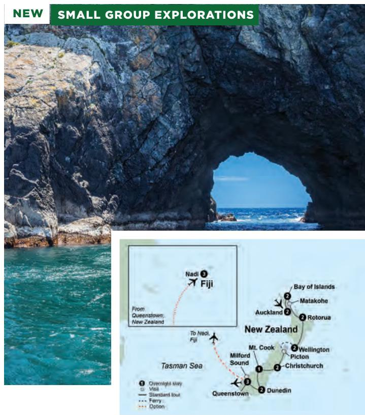

From geothermal springs to stunning fjords and Maori culture, experience New Zealand at its best. The vibrant lifestyle of the Pacific Islands welcomes you.

## HIGHLIGHTS

- Cruise through the Bay of Islands' famous "Hole in the Rock."
- Overnight in the Mt. Cook region, blanketed by ice fields and glaciers.
- Visit a farm and learn about life in New Zealand's high country.
- Explore Te Puia, a Maori cultural and geothermal experience.
- Experience a Hangi dinner and learn about Maori culture.

## STAYS

2 Nights Auckland / 2 Nights Bay of Islands / 2 Nights Rotorua / 2 Nights Wellington / 2 Nights Christchurch / 1 Night Mount Cook / 2 Nights Dunedin / 3 Nights Queenstown

## VISIT COLLETTE.COM/675 FOR MORE DETAILS.

## AUSTRALIA \& NEW ZEALAND UNCOVERED

22 DAYS / 31 MEALS / STARTING AT \$5,999* PP PRICE BASED ON APRIL 25, 2022 DEPARTURE.

View our website for additional dates.
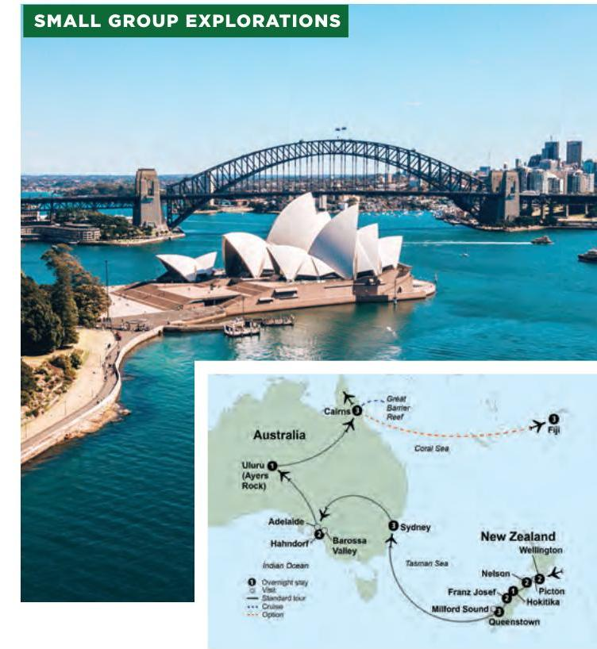

Uncover the core of Maori culture in New Zealand. Dive into the unparalleled Outback of Australia. This is Oceania, a paradise in the South Pacific.

## HIGHLIGHTS

- Explore New Zealand's wilderness and coastlines.
- Join a local Kiwi family for a home-cooked dinner.
- Sail through the Abel Tasman National Park.
- Get behind-the-scenes at the Sydney Opera House.
- Spend a day up close with the Great Barrier Reef.

## STAYS

2 Nights Wellington / 2 Nights Nelson / 1 Night Hokitika / 2 Nights Franz Josef / 3 Nights Queenstown / 3 Nights Sydney / 2 Nights Hahndorf / 1 Night Ayers Rock / 3 Nights Cairns

## VISIT COLLETTE.COM/644 FOR MORE DETAILS.

## Page 85

# Extend your tour with 3 nights in 

## ADD TO:

- The Complete South Pacific
- South Pacific Wonders
- South Pacific Wonders with New Zealand's North Island
- Exploring New Zealand's Wonders
- Australia's Outback to New Zealand's South Island
- Australia \& New Zealand Uncovered

## Page 86

# south \& central america 

## TROPICAL COSTA RICA

9 DAYS / 14 MEALS / STARTING AT \$1,599* PP PRICE BASED ON NOVEMBER 6, 2021 DEPARTURE.

View our website for additional dates.
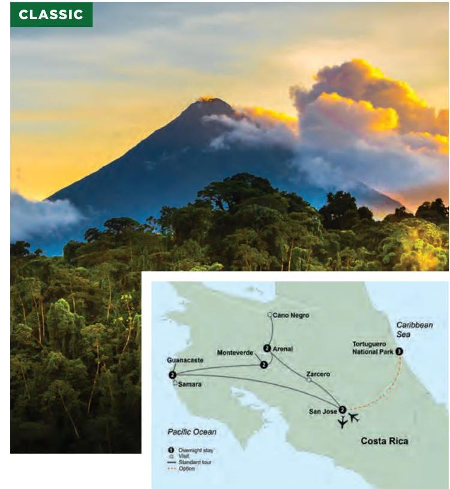

Discover Costa Rica's good life on a rendezvous with abundant wildlife, exotic fauna, lush rainforests, and endless coastlines.

## HIGHLIGHTS

- Discover Zarcero and its whimsical topiary garden.
- Enjoy the stunning scenery surrounding Arenal Volcano.
- Spot wildlife while on a Cano Negro riverboat cruise.
- Take a guided walk through Costa Rica's cloud forest.
- Visit a coffee plantation in Costa Rica.

## STAYS

1 Night San Jose / 2 Nights Guanacaste /
2 Nights Monteverde Cloud Forest / 2 Nights Arenal /
1 Night San Jose

## VISIT COLLETTE.COM/89 FOR MORE DETAILS.

## COSTA RICA: A WORLD OF NATURE

12 DAYS / 24 MEALS / STARTING AT \$2,299* PP PRICE BASED ON SEPTEMBER 12, 2021 DEPARTURE.

View our website for additional dates.
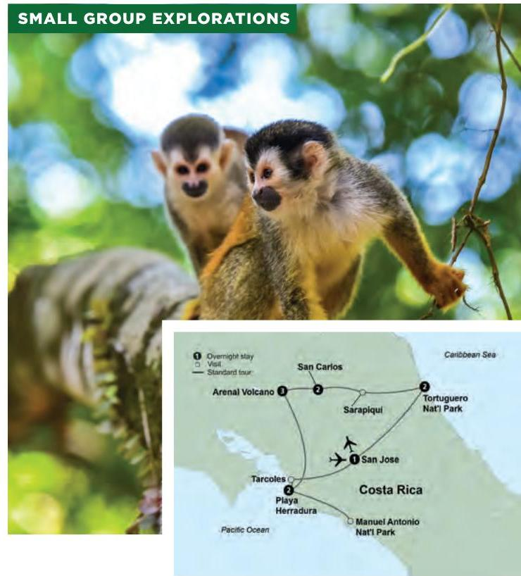

By land and by sea, thrilling journeys await as you seek to discover the essence of Pura Vida. Pull back the curtain of the rainforest and step inside to experience life unfiltered.

## HIGHLIGHTS

- Explore Arenal during a captivating 3-night stay.
- Stay in Tortuguero National Park, surrounded by wildlife.
- Hop aboard a river boat for a jungle crocodile safari.
- See the process of converting cacao from bean to bar.
- Learn how to cook with local flavor during a cooking class and tasting.

## STAYS

1 Night San José / 2 Nights Tortuguero / 2 Nights San Carlos / 3 Nights Arenal / 2 Nights Playa Herradura / 1 Night San José

VISIT COLLETTE.COM/294 FOR MORE DETAILS.

## Page 87

## PERU: FROM LIMA TO LAKE TITICACA

10 DAYS / 15 MEALS / STARTING AT \$2,699* PP PRICE BASED ON FEBRUARY 19, 2022 DEPARTURE.

View our website for additional dates.
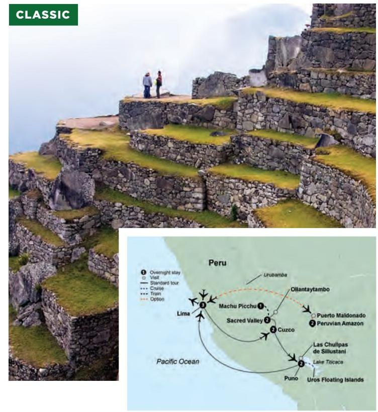

From the sacred citadel of Machu Picchu to the floating islands of Lake Titicaca, the magical wonders of Peru are waiting behind every corner.

## HIGHLIGHTS

- Explore Puno, the birthplace of the Inca empire.
- Cruise the floating islands of Lake Titicaca.
- Learn Andean textile methods at a living museum.
- Discover the Pablo Seminario Ceramics Studio.
- Uncover the mysteries of Machu Picchu with a guide.

## STAYS

2 Nights Lima / 2 Nights Sacred Valley / 1 Night Aguas Calientes / 2 Nights Cuzco / 2 Nights Puno

## PATAGONIA: EDGE OF THE WORLD

14 DAYS / 24 MEALS / \$5,299* PP PRICE BASED ON DECEMBER 7, 2021 DEPARTURE.

View our website for additional dates.
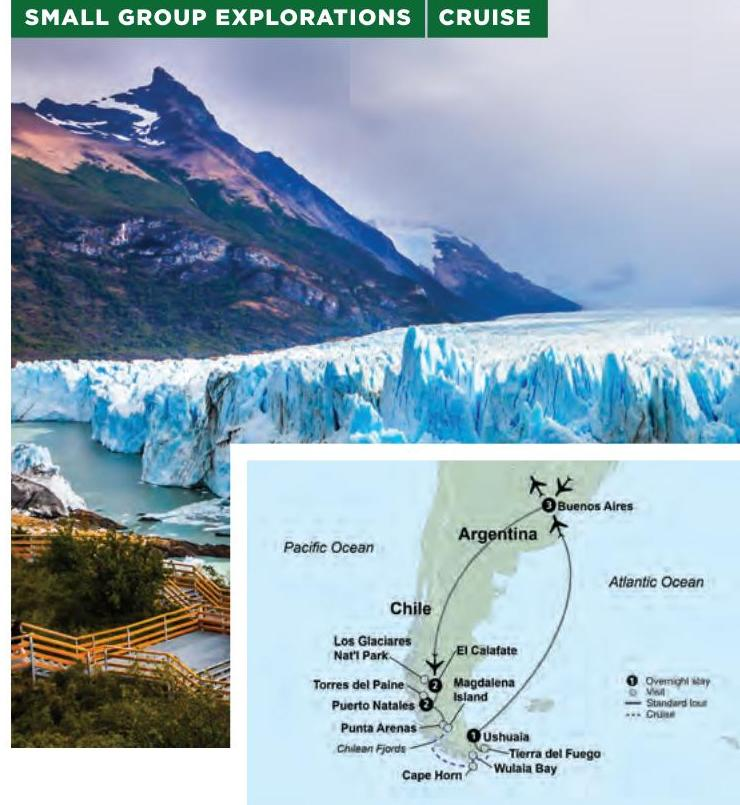

Take a step into a world of pure nature in Patagonia, where crystal-clear waters meet mountainside glaciers.

## HIGHLIGHTS

- Embrace Argentine culture at a tango performance.
- Embark on a 4-night cruise through Patagonia.
- Hike the "End of the Earth" at Cape Horn.
- Meet with local gauchos, Patagonia cowboys.
- Venture to Argentina's Perito Moreno Glacier.

## STAYS

2 Nights Buenos Aires / 2 Nights El Calafate / 2 Nights Puerto Natales / 4 Night Cruise Aboard the Stella Australis / 1 Night Ushuaia / 1 Night Buenos Aires

VISIT COLLETTE.COM/654 FOR MORE DETAILS.

## Page 88

# south \& central america 

## MACHU PICCHU \& GALÁPAGOS WONDERS

14 DAYS / 28 MEALS / STARTING AT \$4,999* PP PRICE BASED ON MARCH 3, 2022 DEPARTURE.

View our website for additional dates.
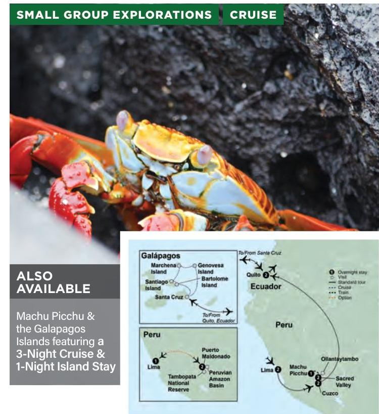

Journey from the Land of the Incas to the Galápagos archipelago, enjoying a 4-night cruise aboard a personal yacht.

## HIGHLIGHTS

- Meet tortoises at the Charles Darwin Research Station.
- Wind through the Andes in a domed train.
- Visit the Equatorial Line Monument and Museum.
- Cruise the Galápagos Islands with a naturalist guide.
- Explore the fabled ruins of Machu Picchu.

## STAYS

2 Nights Lima / 2 Nights Yucay / 1 Night Aguas
Calientes / 2 Nights Cuzco / 2 Nights Quito /
4 Night Cruise Aboard the M/Y Passion

## VISIT COLLETTE.COM/664 FOR MORE DETAILS.

## CULTURAL TREASURES OF JAPAN

14 DAYS / 19 MEALS / STARTING AT \$4,699* PP PRICE BASED ON FEBRUARY 27, 2022 DEPARTURE.

View our website for additional dates.
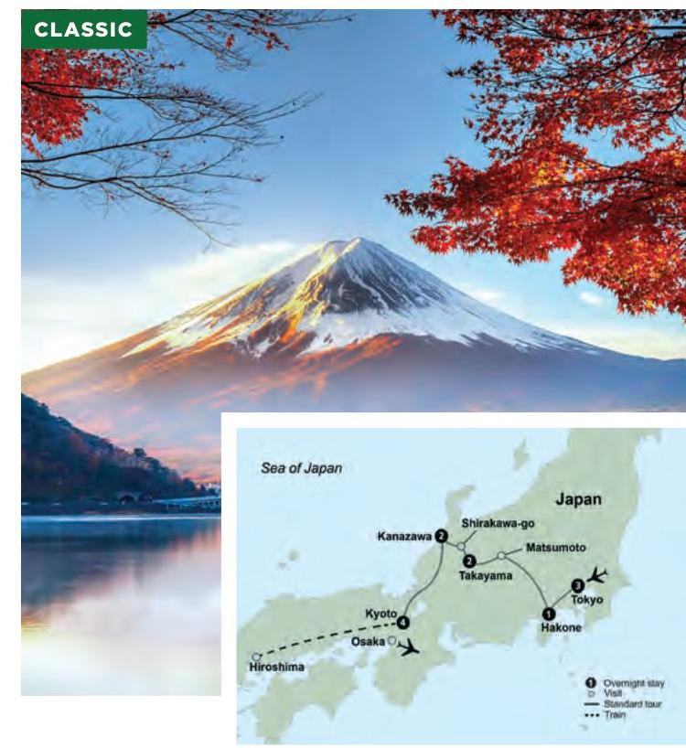

From the tranquility of ancient temples to the kinetic energy of bustling city streets, the blend of old and new is alive and well in Japan.

## HIGHLIGHTS

- Cruise the deep blue waters of Lake Ashi.
- Travel by the famous Shinkansen bullet train.
- Explore Nijo Castle, home of the first Shogun.
- Take in views of Mt. Fuji from the Hakone Ropeway.
- Stop for a sushi lunch in Tokyo's famous fish market.

## STAYS

3 Nights Tokyo / 1 Night Hakone / 2 Nights Takayama / 2 Nights Kanazawa / 4 Nights Kyoto

## VISIT COLLETTE.COM/607 FOR MORE DETAILS.

## Page 89

## MYSTERIES OF INDIA

15 DAYS / 26 MEALS / STARTING AT \$2,599* PP PRICE BASED ON MARCH 21, 2022 DEPARTURE.

View our website for additional dates.
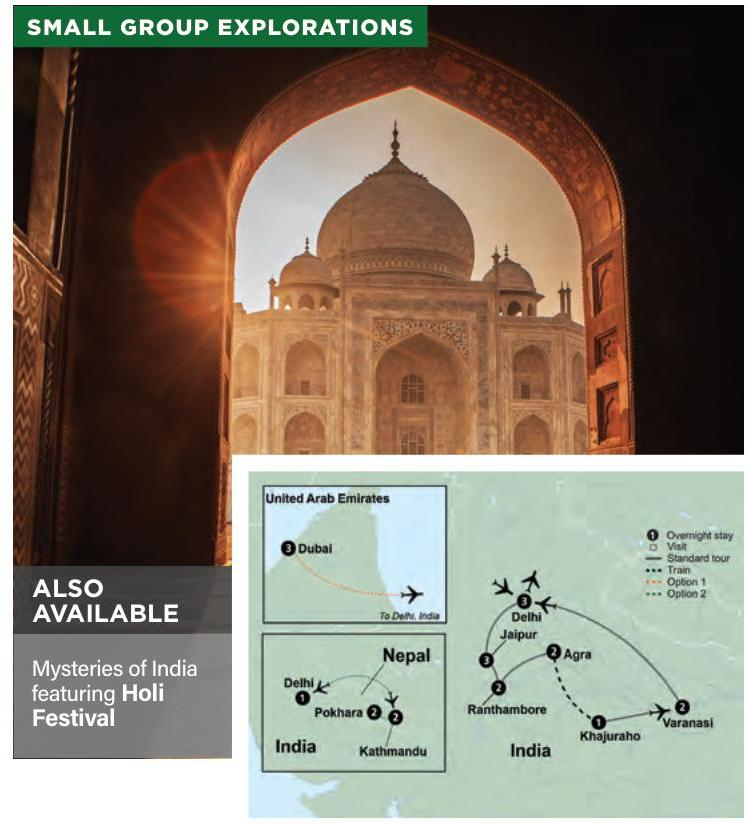

Welcome to India - a perfect synthesis of nature, spirituality, and regal legacy. Breathe new life into the soul and resurrect the senses on this electrifying
plunge into India's stunningly vibrant culture.

## HIGHLIGHTS

- Marvel at the illuminated Ganga Aarti ceremony.
- Venture through the streets of Old Delhi via rickshaw.
- Behold the Taj Mahal at sunrise.
- Watch for tigers during game drives in Ranthambore Park.
- Indulge during a food tour through Old Delhi.

## STAYS

3 Nights Delhi / 3 Nights Jaipur / 2 Nights Ranthambore / 2 Nights Agra / 1 Night Khajuraho / 2 Nights Varanasi / 1 Night Delhi

VISIT COLLETTE.COM/292 FOR MORE DETAILS.

## KINGDOMS OF SOUTHEAST ASIA

19 DAYS / 31 MEALS / STARTING AT \$2,999* PP PRICE BASED ON MARCH 24, 2022 DEPARTURE.

View our website for additional dates.
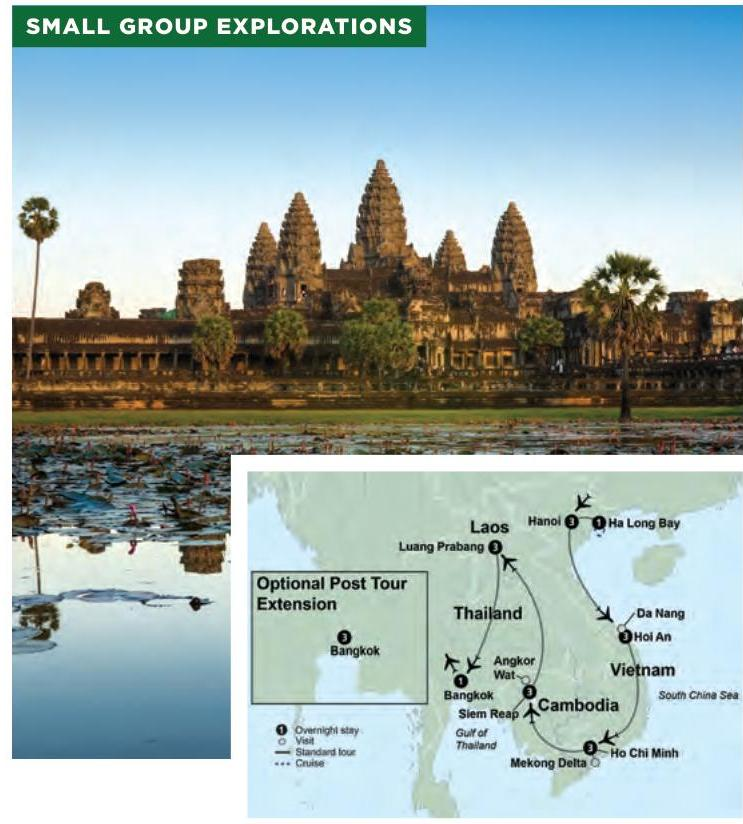

Enrich yourself in the distinctive culture, history, and cuisine of Vietnam, Laos and Cambodia. From ancient cities, to lush jungles, to sandstone temples,

Southeast Asia is an adventure for the senses.

## HIGHLIGHTS

- Take part in a blessing ceremony with the local monks.
- Visit the Pak Ou Caves, home to hundreds of Buddhas.
- See the underground maze of the Cu Chi Tunnels.
- Explore ancient Angkor Wat, the "City of Temples."
- Sample famous Vietnamese dishes on a walking food tour.

## STAYS

3 Nights Hanoi / 1 Night Cruise on Bhaya Classic / 3 Nights Hoi An / 3 Nights Ho Chi Minh / 3 Nights Siem Reap / 3 Nights Luang Prabang / 1 Night Bangkok

VISIT COLLETTE.COM/425 FOR MORE DETAILS.

## Page 90

# asia \& africa 

## SPECTACULAR SOUTH AFRICA

14 DAYS / 24 MEALS / STARTING AT \$2,999* PP PRICE BASED ON APRIL 28, 2022 DEPARTURE.

View our website for additional dates.
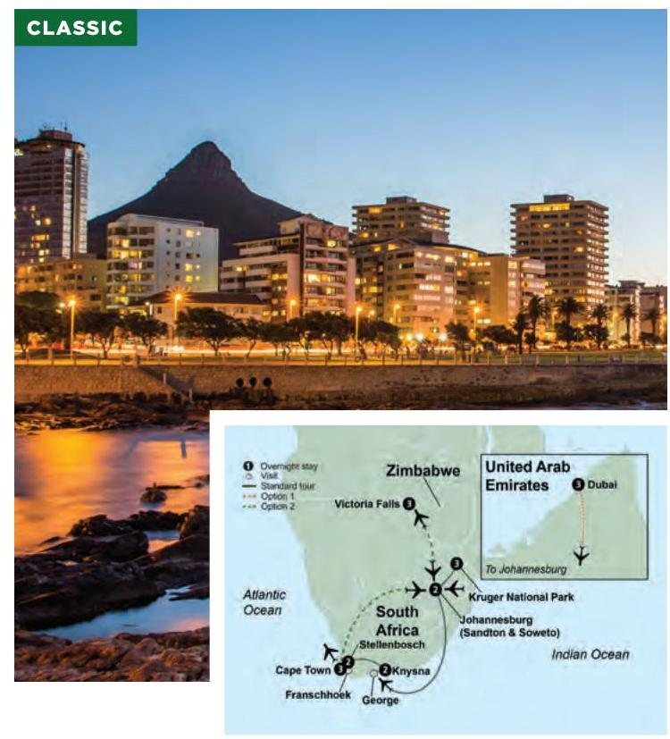

Dive in to South Africa's delightful blend of intriguing cultures, stunning wildlife, lush winelands and complex history.

## HIGHLIGHTS

- Learn the local beat with a lesson on the djembe drums.
- Look for the "Big 5" on two open-air safari game drives.
- Marvel at the breathtaking Drakensberg Mountains.
- Behold the luxurious mansions of Soweto.
- Experience an unforgettable African "Boma" dinner.

## STAYS

2 Nights Sandton / 3 Nights Kruger National Park / 2 Nights Knysna / 2 Nights Stellenbosch / 3 Nights Cape Town

## JOURNEY THROUGH EGYPT \& JORDAN

13 DAYS / 23 MEALS / STARTING AT \$3,899* PP PRICE BASED ON DECEMBER 6, 2021 DEPARTURE.

View our website for additional dates.
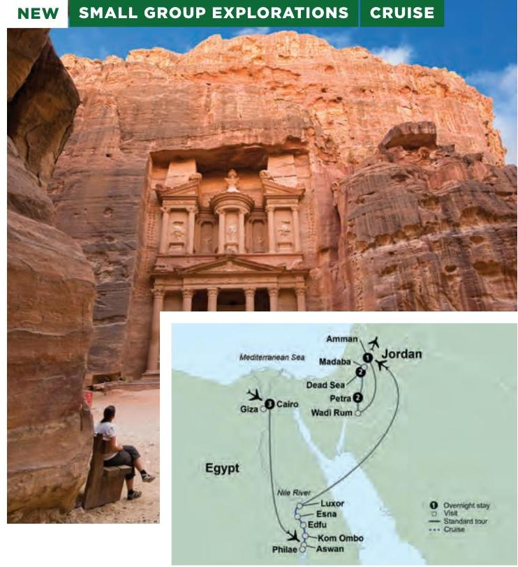

Eons of history, iconic wonders, savory cuisine, and desert sunsets. Discover the essence of Egypt and Jordan.

## HIGHLIGHTS

- Take a 3-night cruise down the legendary Nile river.
- Explore the legendary tomb of King Tut.
- Stand before an ancient wonder, the Pyramids of Giza.
- Meander through historic Petra, the "rose-red" city.
- Take in the striking landscape of Wadi Rum.

## STAYS

3 Nights Cairo / 3 Night Cruise Aboard the Sonesta St. George / 1 Night Amman / 2 Nights Petra / 2 Nights Dead Sea

## Page 91

## TREASURES OF EGYPT

12 DAYS / 21 MEALS / STARTING AT \$2,999* PP PRICE BASED ON DECEMBER 2, 2021 DEPARTURE.

View our website for additional dates.
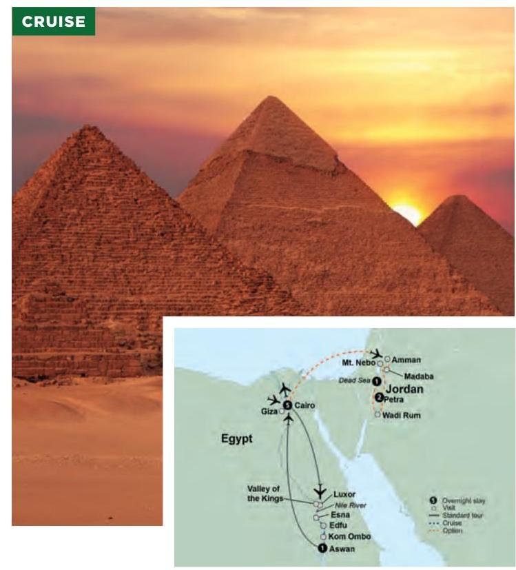

Follow the allure of the Nile as you retrace the steps of pharaohs in ancient Egypt. Uncover legends, beauty and history on this awe-inspiring journey.

## HIGHLIGHTS

- Discover the secrets of the Nile on a 4-night cruise.
- Take in a sound and light show at Philae Temple.
- Explore the Karnak Temple, dating back to 2000 B.C.
- Visit the majestic Pyramids of Giza.
- Explore the Valley of the Kings.

## STAYS

3 Nights Cairo / 4 Night Cruise Aboard the Royal Lily or the Royal Lotus / 1 Night Aswan / 2 Nights Cairo

## COLORS OF MOROCCO

14 DAYS / 24 MEALS / STARTING AT \$2,999* PP PRICE BASED ON JANUARY 20, 2022 DEPARTURE.

View our website for additional dates.
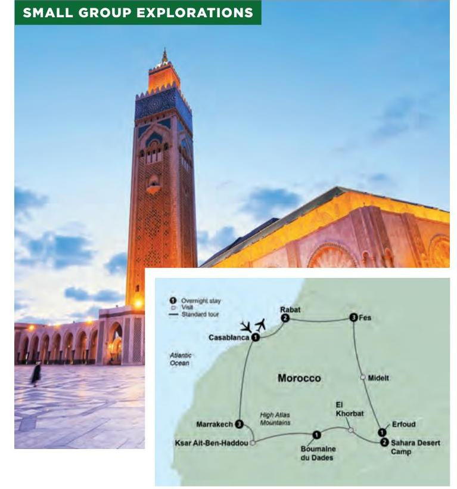

From vibrant cities to the still of the desert, Morocco will enchant you with its deep history, unique atmosphere and welcoming people.

## HIGHLIGHTS

- Stroll through ancient markets and medinas.
- Visit Fes, one of the holiest Muslim cities.
- Traverse the Sahara Desert by $4 \times 4$ to your tented camp.
- Feel Moroccan hospitality during dinner at your riad.
- Take a culinary workshop at a local women's cooperative.

## STAYS

2 Nights Rabat / 3 Nights Fes / 1 Night Erfoud /
2 Nights Sahara Desert / 1 Night Boumalne du Dades /
3 Nights Marrakech / 1 Night Casablanca

VISIT COLLETTE.COM/526 FOR MORE DETAILS.

## Page 92

## EXPLORING SOUTH AFRICA, VICTORIA FALLS \& BOTSWANA

15 DAYS / 29 MEALS / STARTING AT \$4,899* PP PRICE BASED ON DECEMBER 29, 2021 DEPARTURE.

View our website for additional dates.

## SMALL GROUP EXPLORATIONS

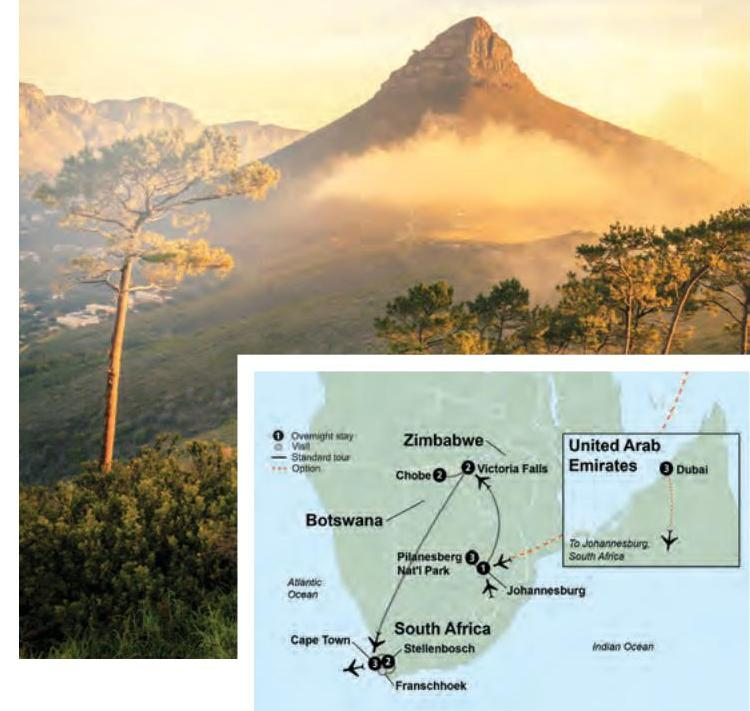

Thread by thread, the tapestry of South African life comes alive before your very eyes. From the "Big 5" to connecting with the people who call this place home, this is a journey to remember.

## HIGHLIGHTS

- Explore the vineyards of the Cape wine lands.
- Interact with incredibly intelligent African elephants.
- Seek the elusive "Big 5" on eight wildlife safaris.
- Climb to the top of Table Mountain in a cable car.
- Witness the beauty and power of Victoria Falls.

## STAYS

1 Night Johannesburg / 3 Nights Pilanesburg / 2 Nights Victoria Falls / 2 Nights Kasane / 2 Nights Stellenbosch / 3 Nights Cape Town

## THE PLAINS OF AFRICA

14 DAYS / 33 MEALS / STARTING AT \$4,899* PP PRICE BASED ON JANUARY 27, 2022 DEPARTURE.

View our website for additional dates.
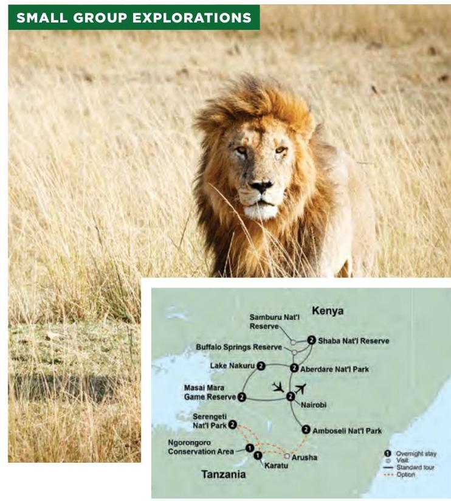

Prepare to see an Africa you've only known in your dreams, and one you never knew existed. Explore Kenya's wildlife, up close and personal, against a stunningly untamed backdrop.

## HIGHLIGHTS

- Feed Rothschild giraffes up-close at a sanctuary.
- Learn about the Samburu people during a tribe member visit.
- Experience the Masai culture during a village visit.
- Go on numerous game drives in search of the "Big 5."
- See wildlife from your treetop lodge, The Ark.

## STAYS

1 Night Nairobi / 1 Night Nyeri / 2 Nights Shaba Reserve / 1 Night Nyeri / 2 Nights Lake Nakuru / 2 Nights Masai Mara / 1 Night Nairobi / 2 Nights Amboseli

VISIT COLLETTE.COM/146 FOR MORE DETAILS.

## Page 93

## AFRICAN SAFARI: KENYA \& TANZANIA

15 DAYS / 38 MEALS / STARTING AT \$5,749* PP PRICE BASED ON JANUARY 17, 2022 DEPARTURE.

View our website for additional dates.

NEW SMALL GROUP EXPLORATIONS
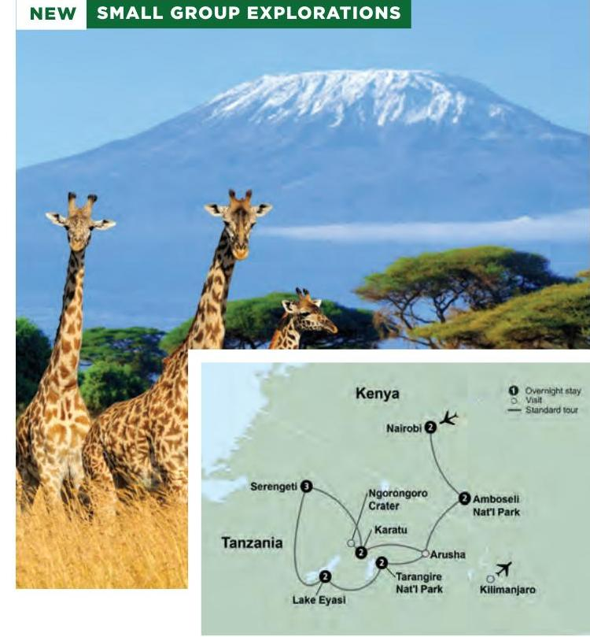

In the shadow of Mt. Kilimanjaro, embark on 12 lively safaris to seek out the elusive "Big 5" Africa's "bucket list" of animals.

## HIGHLIGHTS

- See how a local workshop empowers citizens with disabilities.
- Get a peek into the daily lives of 2 local tribes at Lake Eyasi.
- Visit Karen Blixen's Out of Africa farmhouse and feed the sanctuary's Rothschild giraffes.
- Spend 3 nights on the legendary Serengeti.
- Enjoy 5 picnic lunches on your game drives.

## STAYS

2 Nights Nairobi / 2 Nights Amboseli / 2 Nights Karatu / 3 Nights Serengeti / 2 Nights Lake Eyasi / 2 Nights Tarangire National Park
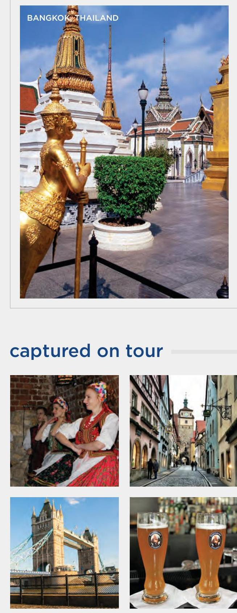
we love seeing the photos our travelers share on tour!

## Page 94

# (2) FREQUENTLY ASKED questions 

## accommodations

What is the difference between a twin room and a double room? In certain countries, hotel rooms tend to be smaller than U.S. standard accommodations. A double room is designed to accommodate two people, but may not have two separate beds. A twin bedded room has two separate beds of any size, and is the type most commonly utilized.
What size is a triple room? A triple room is the same size as a twin bedded room and beds will accommodate three people, but we cannot guarantee that there will be three separate beds. If there are only two beds, a rollaway may be requested but cannot be guaranteed due to size of room and fire codes. Please inquire at time of reservation.
Can my children travel on tour? Children over the age of 5 may travel on a Collette tour accompanied by an adult. Child land rates are valid for ages 5-12, sharing a room with two full-paying adults.
Are single and triple rooms always available? On many tours, triple and single accommodations are limited and are available on a first come, first served basis. Be advised that single rooms are often smaller.
When can I check into my hotel? Normal check-in time is late afternoon in most locations. Due to early arrival times into some cities, rooms may not always be available for immediate check-in.

## air

Can Collette book our airline reservations? Collette is happy to assist you in accommodating your flight needs. Due to tour scheduling and limited availability, you are strongly encouraged to take advantage of Collette's air packages. We are not responsible for air arrangements you have made on your own. On occasion, it is necessary to change tour dates. In this case, we can only protect air reservations booked through Collette. For all air reservations, it is strongly recommended to reconfirm flights before departure, in the event that the airline has an unexpected schedule change. We cannot assume responsibility for schedule changes, routings or flight cancellations involving the airlines. Not all airlines offer pre-assigned seats. Some charge a fee for seats which will be at the guests' expense. Where pre-assigned seats are not offered, the guests must contact the airline directly to arrange seat assignments.

## attractions \& sightseeing

Are attractions always available? Access to some attractions or Collette Foundation sites may be affected by the observance of holidays, weather conditions or other circumstances. As a result, the days and order of sightseeing may change to best utilize your time on tour. Boat rides are weather permitting. Some attractions may not be available during the "off-season" months. When attractions are unavailable, other similar attractions will be substituted. Wildlife sightings are not guaranteed.
Is there a lot of walking on tour? We pride ourselves on bringing travelers the very best experiences a destination offers. Our itineraries include many activities and may consist of walking on uneven terrain or significant walking at times. Some of the most unique sightseeing can mean accessing locations that restrict motorcoaches, especially in historic areas. Some hotels/lodges in remote locations may not have elevators. For your comfort, we recommend bringing walking shoes. Review each tour's "Tour Activity Level" and "Tour Pacing" on the tour itinerary webpage.
Can you tell me more about the safaris? In order to most fully experience the wildlife, you will be traveling by custom-built safari vehicle which requires climbing in and out frequently and sometimes travels on bumpy roads. To experience Africa fully, we recommend that all travelers be in reasonably good health and prepare properly.

How can I plan for shore landings? Special clothing is required for the shore landings (Antarctica, Galapagos); please refer to your predeparture documents for important details.
Are all theater performances suitable for children? Some theater performances may be unsuitable for children - consult your Tour Manager.

## documentation

Do I need a passport? Government-issued identification is required for all air travel. A valid passport is required for all trips outside the USA. All passengers should check with the appropriate foreign consulate for entry and validity requirements. We recommend that your passport has six months validity, and at least 3 blank pages. Passports and visas are the responsibility of each client.
International Borders Any child under age 16 (traveling without a parent or legal guardian to Canada) must have written permission from a parent or legal guardian.
Please be advised that if you have been convicted of an offense, or have committed a criminal act that is an offense under the laws where it occurred and would be an offense in Canada, you may be inadmissible into Canada. You will need to apply for a Minister's Permit of Approval of Rehabilitation at a Canadian Consulate. All other travelers should contact the appropriate consulate for entry requirements in other international destinations.
In South Africa, children are required to have a passport as well as additional documentation to travel with you into and out of the country. Please consult the South African Embassy for the current specific requirements related to your travel dates.
If traveling internationally with a child under the age of 18, please check directly with the airline for the legal documentation that is required. It is the sole responsibility of the guest to procure the proper documentation to travel and many requirements vary by airline and destination.
Collette will not be responsible for costs incurred for missed flights or canceled tours where a guest fails to secure proper documentation.

## extending your stay

Can I extend my tour to see more of a region? Yes! You may enhance your tour by purchasing either an extension or pre/post hotel stays, offered on select tours. Extensions may be "hosted" rather than escorted. When hosted, passengers will be greeted upon arrival by a local tour manager who will provide all included services and be available on-call during the duration of the extension. A minimum number of passengers may be required to operate some extensions. Extensions not purchased at time of deposit are subject to availability and applicable charges at time of request.
Collette also offers pre and post hotel nights before and/or after a tour for you to explore the destination independently. Should you purchase additional nights, please be advised that your Tour Manager will not be available during this time.

## extras

What is not included in the tour price? The land price does not include air travel, airline fees, airport or departure taxes, transfers, visas, customary end-oftrip gratuities for your Tour Manager, driver, local guides, hotel housekeepers, cruise ship waitstaff, and any incidental charges.

## late bookings

Do you accept late bookings? Tour sales normally close 7 days prior to departure. All late bookings are on request and must be guaranteed with a credit card if within 60 days of departure date.

## Page 95

## on-tour experience

Where do I meet my Tour Manager? Your tour will begin at your first hotel. The Tour Manager will make contact with you at the hotel and will provide details relating to your tour. The hotel's address and phone number will be included in your documents.
Can I pre purchase optional excursions/activities? Yes, the majority of optional excursions and activities are available for advance purchase for applicable tours provided that you make your options purchase prior to 15 days of the tour departure. Collette makes it convenient to reserve presold options by visiting our website for a full listing of activities and excursions or when your reservation is made with our reservations staff. In addition, there are benefits to prepurchasing options including a price guarantee once your tour is paid in full. So, while the cost of an optional activity may change from the time you book your tour, once payment is received in full, your preselected options are guaranteed by Collette at their original price. Although you can still purchase options while on tour, reserving them ahead of time ensures you a spot in the event that the activity sells out. Collette will provide a refund if you cancel a presold option prior to tour departure. Any presold options canceled while on tour are nonrefundable.

## revisions/changes

Would my tour date ever be changed? While it is unlikely, Collette does reserve the right to cancel a tour prior to departure. Should this happen, Collette will make every effort to put you on another departure date. If an alternate cannot be found, a full refund will be made. Air booked through Collette will be protected. We cannot be held responsible for penalties incurred if you have secured your own air.
Can I make changes to my reservation? Should you decide to change your reservation after initial booking, a handling fee of $\$ 25$ per transaction will be charged. A change of tour date, tour itinerary or passenger name, within the guidelines of the cancellation policy, will be treated as a cancellation and regular cancellation fees may apply.
Revisions to air tickets are subject to the rules and regulations of the airline. See our Cancellation Policy for more details.

## tour pacing

How can I be best prepared for the pacing and physical requirements on a Collette tour? Tour pacing varies by itinerary, and each destination's sightseeing and activities are unique. Pacing is subject to personal interpretation. At Collette, we do include the best a destination has to offer, enhancing your overall tour experience. For overnight pacing of a tour, as well as day-by-day descriptions of the tour, please refer to our website.
The Tour Activity Level Ranking is featured on each tour itinerary webpage in a circle. The definition of each activity level is listed here. If you have additional questions regarding a specific tour, please inquire at time of reservation. For your comfort, we recommend packing comfortable walking shoes so you can fully enjoy every aspect of your tour.
Level 1: You're a leisurely traveler. You like to discover the energy of a new place, but typically take it easy. You can handle at least one flight of stairs, board a coach, and walk for 15-30 minutes at a time with little difficulty.
Level 2: You like a balanced approach to travel. You feel confident walking at least 30-45 minutes at a time over a variety of terrains - from cobblestone
streets to easy straightaways to a couple hills or flights of stairs. You're comfortable walking a few city blocks at a time, but need some time to unwind and relax.
Level 3: You're an on-the-go traveler. You don't want to miss a thing, so walking and standing for longer periods of time (1-2 hours) isn't a big deal. You can navigate hills and uneven ground, climb into various modes of transportation (tuk-tuk, cable car, zodiac, etc.), and could possibly anticipate changes in elevation. You can expect some longer days balanced with freetime to recharge or set out on your own adventure.
Level 4: You're ready to seize the day, whatever it may bring. You lead an active life at home (walking, biking, and hiking are things you may enjoy) and few thousand steps a day isn't out of the norm. You can handle longer walking tours (more than 90 minutes), traversing dusty or uneven terrain, standing for periods of time, varying altitudes and temperatures, and don't mind being on the go with some early starts, late-night experiences, and full days. Unfortunately, this level is not appropriate for individuals who use wheelchairs or walkers.

## transfers

Are airport and hotel transfers available? Roundtrip airport-to-hotel transfers are provided for all passengers who purchase airfare through Collette. These transfers also apply to pre- and post-night stays purchased through Collette. Passengers who do not purchase airfare through Collette can purchase transfers (for the first and last day of the tour) at an additional cost of $\$ 100$ per person, roundtrip. Some restrictions may apply. All transfers leave at prescheduled times.
What is Roundtrip Home to Airport Sedan Service? It's your ticket to and from the airport. This service is available for all air-inclusive tour bookings. This personalized service is included in many U.S. cities within a 50 mile radius from more than 90 airport gateways.* Service is available between 51 and 75 miles for a small fee. Not valid on group travel.
*One transfer per room booking. Additional stops are not permitted on route.

## the Collette Passport Club

What is the Collette Passport Club? Collette Passport Club members receive a $\$ 150$ travel credit for each trip they take* along with various other benefits.
*Full credit is valid for your next tour when travel is completed within 12 months of the original trip. $\$ 100$ of the credit remains valid for travel within 13-24 months. Credit expires 24 months after the original trip.

## our awards

partnerships

## Page 96

# AIR information 

## THE CHOICE IS YOURS three great air options

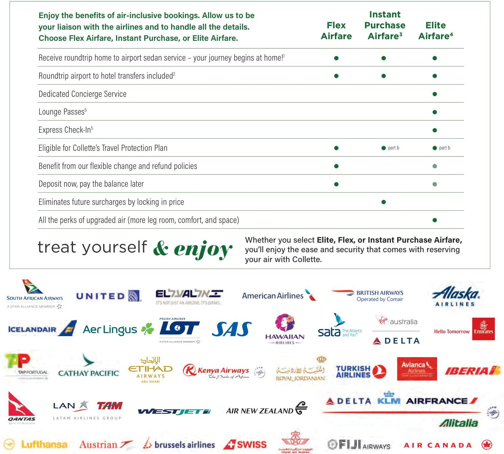

[^0]
[^0]:    This roundtrip home to airport sedan service is included in many U.S. cities within a 50 mile radius from more than 90 airport gateways when you purchase an air-inclusive tour. Service is available between SI and 75 miles for a small fee. One transfer per room booking. Additional stops not permitted on route. Not valid on group travel. ${ }^{1}$ These transfers are available on the first and last day of the actual tour dates and when you are traveling on select flights. Land only clients may purchase transfers on the first and last day of the actual tour dates for an additional cost of $\$ 100$ per person, roundtrip (some restrictions may apply). ${ }^{2}$ Instant Purchase Airfare is offered on select dates; consult your booking agent. ${ }^{3}$ Elite Airfare status is only included with the purchase of a First Class, Business Class or Premium Economy ticket with either Flex or Instant Purchase air; only on the international/long-haul portion of your journey. ${ }^{4}$ Lounge Passes \& Express Check-in are based on airline and airport availability for Business Class passengers only; Premium Economy tickets do not qualify. Lounge passes are not available for travel from North America to destinations within North America or the Caribbean. Not applicable with Instant Purchase Airfare.

## Page 97

# RESERVATION infornution 

## Land Rates

Land rates are per person, double occupancy, unless otherwise noted. Availability of departures at the prices noted in the brochure is limited. For current prices, please see our website. Government taxes and fees are additional. Land rates are guaranteed at time of deposit.
The land price includes those land based items delineated as included in the package itinerary and does not include any other items such as air travel, airline fees, airport or departure taxes, transfers, visas, customary end of trip gratuities for your Tour Manager, driver, local guides, hotel housekeepers, cruise ship waitstaff, and any incidental charges.

## Payments

## Land Package Deposit

- A $\$ 300$ non-refundable deposit is due with your land only reservation.
- For Antarctica and Cruises only reservations, a non-refundable $\$ 500$ deposit is required. An additional $\$ 1,000$ non-refundable second deposit is due 180 days prior to departure for Antarctica.
- For Oberammergau only reservations, a non-refundable $\$ 500$ deposit is required. An additional $\$ 1,500$ non-refundable second deposit is due one year prior to departure.

## Air Inclusive Package Deposit

- A $\$ 600$ non-refundable deposit is due with your air inclusive reservation.
- For Antarctica and Cruises air inclusive reservations, a non-refundable $\$ 800$ deposit is required. An additional $\$ 1,000$ non-refundable second deposit is due 180 days prior to departure for Antarctica.
- For Oberammergau air inclusive reservations, a non-refundable $\$ 800$ deposit is required. An additional $\$ 1,500$ non-refundable second deposit is due one year prior to departure.

## Instant Purchase Air

- If you have selected Instant Purchase air, the deposit required is the full cost of the airfare plus the land package deposits noted above; all of which is non-refundable.
Should you decide to purchase our per-person Travel Protection Plan, you must do so at the time of booking. This Plan includes the Pre-Departure Cancellation Fee Waiver (a non-insurance feature provided by Collette) which protects you from penalties in the event you have to cancel your entire tour package for any reason up to the day prior to departure (see Part A for more details). If you originally purchased Instant Purchase airline tickets, Part B of the Travel Protection Plan reimburses for the airline tickets, taxes, or fees in the event of a cancellation for a covered reason (see Part B for more details).

## Final Payment

Unless otherwise noted, the balance is due 60 days before departure on all tours, except cruises, Antarctica, Galapagos and Oberammergau for which the balance is due 120 days before departure. Payment may be made by charging to clients' Mastercard, Visa, American Express, or Discover (card imprint and signature required) or by sending a check or money order. All land rates are guaranteed upon deposit. Payment may also be made online at https://reservations.gocollette. com/payment.aspx.

## TINVEL PROFESSIONALS PLEASE CONTACT:

Collette: 1-800-611-3361
PLEASE SEND PAYMENTS TO:
Collette Travel Service, 162 Middle Street, Pawtucket, RI 02860
Attn: Accounts Receivable

## Revision Fees

A handling fee of $\$ 25.00$ per transaction will be assessed for any change or revision made to a reservation. A change of departure date within 11 months of departure will be treated as a cancellation, and cancellation charges will apply.

## Cancellation Charges

Cancellations of confirmed bookings and transfers to new travel dates both result in penalties and fees assessed by travel suppliers. If you need to transfer or cancel for any reason prior to tour departure, the following cancellation fees will be assessed on your land or cruise product. Air is $100 \%$ nonrefundable once paid in full. If canceled prior to being paid in full, the following cancellation fees will also apply to air.

- More than 60 days prior to departure: a nonrefundable deposit will be retained.
- 60 - 90 days prior to departure: $30 \%$ of land or cruise price
- 10 - 1 day prior to departure: $50 \%$ of land or cruise price
- Day of departure and after: $100 \%$ of land or cruise price

## Exceptions:

Ocean Cruises:

- More than 90 days prior to departure, a nonrefundable deposit will be retained.
- 90 - 61 days prior to departure: $35 \%$ of land or cruise price
- 60 - 31 days prior to departure: $60 \%$ of land or cruise price
- 30 - 0 days prior to departure: $100 \%$ of land or cruise price

## River Cruises: including Europe, Russia, Egypt and China

- More than 90 days prior to departure, a nonrefundable deposit will be retained.
- 90 - 61 days prior to departure: $50 \%$ of land or cruise price
- 60 - 31 days prior to departure: $95 \%$ of land or cruise price

## Galapagos \& Antarctica:

- More than 120 days prior to departure: nonrefundable deposits will be retained.
- 120 - 90 days prior to departure: $60 \%$ of land or cruise price
- 89 - 0 days prior to departure: $100 \%$ of land or cruise price

## Oberammergau

- More than 120 days prior to departure - a nonrefundable deposit will be retained.
- 120 - 91 days prior to departure - $75 \%$ of total price
- 90 days - 0 days prior to departure - $100 \%$ of total price
* Instant Purchase air and its associated taxes, fees and surcharges are 100\% nonrefundable at time of reservation.
Upon cancellation of transportation or travel services where you, the customer, are not at fault and have not canceled in violation of the terms and conditions above, you will be refunded 100\%.

## Airfare

For your convenience, we offer airfare for purchase with all tour packages. If you purchase an airinclusive program, your airfare will be quoted inclusive of all fuel, taxes and fees. Your rates are subject to change until paid in full. Seats are limited and may not be available on every flight or departure date.
Instant Purchase Airfare includes roundtrip airport/hotel transfers (excluding pre- or post-days and extensions). Instant Purchase airfare requires full payment at the time of booking. If you purchase the Travel Protection Plan, the Instant Purchase airfare may be reimbursed, if you cancel your trip for a covered reason (see Part B for more details). Tickets will be issued immediately and once issued are nonrefundable, and may only be changed for a fee up to $\$ 300$ plus any difference in airfare for travel in the following 12 months; specific fees and policies may vary by airline. These tickets include an administration fee and roundtrip airport-to-hotel transfers, both of which hold no airline reissue value. Once issued, there can be no fluctuation in price due to an increase in government taxes or in airline fuel surcharges. Therefore, any such fees or airport-to-hotel transfers are not refundable under any circumstances.

## Aircraft Cabin Disinsection Disclaimer

Some countries may require aircraft cabin insecticide treatment for inbound foreign flights. Information about aircraft disinsection requirements and a list of countries requiring such disinsection are available online at http://www.dot.gov/office-policy/aviation-policy/aircraft-disinsection-requirements.

## Travelers Needing Special Assistance

You must report any disability requiring special attention to Collette at the time the reservation is made.* Collette will make reasonable efforts to accommodate the special needs of tour participants. Such participants, however, should be aware that the Americans with Disabilities Act is inapplicable outside of the United States and facilities outside the United States for disabled individuals are limited. It is strongly recommended that persons requiring assistance be accompanied by a companion who is capable of and totally responsible for providing the assistance. Neither Collette nor its personnel, nor its suppliers, may physically lift or assist clients into transportation vehicles. If a traveler thinks he or she might need assistance during a trip, he or she should call Collette to determine what assistance might reasonably be given. Collette cannot provide special individual assistance to tour members with special needs for walking, dining or other routine activities.
*To request a wheelchair accessible room on a cruise, the traveler or person sharing the room must have a recognized disability that alters a major life function and requires the use of a mobility device and the use of the accessible features provided in the wheelchair accessible statesrom.

## Holiday and Museum Closures

Museum visits and personal shopping time may be disrupted due to unforeseen circumstances or many religious, state and local holidays observed throughout the world.

## Motorcoach Washrooms

Most motorcoaches used on our tours are equipped with washrooms except safari vehicles, exotic locations, and some of our Explorations tours. These are typically for emergency use, as we make plenty of comfort stops, allowing you the opportunity to use public restrooms and/or stretch your legs.

## Seat Rotation

Seats are rotated onboard the coach for all Collette tours under the direction of the tour manager. So that we do not show partiality among passengers, exceptions cannot be made.

## Maps and Photos

Maps shown on tour pages are current at the time of printing and may not reflect actual tour routing should the tour change. Photos shown on tour pages are reflective of the area(s) visited, but may not be included in the actual tour itinerary and the conditions you experience may be different than depicted in the photograph(s).

## Baggage Disclaimer

Although every effort is made to handle passengers' luggage as carefully as possible, Collette is not responsible for and does not assume liability or accept claims for loss of or damage to luggage due to breakage, theft or wear and tear through hotel and group carrier handling. It is recommended for your own self-interest and protection that you have adequate insurance to cover these eventualities. There are limitations by coach and air carrier as to the number and size of bags which can be carried onboard and in bulk storage. Be sure to ask your travel professional about such restrictions before departing for your tour.

## Checked Baggage Charges:

Some airlines may impose additional charges if you choose to check any baggage. Please contact your airline or refer to its website for detailed information regarding your airline's checked baggage policies. Please be advised baggage fees may apply on most trans-border flights. This is a fee levied by the airlines, not Collette, and may be subject to change.

## Page 98

# RESERVATION infornation 

## Explanation of Responsibilities and Tour Conditions for Collette

Each client is responsible for proper documentation and inoculations that may be required and/or recommended to participate on tour. Please contact your local travel clinic or personal physician for specific details on the destinations you are traveling to and from. If you decide to make a reservation, you acknowledge and agree that you are physically well enough to travel and understand that medical facilities may not be similar to what you are accustomed to at home. You must bring enough medication with you for the trip. Any person reserving or purchasing any Collette product published in this brochure accepts the condition that Collette reserves to itself the exclusive right to cancel, re-schedule or make other adjustments to any guided vacation departure in any circumstances deemed necessary, including in accordance with operating requirements or circumstances beyond its control, including for tours designated as "guaranteed departures." If cancellation is made by Collette any time prior to the departure date of the guided vacation, except when a customer fails to pay the final balance on time, Collette, at its sole discretion, will offer a comparable vacation on an alternate departure date, or reserves the right to offer a future travel credit. Collette will refund any difference in price if the alternative date is of a lower price, however the guest will be responsible for additional costs if the alternative is priced higher. Collette will not be liable for cancellation, delay, rescheduling or other adjustment or impact to a departure or itinerary or other aspect of the vacation brought about due to force majeure or other circumstance beyond its control that prevents or interferes with any aspect of the tour, also including governmental and administrative actions. Collette is not responsible for other travel arrangements affected due to our cancellations or change costs or penalties incurred on other travel arrangements, including air tickets. Published times on itineraries are as accurate as possible but subject to change due to traffic, weather, mechanical and any other conditions beyond Collette's control that prevent Collette from operating as scheduled. Collette expressly disclaims any liability for any damages that may be incurred for any changes, cancellations or delays on any itinerary on any Collette tour.
All rates on foreign tours are subject to fluctuations of currency and may be changed when necessary without advance notice prior to deposit.
All rates published are per person as indicated and are based on double occupancy when only one rate is shown. Reservations will be accepted subject to availability at the time of request and will be considered confirmed only upon receipt of a minimum deposit. Child land rates are available and are valid for ages 5-12, sharing a room with two full-paying adults.
Collette does not accept liability in the case of any passenger being denied boarding by any airline carrier due to the carrier's overbooking of a flight. All cancellation charges, fees and refunds for any tour within this brochure are in effect as of the effective date as indicated on page 75 and supersede any other previously printed policies relating to these same charges.

## GENERAL DISCLAIMER

Collette monitors security situations around the world as well as government travel advisories. Conditions may require Collette to change or even cancel trips. You accept the risks involved in travel, both foreign and domestic, and accept responsibility for your own travel decisions. Guests may be required to review and sign a participation agreement prior to engaging in certain activities on the trip.
Neither Collette Travel Service, Inc., its affiliated entities and its and their employees, shareholders, officers, directors, successors, agents, and assigns (collectively "Collette"), own or operate any person or entity which is to or does provide goods or services for these trips. You agree to be bound by the conditions of carriage for all transportation providers. Collette does not maintain control or operate the personnel, equipment, or operations of these suppliers it uses and as such Collette assumes no responsibility for and cannot be held liable for any personal injury, death, property damage or other loss, accident, delay, inconvenience, or irregularity which may be occasioned by reason of (1) any wrongful, negligent, willful or unauthorized acts or omissions on the part of any of the suppliers or other employees or agents, (2) any defect in or failure of any vehicle, equipment, or instrument owned, operated or otherwise used by any of these suppliers, or (3) any wrongful, willful or negligent act or omission on the part of any other party.
Client shall indemnify and hold harmless Collette Travel Service, Inc., its affiliated entities and its and their employees, agents, shareholders, officers, successors and assigns (collectively "Collette"), from all suits, actions, losses, damages, claims or liability for any personal injury, death, property damage or other loss, accident, delay, inconvenience or irregularity which is occasioned by any negligent acts or omissions of Collette arising out of any goods or services provided for this or these trips.
Additionally, responsibility is not accepted for losses or expenses due to sickness, lack of appropriate medical facilities or practitioners, weather, strikes, theft or other criminal acts, war, terrorism, computer problems, or other such causes. Other risks may arise such as, but not limited to, hazards of traveling in foreign countries including undeveloped areas, the hazards of travel by aircraft, bus, van, train, automobile or other motorized vehicle, differing safety standards, sickness, criminal acts committed by others, allergic reactions, and/or animal encounters. You are voluntarily participating in the tour and Collette, and as lawful consideration for the agreement to travel with Collette, you agree not to make a claim against Collette, its related companies, officers and employees for injuries, death, or any other claim and agree to release Collette, its related companies, officers and employees from any such claim. This release is binding on all members of your traveling party, as well as your Estate and Feers and this provision shall be enforceable even after your trip has ended. If you make your own air reservations, Collette is not responsible and shall provide no refund if your flight schedule changes so that you are not able to enjoy the entirety of your tour. All services and accommodations are subject to the laws of the country in which they are provided. Collette reserves the right to make changes in the published itinerary whenever, in their sole judgment, conditions warrant, or if Collette deems it necessary for the comfort, convenience, or safety of the tour. Collette reserves the right to withdraw any tour announced. Collette reserves the right to decline to accept any person as a member of the tour, or to require any participant to withdraw from the tour at any time, when such action is determined by the Tour Manager to be in the best interests of the health, safety, and general welfare of the tour group or of the individual participant. If 98
you are traveling with children, you are solely responsible for their behavior and monitoring them throughout the tour. Neither does Collette accept liability for any carrier's cancellation penalty incurred by the purchase of a nonrefundable airline or other ticket to the tour departure city and return or otherwise. Baggage and personal effects are the sole responsibility of the owner at all times.
Collette is not responsible, and will not be bound by, representations made by third party representatives, travel agents, unaffiliated websites, or any other party.
Participants may be photographed for the promotional purposes of Collette. In addition, any comments that you submit as a review or your social media posts may be used for Collette's promotional purposes. Payment of the deposit to Collette constitutes acceptance of these terms and conditions. Collette reserves the right to modify these terms and conditions at any time, without notice.

## FORUM SELECTION AND CHOICE OF LAW

THIS AGREEMENT SHALL BE GOVERRED AND INTERPRETED PURSUANT TO THE LAWS OF THE STATE OF RHODE ISLAND BY MUTUAL AGREEMENT OF THE PARTIES HERITO AND THE PODERAL AND STATE COURTS IN RHODE ISLAND SHALL HAVE EXCLUSIVE AND SOLE JURSDICTION OVER ANY DISPUTS, CONTROVERSY OR SUIT ARISING RELATIVE TO THIS AGREEMENT.

## DISPUTES/CLASS ACTION WAVIER

YOU AGREE THAT YOU WILL ONLY SRIING CLAMS AGAINST COLLETTS IN YOUR INDIVIDUAL CAPACITY AND NOT AS A PLANITY OR CLASS MEMBER IN ANY PURPORTO CLASS ACTION OR REPRESENTATIVE PROCEDING. COLLETTS SHALL NOT IN ANY CASE BE LARLE FOR OTHER THAN COMPENSATORY DAMAGES, AND YOUR PAYMENT OF A DEPDST ON A TOUR MEANS THAT YOU AGREE TO THESE CONDITIONS OF SALE AND EXPRESSLY WAVE ANY RIGHT TO PUNITIVE DAMAGES.

## ERRORS AND OMISSIONS

While every effort is made to ensure the accuracy of information in our brochures, on our website or communicated by our reservation staff, errors or omissions are possible and Collette is not responsible for such error. If a mistake is made in billing, we reserve the right to correct the invoice and you will be responsible for proper payment.

## SEVERABILITY

In the event that any clause in this agreement is determined to be invalid, the remaining provisions are valid and enforceable. The invalid provision shall be replaced by Collette by a clause as similar as practicable.

## Consumer Protection Plans

Collette is a member of the following organizations: The National Tour Association, the United States Tour Operators Association, the Alliance of Canadian Travel Associations, the Travel Industry Council of Ontario, and the Association of British Travel Agents. Some of these associations operate a consumer protection plan to cover deposits placed with any tour operator member.
Collette is proud to be a member of USTOA (United States Tour Operators Association), an association that represents the tour operator industry. The USTOA logo on our brochures signifies that Collette is a member in good standing and is backed by their \$1 Million Travelers Assistance Program. Collette, as an Active Member of USTOA, is required to post \$1 million with USTOA to be used to reimburse, in accordance with the terms and conditions of the USTOA Travelers Assistance Program, the advance payments of Collette customers in the unlikely event of Collette's bankruptcy, insolvency or cessation of business. Further, you should understand that the \$1 million posted by Collette may be sufficient to provide only a partial recovery of the advance payments received by Collette. Complete details of the USTOA Travelers Assistance Program may be obtained by email to information@ustoa.com or by visiting their website at www.USTOA.com.
Collette is pleased to give this additional protection to our clients.

## Collette's Travel Protection Plan

The following is an outline of the Non-Insurance Pre-Departure Cancellation Fee Waiver, Insurance Benefits and non-insurance assistance services that make up the Travel Protection Plan.

## Part A Waiver Only provided by Collette Travel Service, Inc.;

The Pre-Departure Cancellation Fee Waiver is provided by Collette, is not an insurance benefit and is not underwritten by United States Fire Insurance Company. Payment of a per person Travel Protection Plan fee guarantees a full refund of all payments (including deposit), except the Travel Protection Plan fee itself, made to Collette for travel arrangements in case of cancellation of your travel plans for any reason prior to the day of departure. The Cancellation Fee Waiver reimburses airline tickets you have purchased from Collette.
Exception: If you originally purchased Instant Purchase airline tickets, this Part A Travel Protection Plan does not provide a refund for the airline tickets, taxes or fees, in the event of a cancellation. This air ticket may be covered by Collette's Travel Protection Plan under Part B, if you cancel your trip for covered reasons (see Part B for more details).
The Part A Waiver portion of Collette's Travel Protection Plan protects you from penalties in the event you have a need to cancel your entire inclusive tour package up to the day prior to departure. The Part A Waiver portion of the Travel Protection Plan does not intentionally you from penalties if you choose to cancel partial tour components or air. If you choose to partially cancel your tour, you will be responsible for a revision fee as well as any penalties that are incurred at the time of the cancellation.
For Residents of MN, MO, NY and WA Only: The Pre-Departure Cancellation Fee Waiver (Part A) can be purchased separately without the purchase of the Travel Protection Plan. Contact Collette at 1-800-8324656 in order to purchase the Pre-Departure Cancellation Fee Waiver separately.
Collette's Part A Waiver portion of the Travel Protection Plan does not reimburse any single supplement charges which arise from an individual's traveling companion electing to cancel for any reason prior to departure. In this case, the single supplement will be deducted from the refund of

## Page 99

the person who cancels. (However, the Part B Benefits referenced below include a single supplement benefit for certain covered reasons, as detailed in Part B.) Division of this charge between the two passengers involved is solely their responsibility. If insufficient funds are deducted from the canceling client, the traveling client will be charged the remaining portion of the single supplement.
Your payment for the Travel Protection Plan (if chosen) must be received by Collette with your deposit. The fee is non-refundable, nontransferable and valid for each applicant only.
Collette can assume no responsibility for and cannot be held liable for any wrongful, negligent or unauthorized acts or omissions of any travel agent or travel agency other than that of Collette Travel Service, Inc. itself, and its own employees.

## Where to Present Part A Claims

To request a refund under the Part A Pre-Departure Cancellation Fee Waiver portion of the Travel Protection Plan, please call Collette and send any unused airline tickets to:
Collette
ATTN: Customer Service Department, 902 Middle Street, Pawtucket, RI 02860
If cancellation occurs prior to departure, contact the Collette Reservations Department. When a client cancels prior to departure, any refunds are processed through the booking agent.
The following is an outline of the Non-Insurance Travel Assistance Services and Insurance Benefits provided in Part B.
Part B Insurance Benefits are provided by United States Fire Insurance Company: On tour, insurance benefits can be provided if you: must interrupt your trip (or return home early) for a covered reason; incur medical expenses for a covered sickness or injury; need to be evacuated due to a medical reason; suffer a baggage loss or a baggage delay of more than 24 hours; are delayed on tour for 12 hours or more for a covered reason.

## SCHEDULE OF BENEFITS

- Trip Cancellation
- Trip Intemption
- Missed Connection
- Travel Delay (Up of \$150 per Day)
- Medical Expense/Emergency Evacuation

Accident \& Sickness Medical Expense Emergency Medical Evacuation, Medical
Repatriation \& Return of Remains
Accidental Death \& Dismemberment
Baggage and Personal Effects
\$500
\$200
\$100
\$500
\$200
\$200
\$500
\$100
\$100
\$100
\$200
\$200
\$200
\$100
\$100
\$100
\$100
\$200
\$200
\$200
\$100
Insurance benefits are not payable for any loss due to, arising or resulting from:
1. suicide, attempted suicide or any intentionally self-inflicted injury of You, a Traveling Companion, Family Member or Business Partner booked to travel with You, while sane or insane; 2. an act of declared or undeclared war; 3. participating in maneuvers or training exercises of an armed service, except while participating in weekend or summer training for the reserve forces of the United States, including the National Guard; 4. riding or driving in races, or speed or endurance competitions or events; 5. mountaineering (engaging in the sport of scaling mountains generally requiring the use of picks, ropes, or other special equipment); 6. participating as a professional in a stunt, athletic or sporting event or competition; 7. participating in skydiving or parachuting except parasailing, hang gliding, bungee cord jumping, extreme skiing, skiing outside marked trails or hell-skiing, any race, speed contests, spelunking or caving, or scuba diving if the depth exceeds 130 feet ( 40 meters) or if You are not certified to dive and a dive master is not present during the dive; 8. piloting or learning to pilot or acting as a member of the crew of any aircraft; 9. being Intoxicated as defined in the Plan, or under the influence of any controlled substance unless as administered or prescribed by a Legally Qualified Physician; 10. the commission of or attempt to commit a felon or being engaged in an illegal occupation; 11. normal childbirth or pregnancy (except Complications of Pregnancy) or voluntarily induced abortion; 12. dental treatment (except as coverage is otherwise specifically provided in the Plan); 13. due to a Pre-Existing Condition, as defined in the Plan. The Pre-Existing Condition Limitation does not apply to the Emergency Medical Evacuation or Return of Remains coverage; 14. any amount paid or payable under any Worker's Compensation, Disability Benefit or similar law; 15. a loss or damage caused by detention, confiscation or destruction by customs; 16. Elective Treatment and Procedures; 17. medical treatment during or arising from a Trip undertaken for the purpose or intent of securing medical treatment; 18. a-mental or nervous condition, unless hospitalization for that condition while the Policy is in effect for You; 19. a loss that results from a Sickness, Injury disease or other condition, event or circumstance which occurs at a time when the Policy is not in effect for you; 20. Bankruptcy or Default or failure to supply services by a supplier of travel services; or 21. an assessment from a Legally Qualified Physician advising You in writing that You, a Traveling Companion, Family Member or Business Partner booked to travel with You are not Medically Fit to Travel, as defined in the Policy, at the time of purchase of Coverage for a Trip.
Excess Insurance Limitation: The insurance provided by this Plan shall be in excess of all other valid and collectible Insurance or indemnity.

The Part B Insurance Benefits are underwritten by: United States Fire Insurance Company, 5 Christopher Way, 2nd Flr, Eatontown, NJ 07724 under Policy Form Series T210 et. al. and TP-401 et. al.

## Non-Insurance Services

General Global Assistance 24-Hour Assistance Services
Included
Global Xpi Medical Records Services
Induded
Non-Insurance Services: are not insurance benefits underwritten by United States Fire Insurance Company. General Global Assistance Services are provided by Generali and Global Xpi Medical Records Services are provided by Trip Mate.

INFORMATION YOU NEED TO KNOW: This is only a brief description of benefits and services. There are certain restrictions, exclusions and limitations that apply to all insurance coverages. This advertisement does not constitute or form any part of the Plan or any other contract of any kind. Plan benefits, limits and provisions may vary by state/jurisdiction and not all coverage is available in all states/jurisdictions. To review full plan details online, go to: www.tripmate.com/wpf-430C. Plan Payments are for the full travel protection plan, which consists of a non-insurance Cancellation Fee Waiver, Insurance Benefits and Non-Insurance Services. Individuals looking to obtain additional information regarding the features and pricing of each travel plan component, please contact Trip Mate.
Consumers in California may contact: California Department of Insurance Hotline 1-830- 927-4357. Consumers in Maryland may contact: Maryland Insurance Administration 1-800-492-6116 or 410-4682340

Plan Administrator: Trip Mate, Inc. (in CA \& UT, dba Trip Mate Insurance Agency CA License \#0805270) 9225 Ward Parkway, Suite 200, Kansas City, and MO 64114, 1-833-297-2259. Email: Claimssupport@tripmate.com

Travel Retailers Disclaimer: In most states, your travel retailer is not a licensed insurance producer/ agent, and is not qualified or authorized to answer technical questions about the terms, benefits, exclusions, and conditions of the insurance offered or to evaluate the adequacy of your existing insurance coverage. Your travel retailer may be compensated for the purchase of a plan and may provide general information about the plan offered, including a description of the coverage and price. The purchase of travel insurance is not required in order to purchase any other product or service from your travel retailer.

## Collette's Travel Protection Plan Pricing (per person)

The cost charged is for the full Travel Protection Plan, which includes a Pre-Departure Cancellation Fee Waiver Provided By Collette Travel Service, Inc., insurance benefits underwritten by United States
Fee Insurance Company, as well as non-insurance assistance services provided by Generali Global Assistance and Trip Mate. Individuals looking to obtain additional information regarding the features and pricing of each travel plan component, please contact Trip Mate.

## Land Only Clients:

- \$149 adult/\$149 child for all domestic escorted tours under 6 days
- \$299 adult/\$169 child for all domestic escorted tours of 6 days or more
- \$349 adult/\$199 child for all international tours not otherwise listed below
- \$399 adult/\$249 child for all cruises, Canadian Rockies train tours, Australia, New Zealand, Africa, South Africa \& Egypt tours
- \$450 adult/\$225 child for Galapagos tours
- \$499 adult/child for Oberammergau tours (must accompany 1st deposit)
- \$925 adult/\$425 child for Antarctica tours

When purchasing pre- and post-night accommodations, including optional extensions, the number of days will be added to the total number of tour days, and may subsequently alter your Travel Protection Plan cost. Please confirm with your reservation agent at time of booking.

## Air-Inclusive Clients (Collette Flex Airfare is purchased through Collette)

- \$199 adult/child for all domestic tours under 6 days
- \$299 adult/child for all domestic tours of 6 days or more
- \$399 adult/child for all international tours not otherwise listed below
- \$449 adult/child for all cruises, Canadian Rockies train tours, Australia, New Zealand, Africa, South Africa \& Egypt tours
- \$500 adult/child for Galapagos tours
- \$550 adult/child for Oberammergau tours (must accompany 1st deposit)
- \$975 adult/child for Antarctica tours

Collette's Travel Protection Plan for air inclusive clients can only be purchased by individuals who have purchased Collette Flex Airfare or Instant Purchase air through Collette. Instant Purchase air and its associated taxes, fees and surcharges require full payment at time of reservation and are 100\% nonrefundable. This air ticket may be covered by Collette's Travel Protection Plan under Part B if you cancel your trip for covered reasons. Tickets may only be changed for a fee up to $\$ 300$ plus any difference in airfare for travel in the following 12 months; specific fees and policies may vary by airline. To review full plan details online, go to http://www.tripmate.com/wpf-430C. AH#203

## Page 100

# For reservations, contact your Travel Professional or call Collette at 800.611.3361. Visit collette.com/offers for special savings. 

source code

## OLXFR

"Pricing is per person, land only, double occupancy, and varies by departure date. Port and park fees are included where applicable.

The Best Travel Protection Plan in Guided Travel! - Private Sedan Service Included (see inside for details.)

## The

TRAVELING WELL experience

## Our Commitment to Your

Well-being \& Enjoyment
Each guest that travels with us deserves a memorable and fulfilling travel experience. And we intend to continue to deliver on that promise. Your health, well-being, and enjoyment remain our top focus - just as they have been since we started.

To see all of the proactive wellness measures we've taken, see page 5 or visit collette.com/travelingwell

## MAKE ANY TOUR principle

Private exclusive departure just for your group
(1) 10 or more friends, family, social group, etc.
(2) Thousands of available departures
(3) Pricing will vary from published rates